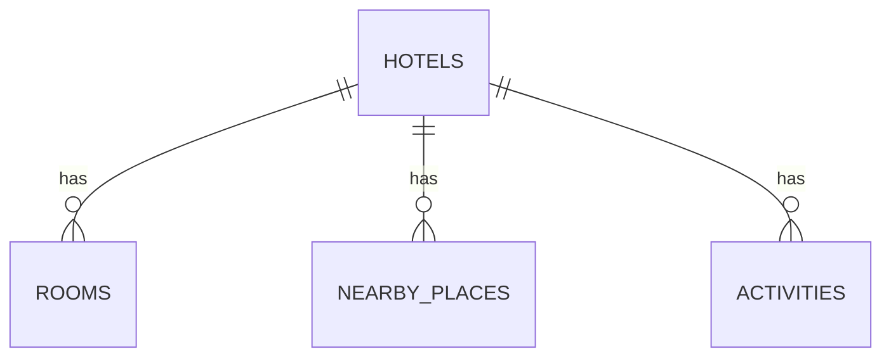

# Chi Tiết Schema Cơ Sở Dữ Liệu Quan Hệ (PostgreSQL)

Tài liệu này định nghĩa chi tiết 4 bảng cốt lõi trong cơ sở dữ liệu quan hệ PostgreSQL phục vụ lưu trữ dữ liệu du lịch OTA được chuẩn hóa từ các tệp tin JSON.

---

## 1. Sơ Đồ Thực Thể Liên Kết (ER Diagram)

---

## 2. Chi Tiết Các Bảng Dữ Liệu

### 2.1. Bảng `hotels` (Thông tin Khách sạn)
Lưu trữ thông tin cơ bản và thuộc tính mô tả chung của khách sạn.

| Tên cột | Kiểu dữ liệu | Ràng buộc | Nguồn gốc trong JSON / Mô tả |
| :--- | :--- | :--- | :--- |
| `id` | `INTEGER` | PRIMARY KEY | `hotel_id`: ID duy nhất của khách sạn |
| `name` | `VARCHAR(255)` | NOT NULL | `name`: Tên khách sạn |
| `accommodation_type` | `VARCHAR(100)` | | `accommodation_type`: Loại chỗ ở (e.g., Resort, Biệt thự, Homestay) |
| `star_rating` | `NUMERIC(3,1)` | | `star_rating`: Số sao (e.g., 5.0, 4.0) |
| `is_luxury` | `BOOLEAN` | DEFAULT FALSE | `is_luxury`: Phân loại phân khúc cao cấp/sang trọng |
| `review_score` | `NUMERIC(3,1)` | | `review_score`: Điểm đánh giá trung bình (e.g., 9.0, 8.8) |
| `review_count` | `INTEGER` | DEFAULT 0 | `review_count`: Số lượng nhận xét |
| `address` | `TEXT` | | `address`: Địa chỉ chi tiết của khách sạn |
| `city` | `VARCHAR(100)` | | `city` hoặc `province`: Thành phố/Tỉnh |
| `latitude` | `DOUBLE PRECISION`| | `latitude`: Vĩ độ phục vụ định vị địa lý |
| `longitude` | `DOUBLE PRECISION`| | `longitude`: Kinh độ phục vụ định vị địa lý |
| `description` | `TEXT` | | `description`: Bài viết mô tả chi tiết |
| `amenities` | `TEXT[]` | | `amenities`: Mảng toàn bộ các tiện ích của khách sạn |
| `useful_info` | `JSONB` | | `useful_info`: Thông tin bổ sung dạng key-value linh hoạt (phí dịch vụ, v.v.) |
| `policyNotes` | `TEXT[]` | | `policyNotes`: Danh sách các ghi chú và chính sách đặc biệt khi nhận phòng |
| `suitable_for` | `TEXT[]` | | `suitable_for`: Danh sách đối tượng phù hợp (e.g., Cặp đôi, Gia đình có trẻ nhỏ) |
| `reviews_detail` | `JSONB` | | `grades`: Điểm số đánh giá chi tiết (grades) và tag nhận xét |
| `images` | `TEXT[]` | | `images`: Danh sách các URL ảnh của khách sạn |
| `source_url` | `TEXT` | | Đường dẫn trang nguồn crawl dữ liệu khách sạn |

### 2.2. Bảng `rooms` (Thông tin Phòng)
Lưu thông tin chi tiết của từng loại phòng trực thuộc khách sạn.

| Tên cột | Kiểu dữ liệu | Ràng buộc | Nguồn gốc trong JSON / Mô tả |
| :--- | :--- | :--- | :--- |
| `id` | `SERIAL` | PRIMARY KEY | ID tự sinh cho mỗi loại phòng |
| `hotel_id` | `INTEGER` | REFERENCES `hotels(id)` | Khách sạn sở hữu phòng này (Cascade Delete) |
| `room_type_id` | `BIGINT` | | `room_grid.rooms.room_type_id`: ID loại phòng gốc |
| `name` | `VARCHAR(255)` | NOT NULL | `room_grid.rooms.name`: Tên loại phòng |
| `price` | `NUMERIC(15,2)` | | Giá phòng trung bình hoặc rẻ nhất (đơn vị VND) |
| `room_size` | `VARCHAR(50)` | | `room_size`: Kích thước phòng hiển thị (e.g., "38 m²") |
| `max_occupancy` | `INTEGER` | | `max_occupancy`: Số người tối đa được ở |
| `bed_type` | `VARCHAR(255)` | | `bed_type`: Mô tả loại giường |
| `room_view` | `VARCHAR(100)` | | `room_view`: Hướng phòng (e.g., Hướng Biển, Hướng Vườn) |
| `room_amenities` | `TEXT[]` | | `room_grid.rooms.room_amenities`: Mảng các tiện ích phòng chi tiết |
| `images` | `TEXT[]` | | `room_grid.rooms.images`: Danh sách các URL ảnh phòng |
| `review_score` | `NUMERIC(3,1)` | | `room_grid.rooms.review_score`: Điểm đánh giá riêng cho loại phòng |

### 2.3. Bảng `nearby_places` (Địa điểm Lân cận)
Lưu trữ các địa danh nổi tiếng gần khách sạn.

| Tên cột | Kiểu dữ liệu | Ràng buộc | Nguồn gốc trong JSON / Mô tả |
| :--- | :--- | :--- | :--- |
| `id` | `SERIAL` | PRIMARY KEY | ID tự sinh |
| `hotel_id` | `INTEGER` | REFERENCES `hotels(id)` | Khách sạn liên kết |
| `name` | `VARCHAR(255)` | NOT NULL | `nearby_places.name`: Tên địa danh (e.g., VinWonders Nha Trang) |
| `type` | `VARCHAR(100)` | | `nearby_places.type`: Phân loại (e.g., Khu vui chơi, Bãi biển) |
| `distance_km` | `NUMERIC(6,2)` | | `nearby_places.distance_km`: Khoảng cách thực tế (km) |

### 2.4. Bảng `activities` (Hoạt động Giải trí / Điểm vui chơi)
Lưu thông tin về hoạt động vui chơi để phục vụ tạo gói combo.

| Tên cột | Kiểu dữ liệu | Ràng buộc | Nguồn gốc trong JSON / Mô tả |
| :--- | :--- | :--- | :--- |
| `id` | `SERIAL` | PRIMARY KEY | ID tự sinh |
| `hotel_id` | `INTEGER` | REFERENCES `hotels(id)` | Liên kết với khách sạn có hoạt động này |
| `title` | `VARCHAR(255)` | NOT NULL | `activities.title`: Tên vé/hoạt động giải trí |
| `description` | `TEXT` | | `activities.description`: Mô tả chi tiết hoạt động |
| `price_amount` | `NUMERIC(15,2)` | | `activities.price_amount`: Giá vé vui chơi (VND) |
| `review_score` | `NUMERIC(3,1)` | | `activities.review_score`: Điểm đánh giá hoạt động |
