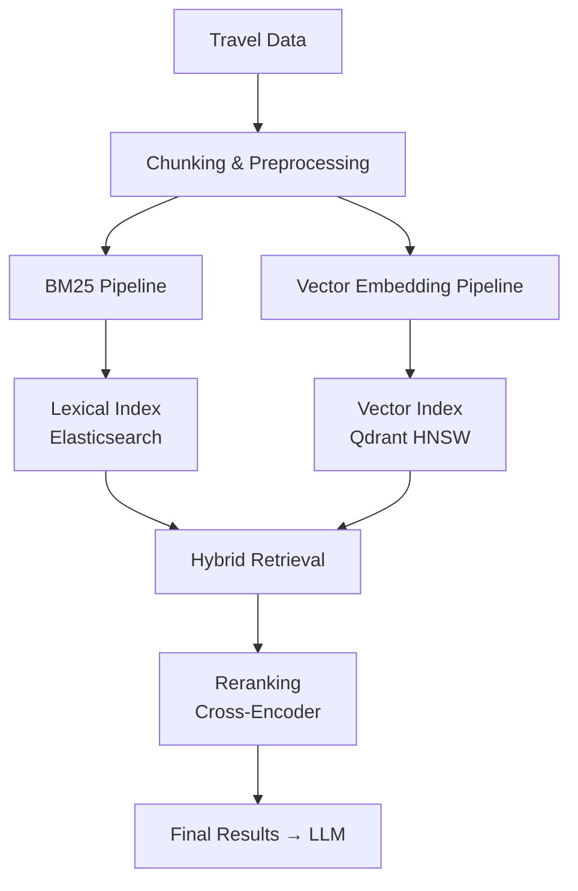
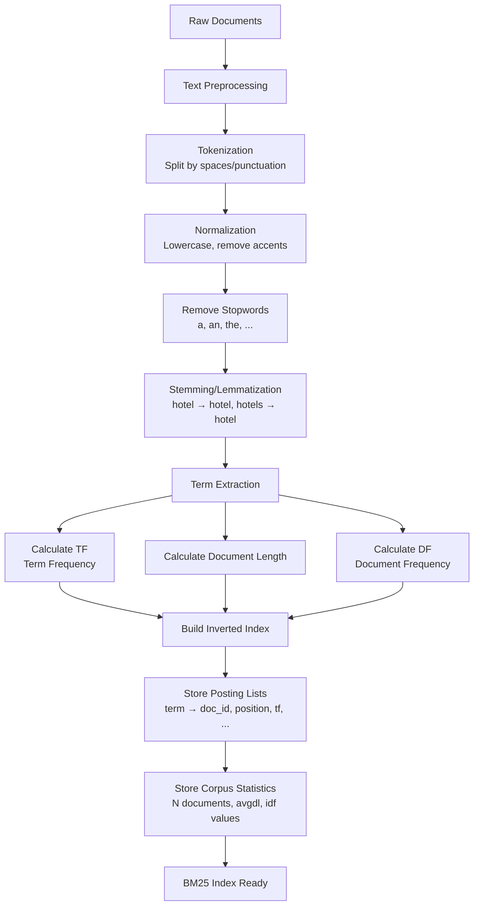
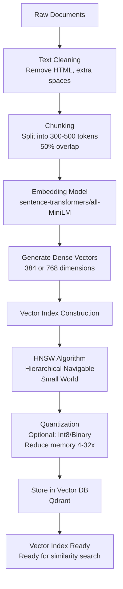
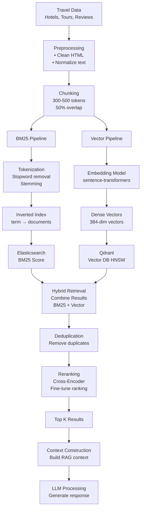

# Search Architecture - Báo Cáo Kiến Trúc Tìm Kiếm Hybrid

## 1. Tổng Quan Hệ Thống

Hệ thống tìm kiếm sử dụng kỹ thuật **Hybrid Search** kết hợp:

- **BM25 (Lexical Search)**: Tìm kiếm dựa từ khóa chính xác
- **Vector Search (Semantic Search)**: Tìm kiếm dựa nghĩa ngữ cảnh



---

## 2. Thuật Toán 1: BM25 Search (Tìm Kiếm Từ Khóa)

### 2.1 Khái Niệm

**BM25 (Best Matching 25)** là thuật toán xếp hạng tài liệu dựa trên tần suất từ khóa. Nó cải tiến so với TF-IDF bằng cách:

- Bao hòa (saturation) tần suất từ thấp hơn
- Tính toán độ dài tài liệu chuẩn hóa
- Tối ưu hóa cho tìm kiếm toàn văn

### 2.2 Công Thức BM25

$$BM25(D, Q) = \sum_{i=1}^{n} IDF(q_i) \cdot \frac{f(q_i, D) \cdot (k_1 + 1)}{f(q_i, D) + k_1 \cdot (1 - b + b \cdot \frac{|D|}{avgdl})}$$

Trong đó:

- `IDF(q_i)`: Inverse Document Frequency của từ khóa
- `f(q_i, D)`: Tần suất từ khóa trong tài liệu
- `|D|`: Độ dài tài liệu
- `avgdl`: Độ dài tài liệu trung bình
- `k_1, b`: Tham số điều chỉnh (thường k₁=1.5, b=0.75)

### 2.3 Quy Trình Indexing BM25



### 2.4 Ví Dụ Cụ Thể

**Input Documents:**

```
Doc1: "Luxury hotel with 5-star amenities in Paris"
Doc2: "Hotels and resorts for family vacation"
Doc3: "Paris luxury apartments near Eiffel Tower"
```

**Sau Preprocessing:**

```
Doc1: [luxury, hotel, 5-star, amenities, paris]
Doc2: [hotel, resort, family, vacation]
Doc3: [paris, luxury, apartment, eiffel, tower]
```

**Inverted Index:**

```
luxury: {doc1, doc3} → DF=2
hotel: {doc1, doc2} → DF=2
paris: {doc1, doc3} → DF=2
```

**Query: "luxury hotels paris"**

- BM25 Score = BM25(luxury) + BM25(hotel) + BM25(paris)
- Doc1: 0.65 + 0.58 + 0.62 = **1.85** ✓ (Cao nhất)
- Doc3: 0.65 + 0 + 0.62 = 1.27
- Doc2: 0 + 0.58 + 0 = 0.58

### 2.5 Ưu & Nhược Điểm

| Ưu Điểm | Nhược Điểm |
|--------|-----------|
| ✓ Nhanh, hiệu quả | ✗ Không hiểu ngữ cảnh |
| ✓ Chính xác với keyword | ✗ Nhạy cảm với typo |
| ✓ Quy mô tốt (large corpus) | ✗ Yêu cầu exact match |
| ✓ Chi phí thấp | ✗ Không xử lý từ đồng nghĩa |

---

## 3. Thuật Toán 2: Vector Search (Tìm Kiếm Ngữ Nghĩa)

### 3.1 Khái Niệm

**Vector Search** chuyển đổi văn bản thành vector dày đặc (dense vector) dùng mô hình embedding, tìm kiếm dựa trên độ tương tự ngữ cảnh.

### 3.2 Mô Hình Embedding

Sử dụng **Sentence-Transformers** (BERT-based):

- Input: Chuỗi văn bản
- Output: Vector 384-768 chiều
- Đặc điểm: Capture semantic meaning, xử lý đồng nghĩa, typo tolerance

**Ví dụ:**

```
"Luxury 5-star hotel in Paris" 
  → [0.234, -0.156, 0.789, ..., 0.412] (384 dims)

"Expensive hotel with high quality in Paris"
  → [0.241, -0.143, 0.795, ..., 0.408] (384 dims)

Cosine Similarity: 0.98 ✓ (Very Similar)
```

### 3.3 Quy Trình Indexing Vector Search



### 3.4 Chi Tiết HNSW

**HNSW (Hierarchical Navigable Small World)**:

- Cấu trúc graph multi-layer
- Tìm kiếm gần đúng (Approximate Nearest Neighbor)
- Độ phức tạp: O(log N), recall ~99.9%

```
Layer 2:  A -------- B
          |          |
Layer 1:  A -- C -- B -- D
          |    |    |    |
Layer 0:  A -- C -- B -- D -- E
                ↑ Query point
          Tìm k-nearest neighbors
```

### 3.5 Ví Dụ Tìm Kiếm Vector

**Query: "Best 5-star luxury hotels in France"**

1. Embedding → Vector [0.245, -0.148, 0.801, ...]
2. HNSW tìm 5-nearest vectors
3. Kết quả (Cosine Similarity):
   - Doc1 "Luxury hotel 5-star in Paris": 0.89 ✓
   - Doc3 "Premium Parisian apartments": 0.76
   - Doc4 "Hotel amenities guide": 0.65

### 3.6 Ưu & Nhược Điểm

| Ưu Điểm | Nhược Điểm |
|--------|-----------|
| ✓ Hiểu ngữ cảnh & ý nghĩa | ✗ Chi phí embedding cao |
| ✓ Xử lý đồng nghĩa tốt | ✗ Indexing chậm hơn |
| ✓ Typo tolerance | ✗ Cần GPU/CPU mạnh |
| ✓ Tìm kiếm semantic | ✗ Memory cao |

---

## 4. Kiến Trúc Hybrid Search Toàn Diện

