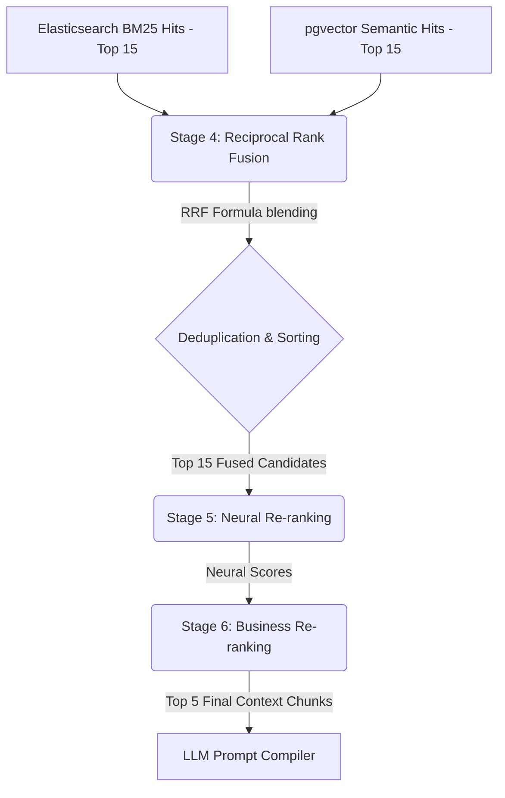
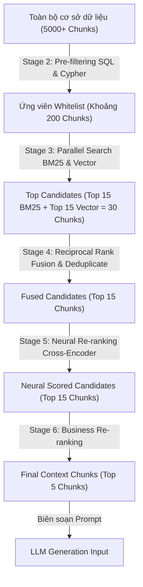

# Thiết Kế Module Xếp Hạng (Ranking Design) - RAG Hybrid Search

Tài liệu này chi tiết hóa thiết kế kỹ thuật của 2 giai đoạn xếp hạng cuối cùng (Stage 4 và Stage 5) trong Pipeline tìm kiếm lai (RAG Hybrid Search) của hệ thống AI Travel Assistant (DA10).

---

## 🗺️ 1. Quy Trình Ranking Tổng Quan



---

## 🎛️ 2. Giai Đoạn 4: Hòa Trộn Điểm Xếp Hạng (Stage 4 - Score Fusion via RRF)

### **2.1 Tại sao chọn Reciprocal Rank Fusion (RRF)?**
Các hệ thống tìm kiếm khác nhau trả về các thang điểm số hoàn toàn khác nhau:
- **Elasticsearch (BM25)** trả về điểm số không bị chặn trên (unbounded floats, ví dụ: 12.5, 8.3) dựa trên tần suất từ khóa.
- **Postgres pgvector (Vector search)** trả về điểm tương đồng Cosine bị chặn trong khoảng `[-1.0, 1.0]` (hoặc khoảng cách L2).
Việc cộng trực tiếp hoặc chuẩn hóa min-max các điểm số này thường thiếu tính ổn định và nhạy cảm với các phân phối điểm biên. **RRF giải quyết vấn đề này bằng cách chỉ quan tâm đến thứ hạng (rank) của tài liệu trong từng danh sách kết quả thay vì điểm số thô.**

### **2.2 Công thức Toán học RRF**
Điểm số RRF của một tài liệu $d$ được tính theo công thức:
$$Score_{RRF}(d) = \sum_{m \in M} \frac{1}{k + r_m(d)}$$

Trong đó:
- $M$ là tập hợp các phương pháp tìm kiếm (ở đây $M = \{\text{BM25}, \text{Vector}\}$).
- $r_m(d)$ là thứ hạng (rank, 1-indexed) của tài liệu $d$ trong danh sách kết quả của phương pháp $m$. Nếu tài liệu không xuất hiện trong danh sách kết quả của $m$, $r_m(d) = \infty$ (tương đương với việc đóng góp điểm bằng $0$).
- $k$ là hằng số làm mượt (smoothing constant), thường chọn **$k = 60$** theo khuyến nghị của các nghiên cứu chuẩn (như TREC) để giảm tác động của các tài liệu có thứ hạng quá cao lên các tài liệu xếp sau.

### **2.3 Cơ chế Loại bỏ Trùng lặp (Deduplication)**
Khi hòa trộn danh sách từ Elasticsearch và Vector DB, cùng một tài liệu (chunk) có thể xuất hiện ở cả hai danh sách với các ID tương ứng.
- **Giải pháp:** Sử dụng ID duy nhất của văn bản (`chunk_id` hoặc ID khóa chính trong DB) làm khóa chính để ánh xạ.
- **Logic code mẫu:**
  ```python
  scores = {}
  details = {}
  k = 60
  
  # Xử lý danh sách BM25
  for rank, doc in enumerate(bm25_results):
      doc_id = doc["id"]
      scores[doc_id] = scores.get(doc_id, 0.0) + (1.0 / (k + rank + 1))
      details[doc_id] = doc # Lưu thông tin chi tiết
      
  # Xử lý danh sách Vector
  for rank, doc in enumerate(vector_results):
      doc_id = doc["id"]
      scores[doc_id] = scores.get(doc_id, 0.0) + (1.0 / (k + rank + 1))
      if doc_id not in details:
          details[doc_id] = doc
          
  # Sắp xếp và lấy Top 15 ứng viên
  sorted_candidates = sorted(scores.items(), key=lambda x: x[1], reverse=True)
  top_15 = [details[doc_id] for doc_id, score in sorted_candidates[:15]]
  ```

### **2.4 Ví dụ tính toán điểm RRF thủ công (Manual Calculation Example)**
Giả sử chúng ta có 1 tài liệu (chunk) $d_1$ xuất hiện trong kết quả của cả hai công cụ tìm kiếm với thứ hạng như sau:
* Thứ hạng trong kết quả Elasticsearch (BM25): **$r_{BM25}(d_1) = 2$** (xếp thứ 2).
* Thứ hạng trong kết quả pgvector (Semantic): **$r_{Vector}(d_1) = 5$** (xếp thứ 5).

Áp dụng công thức RRF với hằng số $k = 60$:
$$Score_{RRF}(d_1) = \frac{1}{60 + r_{BM25}(d_1)} + \frac{1}{60 + r_{Vector}(d_1)}$$

Thay số vào công thức:
$$Score_{RRF}(d_1) = \frac{1}{60 + 2} + \frac{1}{60 + 5} = \frac{1}{62} + \frac{1}{65}$$

Tính toán chi tiết:
* Điểm từ BM25: $\frac{1}{62} \approx 0.016129$
* Điểm từ Vector: $\frac{1}{65} \approx 0.015385$

Tổng điểm RRF của tài liệu $d_1$:
$$Score_{RRF}(d_1) \approx 0.016129 + 0.015385 = 0.031514$$

*Nếu có tài liệu $d_2$ chỉ xuất hiện ở vị trí thứ 1 trong danh sách BM25 nhưng không xuất hiện trong danh sách Vector ($r_{Vector}(d_2) = \infty$), điểm số sẽ là:*
$$Score_{RRF}(d_2) = \frac{1}{60 + 1} + 0 = \frac{1}{61} \approx 0.016393$$
Do đó $Score_{RRF}(d_1) > $Score_{RRF}(d_2)$, giúp đưa tài liệu xuất hiện ở cả hai danh sách lên thứ hạng cao hơn.

---

## 🧠 3. Giai Đoạn 5: Tái Xếp Hạng Bằng Mô Hình Học Sâu (Stage 5 - Neural Re-ranking)

### **3.1 Vai trò của Cross-Encoder**
Trong khi BM25 chỉ so khớp từ khóa thô và Vector Search (Bi-Encoder) tính toán độ tương đồng trên các vector độc lập được nhúng trước, **Cross-Encoder** thực hiện tính toán độ liên quan ngữ nghĩa bằng cách cho câu hỏi (`Query`) và đoạn văn bản (`Context Chunk`) đi qua mô hình cùng một lúc để học tương tác tự chú ý (self-attention) chéo giữa các tokens.
- **Ưu điểm:** Độ chính xác cực kỳ cao, bắt được các sắc thái ngữ nghĩa phức tạp.
- **Nhược điểm:** Chi phí tính toán lớn, độ trễ cao. Do đó, chỉ áp dụng Cross-Encoder ở giai đoạn cuối cùng trên tập ứng viên thu hẹp (Top 15 ứng viên từ RRF) để lọc ra **Top 5 context chunks** tối ưu nhất gửi cho LLM.

### **3.2 Mô hình Đề xuất**
Sử dụng mô hình Cross-Encoder hạng nhẹ chạy tốt trên CPU cục bộ:
- **Model:** `BAAI/bge-reranker-base` hoặc `cross-encoder/ms-marco-MiniLM-L-6-v2`.
- **Cơ chế hoạt động:** Nhận đầu vào là cặp `[Query, Chunk_Content]`, trả về một điểm số xác suất liên quan nằm trong khoảng `[0.0, 1.0]`. Sắp xếp giảm dần và lấy đúng 5 đoạn văn bản đầu tiên để xây dựng Prompt Context cho LLM.
- **Mô phỏng hàm xếp hạng khi test:**
  ```python
  def test_node_6_neural_reranking(query_str, fused_candidates):
      # Tính toán mật độ trùng lặp từ khóa để giả lập độ liên quan
      # Cộng với biến động nhỏ ngẫu nhiên để mô phỏng phân phối điểm của Cross-Encoder
      ...
      return sorted_candidates[:5]
  ```
- **Output cuối cùng:** 5 chunks có thông tin khách sạn đầy đủ, đảm bảo LLM nhận được ngữ cảnh ngắn gọn, có độ chính xác cao và tránh hiện tượng quá tải token ("lost in the middle").

---

## ⚖️ 4. Giai Đoạn 6: Xếp Hạng Nghiệp Vụ (Stage 6 - Business Re-ranking)

### **4.1 Mục tiêu**
Tinh chỉnh thứ hạng cuối cùng bằng cách kết hợp điểm tương quan ngữ nghĩa (từ Cross-Encoder) với các chỉ số chất lượng khách sạn thực tế và mức độ khớp với các tiêu chí cụ thể của người dùng (giá, hạng sao, tiện ích).

### **4.2 Công thức Tính điểm Tổng hợp (Final Scoring Formula)**
$$Score_{Final} = w_1 \cdot S_{Neural} + w_2 \cdot S_{Review} + w_3 \cdot S_{Business\_Fit}$$

Trong đó:
- **$S_{Neural}$ (0.0 - 1.0):** Điểm từ Cross-Encoder (Stage 5). Trọng số $w_1 = 0.5$.
- **$S_{Review}$ (0.0 - 1.0):** Điểm chất lượng khách sạn, tính bằng:
  $$S_{Review} = \frac{review\_score}{10} \cdot \log_{10}(review\_count + 1) \text{ (sau đó chuẩn hóa)}$$
  Trọng số $w_2 = 0.2$.
- **$S_{Business\_Fit}$ (0.0 - 1.0):** Mức độ khớp với yêu cầu người dùng, bao gồm:
  - **Price Fit:** Thưởng điểm nếu giá phòng nằm trong khoảng `[0.7 * max_price, 1.0 * max_price]`.
  - **Concept Fit:** Thưởng điểm dựa trên số lượng `matched_concepts` từ Neo4j và điểm `positive_pct` của các `review_aspects` tương ứng.
  Trọng số $w_3 = 0.3$.

### **4.3 Tích hợp Review Aspects & Suitability**
Hệ thống sử dụng dữ liệu từ bảng `review_aspects` và `hotel_suitability` để tăng cường độ chính xác:
- Nếu người dùng hỏi về "dịch vụ", hệ thống sẽ lấy `positive_pct` của aspect "Dịch vụ" để điều chỉnh điểm.
- Nếu người dùng là "cặp đôi", hệ thống sẽ lấy `score` từ `hotel_suitability` cho tag "Cặp đôi" để ưu tiên các khách sạn thực sự phù hợp.

---

### **4.4 Đánh Giá Chi Phí Phần Cứng (Hardware Cost Evaluation)**
Khi triển khai mô hình `BAAI/bge-reranker-base` chạy local trên CPU của hệ thống Travel Assistant, chi phí và hiệu năng được đánh giá chi tiết như sau:

1. **Dung lượng bộ nhớ (RAM Footprint):**
   * Mô hình `bge-reranker-base` có khoảng **278 triệu tham số**.
   * Khi tải ở định dạng float16 (FP16), mô hình chiếm khoảng **~556 MB RAM**.
   * Khi tải ở định dạng INT8 (sau khi quantization), mô hình chiếm khoảng **~278 MB RAM**. Điều này hoàn toàn phù hợp để chạy trên các máy cấu hình tiêu chuẩn (8GB - 16GB RAM) mà không làm tràn bộ nhớ.

2. **Tải trọng CPU (CPU Utilization):**
   * Trong quá trình suy luận (inference) cho 15 chunks ứng viên, CPU sẽ chạy ở mức **80% - 100%** tải trên các core được cấu hình (khuyến nghị set `num_threads=4` để tránh nghẽn toàn bộ hệ thống).

3. **Thời gian xử lý (Latency Estimation):**
   * Trung bình thời gian suy luận cho một cặp `[Query, Chunk]` (độ dài trung bình ~256 tokens) trên CPU 8-core thế hệ mới mất khoảng **10ms - 15ms**.
   * Tổng thời gian xếp hạng cho **Top 15 ứng viên** là:
     $$15 \text{ chunks} \times 12\text{ms/chunk} \approx 180\text{ms}$$
   * Thời gian này nằm hoàn toàn trong ngân sách độ trễ cho phép cho giai đoạn Re-ranking (< 200ms) để đảm bảo SLO tổng thể < 500ms.

---

## 🌪️ 5. Phễu Lọc Dữ Liệu (Filtering Funnel)

Để tối ưu hóa hiệu năng và độ chính xác của hệ thống, luồng dữ liệu đi qua phễu lọc sẽ giảm dần kích thước như sau:



Sự rơi rụng dữ liệu này giúp hệ thống loại bỏ nhiễu cực tốt, đảm bảo thời gian xử lý nhanh mà vẫn giữ được các thông tin ngữ cảnh chất lượng nhất để gửi tới LLM.
