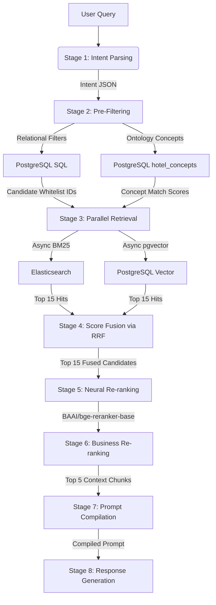

# Thiết Kế Module Tìm Kiếm (Retrieval Design) - RAG Hybrid Search

Tài liệu này chi tiết hóa thiết kế kỹ thuật của 3 giai đoạn đầu tiên (Stage 1 đến Stage 3) trong Pipeline tìm kiếm lai (RAG Hybrid Search) của hệ thống AI Travel Assistant (DA10).

---

## 🗺️ 1. Quy Trình Retrieval & RAG Tổng Quan (End-to-End RAG Flowchart)



### **1.1 Các Giai Đoạn Hạ Nguồn Tiếp Theo (Downstream Stages Overview)**
Mặc dù tài liệu này tập trung chi tiết vào **Stage 1 đến Stage 3**, đầu ra của quá trình truy xuất song song (Parallel Retrieval) sẽ được tiếp nhận và xử lý bởi các giai đoạn xếp hạng nghiệp vụ và sinh phản hồi phía sau:
1. **Stage 4: Reciprocal Rank Fusion (RRF):** Hòa trộn kết quả xếp hạng từ kênh từ khóa (BM25) và ngữ nghĩa (Vector) để ra danh sách 15 ứng viên tối ưu nhất.
2. **Stage 5: Neural Re-ranking (Tái xếp hạng sâu):** Sử dụng Cross-Encoder (`bge-reranker-base`) chạy local trên CPU để đánh giá tương quan ngữ nghĩa chuyên sâu giữa query và 15 ứng viên.
3. **Stage 6: Business Re-ranking (Xếp hạng nghiệp vụ):** Kết hợp điểm tương quan ngữ nghĩa (relevance score) từ Cross-Encoder với các tiêu chí nghiệp vụ như điểm review khách sạn (`review_score`), số lượng đánh giá (`review_count`), mức độ khớp giá phòng (`price_fit`) và mức độ khớp khái niệm soft (`concept_match`) để chọn ra Top 5 chunks chất lượng nhất.
4. **Stage 7: Prompt Compilation (Biên soạn prompt):** Ghép Top 5 chunks làm Context kết hợp cùng System Prompt và Câu hỏi của người dùng theo cấu trúc chuẩn để gửi tới LLM.
5. **Stage 8: Response Generation (Sinh câu trả lời):** LLM cục bộ (Ollama) phân tích context và sinh phản hồi cuối cùng kèm theo các trích dẫn nguồn chuẩn (ví dụ: `[1]`, `[2]`).

---

## 🧩 2. Giai Đoạn 1: Phân Tích Ý Định (Stage 1 - Intent Parsing)

### **2.1 Mục tiêu & Cơ chế**
Chuyển đổi câu hỏi phi cấu trúc bằng ngôn ngữ tự nhiên từ người dùng sang dạng dữ liệu có cấu trúc (JSON schema) để cung cấp tham số lọc cho các cơ sở dữ liệu phía sau.
- **Mô hình chính:** Ollama `qwen2.5:7b` chạy cục bộ (local).
- **Cơ chế dự phòng (Fallback):** Khi kết nối Ollama bị lỗi hoặc quá thời gian phản hồi (timeout > 10s), hệ thống tự động kích hoạt **Rule-based Parser** được tối ưu bằng chuẩn hóa Unicode (NFC) tiếng Việt.

### **2.2 Cấu trúc Dữ liệu Đầu ra (JSON Schema)**
```json
{
  "city": "String or null - Tên thành phố được chuẩn hóa (ví dụ: 'Nha Trang', 'Phú Quốc')",
  "max_price": "Integer or null - Giá trần phòng cao nhất du khách chấp nhận (VND)",
  "star_rating": "Float or null - Hạng sao tối thiểu yêu cầu (ví dụ: 5.0)",
  "concepts": "Array of Strings - Các Concept IDs từ Ontology phù hợp (ví dụ: ['AMEN_PRIVATE_POOL', 'STYLE_LUXURY'])",
  "keyword_expansion": "String - Cụm từ khóa mở rộng tiếng Việt để cung cấp cho Elasticsearch BM25"
}
```

---

## 🗄️ 3. Giai Đoạn 2: Lọc Thuộc Tính & Khớp Khái Niệm Đồ Thị (Stage 2 - Pre-Filtering)

Giai đoạn này áp dụng cơ chế lọc cứng thuộc tính và khớp mờ khái niệm để tạo ra whitelist khách sạn, thu hẹp không gian tìm kiếm văn bản từ hàng nghìn khách sạn xuống còn một vài ứng viên phù hợp nhất.

### **3.1 Lọc Cứng Quan Hệ (PostgreSQL SQL)**
Dựa trên `city`, `max_price`, và `star_rating` thu được từ Giai đoạn 1 để lọc danh sách khách sạn.
- **Logic thực thi:** Khách sạn được giữ lại nếu thuộc thành phố chỉ định, có hạng sao tương ứng và **ít nhất một loại phòng** có mức giá nhỏ hơn hoặc bằng `max_price`.
- **Câu lệnh SQL động mẫu:**
  ```sql
  SELECT h.id, h.name
  FROM hotels h
  JOIN rooms r ON h.id = r.hotel_id
  WHERE 1=1
    AND (h.city ILIKE %s OR %s ILIKE CONCAT('%', h.city, '%'))
    AND h.star_rating >= %s
    AND r.price <= %s
  GROUP BY h.id, h.name;
  ```

### **3.2 So khớp Đồ thị Ontology (Neo4j Cypher)**
Neo4j nhận mảng `concepts` để quét các mối quan hệ ngữ nghĩa (Ontology) giữa Khách sạn (`Hotel`), Tiện ích (`Amenity`), Đối tượng (`TravelerType`), và Khía cạnh đánh giá (`ReviewAspect`).
- **Mục tiêu:** Tìm ra các khách sạn được gắn nhãn tương thích nhất với nhu cầu của người dùng dựa trên Ontology.
- **Câu lệnh Cypher thực thi mẫu:**
  ```cypher
  MATCH (h:Hotel)-[:SUITABLE_FOR|HAS_AMENITY|HAS_REVIEW_ASPECT]->(node)
  WHERE node.id IN $concepts
    AND (toLower(h.city) CONTAINS toLower($city) OR toLower($city) CONTAINS toLower(h.city))
  RETURN h.id AS hotel_id, h.name AS name, h.city AS city, h.review_score AS score, 
         collect(distinct node.name) AS matched_concepts, 
         count(distinct node) AS match_count
  ORDER BY match_count DESC, score DESC
  LIMIT 10;
  ```

---

## ⚡ 4. Giai Đoạn 3: Truy Xuất Song Song (Stage 3 - Parallel Retrieval)

Stage 3 thực hiện tìm kiếm song song bất đồng bộ (`asyncio.gather`) trên hai kênh: **Elasticsearch** (Tìm kiếm từ khóa - Keyword search) và **Postgres pgvector** (Tìm kiếm ngữ nghĩa - Semantic search), cả hai đều được áp dụng bộ lọc whitelist khách sạn thu được từ Stage 2.

### **4.1 Kênh A: Từ khóa (Elasticsearch BM25)**
- **Index:** `hotel_chunks`
- **Bộ lọc Whitelist:** Áp dụng `terms` filter trên trường `metadata.hotel_id` để loại bỏ các kết quả từ các khách sạn không phù hợp điều kiện lọc cứng.
- **Query Body DSL mẫu:**
  ```json
  {
    "size": 15,
    "query": {
      "bool": {
        "must": [
          {
            "match": {
              "content": {
                "query": "khách sạn 5 sao hồ bơi riêng Nha Trang trăng mật cặp đôi",
                "fuzziness": "AUTO"
              }
            }
          }
        ],
        "filter": [
          { "match": { "metadata.city": "Nha Trang" } },
          { "terms": { "metadata.hotel_id": [65153, 805030] } }
        ]
      }
    }
  }
  ```

### **4.2 Kênh B: Ngữ nghĩa (PostgreSQL pgvector / Qdrant)**
- **Cơ chế:** Tính khoảng cách Cosine giữa Vector của câu hỏi người dùng và Vector của các chunk văn bản.
- **PoC pgvector SQL mẫu:**
  ```sql
  SELECT tc.id, h.name, tc.chunk_type, tc.content, 
         (tc.embedding <=> %s::vector) AS distance
  FROM text_chunks tc
  JOIN hotels h ON tc.hotel_id = h.id
  WHERE h.id = ANY(%s) -- Áp dụng whitelist lọc cứng
    AND (h.city ILIKE %s)
  ORDER BY distance ASC
  LIMIT 15;
  ```
- **Kế hoạch chuyển đổi Production:** Vector chunk sẽ được đồng bộ sang **Qdrant Vector DB**, truy xuất bằng `qdrant_client.search()` với cấu hình `Filter` theo ID khách sạn.

---

## 📐 5. Cấu Trúc Dữ Liệu Đầu Ra Sau Tìm Kiếm (Parallel Retrieval Interface Schema)

Sau khi giai đoạn truy xuất song song bất đồng bộ hoàn thành, kết quả từ Elasticsearch (BM25) và pgvector (Semantic) sẽ được tập hợp lại trước khi gửi qua giai đoạn Score Fusion (RRF). Dữ liệu trả về tuân thủ định dạng JSON như sau:

```json
[
  {
    "chunk_id": "text_chunks_102",
    "hotel_id": 65153,
    "hotel_name": "Vinpearl Resort & Spa Nha Trang Bay",
    "text": "[Khách sạn]: Vinpearl Resort & Spa Nha Trang Bay | [Tóm tắt đánh giá]: Khách hàng đánh giá: \"Tuyệt vời: Khách sạn rất đẹp, phục vụ chu đáo, có hồ bơi riêng sạch sẽ.\" | \"Đáng tiền: Phòng nghỉ sang trọng hướng biển, ăn sáng buffet nhiều món.\"",
    "score": 0.8423,
    "source": "vector"
  },
  {
    "chunk_id": "text_chunks_405",
    "hotel_id": 805030,
    "hotel_name": "Sheraton Nha Trang Hotel & Spa",
    "text": "[Khách sạn]: Sheraton Nha Trang Hotel & Spa | [Tóm tắt đánh giá]: Khách hàng đánh giá: \"Vị trí tốt: Khách sạn ngay trung tâm đường Trần Phú, ngắm vịnh Nha Trang rất đẹp.\"",
    "score": 14.52,
    "source": "bm25"
  }
]
```

### Chi tiết các trường dữ liệu:
* **`chunk_id`** (String): Khóa chính duy nhất của text chunk trong cơ sở dữ liệu. Được dùng để phục vụ quá trình loại bỏ trùng lặp (Deduplication) ở các bước sau.
* **`hotel_id`** (Integer): ID của khách sạn chứa chunk này, dùng để kiểm tra tính hợp lệ với Whitelist của bước Pre-filtering.
* **`hotel_name`** (String): Tên của khách sạn để làm giàu ngữ cảnh khi biên soạn prompt cho LLM.
* **`text`** (String): Nội dung thô của đoạn văn bản đã qua tối ưu hóa trích xuất (bao gồm cả các tiêu đề và nội dung đánh giá quan trọng).
* **`score`** (Float): Điểm số gốc từ công cụ truy xuất tương ứng (điểm Cosine similarity đối với vector hoặc điểm BM25 đối với Elasticsearch).
* **`source`** (String): Nguồn truy xuất (`bm25` hoặc `vector`), giúp hệ thống giám sát hiệu năng của từng kênh tìm kiếm độc lập.
