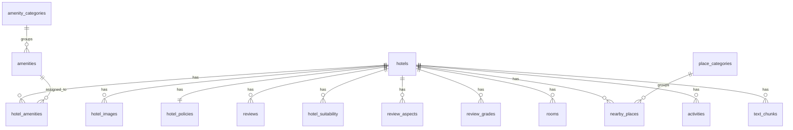

# Phân Tích Database Schema OTA Travel

Nguồn phân tích: `init_db.sql`

Schema này được thiết kế theo hướng chuẩn hóa quan hệ 3NF cho dữ liệu OTA khách sạn, kết hợp thêm bảng vector `text_chunks` để phục vụ semantic search/RAG. Dữ liệu khách sạn chính nằm ở `hotels`; các dữ liệu lặp hoặc có quan hệ nhiều bản ghi như ảnh, phòng, tiện ích, reviews, địa điểm lân cận và hoạt động được tách sang bảng riêng.

## Tổng Quan Bảng

| Nhóm | Bảng | Vai trò |
|---|---|---|
| Core hotel | `hotels` | Thông tin cốt lõi của khách sạn |
| Media | `hotel_images` | Danh sách ảnh của khách sạn |
| Policy | `hotel_policies` | Chính sách nhận/trả phòng, trẻ em, thú nuôi, phụ phí |
| Review | `reviews` | Review thô của khách hàng |
| Review | `review_grades` | Điểm chi tiết theo tiêu chí |
| Review | `review_aspects` | Khía cạnh được nhắc đến trong review |
| Segmentation | `hotel_suitability` | Nhóm khách phù hợp |
| Amenity | `amenity_categories` | Danh mục nhóm tiện ích |
| Amenity | `amenities` | Danh mục tiện ích dùng chung |
| Amenity | `hotel_amenities` | Bảng nối khách sạn - tiện ích |
| Room | `rooms` | Danh sách loại phòng |
| Nearby place | `place_categories` | Danh mục loại địa điểm lân cận |
| Nearby place | `nearby_places` | Địa điểm gần khách sạn |
| Activity | `activities` | Hoạt động/tour/dịch vụ giải trí liên quan |
| Vector | `text_chunks` | Đoạn văn bản và embedding vector |

## Extension

```sql
CREATE EXTENSION IF NOT EXISTS vector;
```

Extension `vector` của PostgreSQL/pgvector được dùng cho cột `text_chunks.embedding VECTOR(1024)`. Đây là nền tảng để lưu embedding và tạo index HNSW phục vụ tìm kiếm tương đồng cosine.

## 1. Bảng `hotels`

Mục đích: lưu thông tin cốt lõi, định danh và mô tả chính của khách sạn. Đây là bảng trung tâm, được hầu hết bảng khác tham chiếu qua `hotel_id`.

Primary key:

- `id`

| Cột | Kiểu dữ liệu | Null | Default | Mô tả |
|---|---:|---|---|---|
| `id` | `INTEGER` | Không | Không | ID khách sạn, lấy từ nguồn crawl/OTA. Đây không phải `SERIAL`, giúp giữ nguyên ID gốc. |
| `name` | `VARCHAR(255)` | Không | Không | Tên khách sạn. |
| `property_type` | `VARCHAR(100)` | Có | Không | Loại property gốc, ví dụ `Hotel`. |
| `accommodation_type` | `VARCHAR(100)` | Có | Không | Loại hình lưu trú, ví dụ `Khách sạn`, `Resort`, `Căn hộ`. |
| `star_rating` | `NUMERIC(3,1)` | Có | Không | Hạng sao, ví dụ `5.0`. |
| `is_luxury` | `BOOLEAN` | Có | `FALSE` | Cờ đánh dấu khách sạn cao cấp/luxury. |
| `review_score` | `NUMERIC(3,1)` | Có | Không | Điểm review tổng quan, thường theo thang 10. |
| `review_count` | `INTEGER` | Có | `0` | Tổng số lượt đánh giá. |
| `address` | `TEXT` | Có | Không | Địa chỉ đầy đủ. |
| `city` | `VARCHAR(100)` | Có | Không | Thành phố. |
| `city_id` | `INTEGER` | Có | Không | ID thành phố từ nguồn dữ liệu. |
| `area` | `VARCHAR(100)` | Có | Không | Khu vực/quận/phường. |
| `country` | `VARCHAR(100)` | Có | Không | Quốc gia. |
| `latitude` | `DOUBLE PRECISION` | Có | Không | Vĩ độ. |
| `longitude` | `DOUBLE PRECISION` | Có | Không | Kinh độ. |
| `description` | `TEXT` | Có | Không | Mô tả dài của khách sạn. |
| `source_url` | `TEXT` | Có | Không | URL nguồn crawl. |

Quan hệ:

- Một `hotel` có nhiều `hotel_images`.
- Một `hotel` có tối đa một `hotel_policies`.
- Một `hotel` có nhiều `reviews`, `review_grades`, `review_aspects`.
- Một `hotel` có nhiều `rooms`, `nearby_places`, `activities`, `text_chunks`.
- Một `hotel` có nhiều `amenities` thông qua `hotel_amenities`.

Index:

- `idx_hotels_city` trên `city`
- `idx_hotels_rating` trên `star_rating`

## 2. Bảng `hotel_images`

Mục đích: quản lý ảnh khách sạn độc lập khỏi bảng `hotels`, tránh lưu mảng ảnh trong một cột.

Primary key:

- `id`

Foreign key:

- `hotel_id` tham chiếu `hotels(id)` với `ON DELETE CASCADE`

| Cột | Kiểu dữ liệu | Null | Default | Mô tả |
|---|---:|---|---|---|
| `id` | `SERIAL` | Không | Auto increment | ID ảnh nội bộ. |
| `hotel_id` | `INTEGER` | Không | Không | Khách sạn sở hữu ảnh. |
| `url` | `TEXT` | Không | Không | URL ảnh. |
| `is_primary` | `BOOLEAN` | Có | `FALSE` | Đánh dấu ảnh đại diện/chính. |

Quan hệ:

- Nhiều ảnh thuộc một khách sạn.
- Khi xóa khách sạn, toàn bộ ảnh liên quan bị xóa theo.

## 3. Bảng `hotel_policies`

Mục đích: lưu chính sách khách sạn đã bóc tách từ phần useful info/policy notes.

Primary key:

- `hotel_id`

Foreign key:

- `hotel_id` tham chiếu `hotels(id)` với `ON DELETE CASCADE`

| Cột | Kiểu dữ liệu | Null | Default | Mô tả |
|---|---:|---|---|---|
| `hotel_id` | `INTEGER` | Không | Không | Đồng thời là khóa chính và khóa ngoại đến `hotels`. |
| `check_in_from` | `VARCHAR(50)` | Có | Không | Giờ nhận phòng, ví dụ `14:00`. |
| `check_out_until` | `VARCHAR(50)` | Có | Không | Giờ trả phòng, ví dụ `12:00`. |
| `service_fee_pct` | `NUMERIC(5,2)` | Có | `0.00` | Phần trăm phí dịch vụ. |
| `child_policy` | `TEXT` | Có | Không | Chính sách trẻ em. |
| `pet_policy` | `TEXT` | Có | Không | Chính sách thú nuôi. |
| `deposit_required` | `BOOLEAN` | Có | `FALSE` | Có yêu cầu đặt cọc hay không. |
| `policy_notes` | `TEXT[]` | Có | Không | Danh sách ghi chú chính sách. |

Quan hệ:

- Quan hệ 1-1 với `hotels`.
- Thiết kế `hotel_id` là primary key giúp mỗi khách sạn chỉ có một bản policy.

## 4. Bảng `reviews`

Mục đích: lưu từng review thô của khách hàng.

Primary key:

- `id`

Foreign key:

- `hotel_id` tham chiếu `hotels(id)` với `ON DELETE CASCADE`

| Cột | Kiểu dữ liệu | Null | Default | Mô tả |
|---|---:|---|---|---|
| `id` | `SERIAL` | Không | Auto increment | ID review nội bộ. |
| `hotel_id` | `INTEGER` | Không | Không | Khách sạn được review. |
| `reviewer_name` | `VARCHAR(100)` | Có | Không | Tên người đánh giá. |
| `reviewer_country` | `VARCHAR(100)` | Có | Không | Quốc gia của người đánh giá. |
| `rating` | `NUMERIC(3,1)` | Có | Không | Điểm đánh giá. |
| `review_date` | `DATE` | Có | Không | Ngày review. |
| `title` | `TEXT` | Có | Không | Tiêu đề review. |
| `text` | `TEXT` | Không | Không | Nội dung review chính. |
| `positive_text` | `TEXT` | Có | Không | Nội dung tích cực nếu có. |
| `negative_text` | `TEXT` | Có | Không | Nội dung tiêu cực nếu có. |

Index:

- `idx_reviews_hotel_rating` trên `(hotel_id, rating)`

## 5. Bảng `hotel_suitability`

Mục đích: lưu các nhóm khách phù hợp với khách sạn, ví dụ cặp đôi, gia đình, khách công tác.

Primary key:

- `id`

Foreign key:

- `hotel_id` tham chiếu `hotels(id)` với `ON DELETE CASCADE`

Unique constraint:

- `UNIQUE(hotel_id, suitable_for_tag)`

| Cột | Kiểu dữ liệu | Null | Default | Mô tả |
|---|---:|---|---|---|
| `id` | `SERIAL` | Không | Auto increment | ID nội bộ. |
| `hotel_id` | `INTEGER` | Không | Không | Khách sạn liên quan. |
| `suitable_for_tag` | `VARCHAR(100)` | Không | Không | Nhãn nhóm khách phù hợp. |
| `mention_count` | `INTEGER` | Có | Không | Số lần được nhắc đến nếu có. |
| `score` | `NUMERIC(4,2)` | Có | Không | Điểm phù hợp nếu có. |

Index:

- `idx_suitability_tag` trên `suitable_for_tag`

## 6. Bảng `review_aspects`

Mục đích: lưu các khía cạnh được nhắc trong review, ví dụ dịch vụ, vị trí, bữa sáng.

Primary key:

- `id`

Foreign key:

- `hotel_id` tham chiếu `hotels(id)` với `ON DELETE CASCADE`

Unique constraint:

- `UNIQUE(hotel_id, aspect_name)`

| Cột | Kiểu dữ liệu | Null | Default | Mô tả |
|---|---:|---|---|---|
| `id` | `SERIAL` | Không | Auto increment | ID nội bộ. |
| `hotel_id` | `INTEGER` | Không | Không | Khách sạn liên quan. |
| `aspect_name` | `VARCHAR(150)` | Không | Không | Tên khía cạnh review. |
| `mentioned` | `INTEGER` | Có | Không | Số lượt nhắc đến. |
| `positive_pct` | `NUMERIC(5,2)` | Có | Không | Tỷ lệ nhắc tích cực, theo phần trăm. |

Index:

- `idx_review_aspects_hotel` trên `hotel_id`

## 7. Bảng `review_grades`

Mục đích: lưu điểm chi tiết theo tiêu chí, ví dụ độ sạch sẽ, dịch vụ, vị trí, đáng tiền.

Primary key:

- `id`

Foreign key:

- `hotel_id` tham chiếu `hotels(id)` với `ON DELETE CASCADE`

Unique constraint:

- `UNIQUE(hotel_id, grade_name)`

| Cột | Kiểu dữ liệu | Null | Default | Mô tả |
|---|---:|---|---|---|
| `id` | `SERIAL` | Không | Auto increment | ID nội bộ. |
| `hotel_id` | `INTEGER` | Không | Không | Khách sạn liên quan. |
| `grade_name` | `VARCHAR(150)` | Không | Không | Tên tiêu chí đánh giá. |
| `grade_score` | `NUMERIC(3,1)` | Có | Không | Điểm tiêu chí. |

## 8. Bảng `amenity_categories`

Mục đích: danh mục nhóm tiện ích, ví dụ tiện nghi phổ biến, ăn uống, đi lại.

Primary key:

- `id`

Unique constraint:

- `name UNIQUE`

| Cột | Kiểu dữ liệu | Null | Default | Mô tả |
|---|---:|---|---|---|
| `id` | `SERIAL` | Không | Auto increment | ID nhóm tiện ích. |
| `name` | `TEXT` | Không | Không | Tên nhóm tiện ích, duy nhất. |

## 9. Bảng `amenities`

Mục đích: danh mục tiện ích dùng chung giữa nhiều khách sạn.

Primary key:

- `id`

Foreign key:

- `category_id` tham chiếu `amenity_categories(id)`

Unique constraint:

- `name UNIQUE`

| Cột | Kiểu dữ liệu | Null | Default | Mô tả |
|---|---:|---|---|---|
| `id` | `SERIAL` | Không | Auto increment | ID tiện ích. |
| `name` | `VARCHAR(150)` | Không | Không | Tên tiện ích, ví dụ `WiFi miễn phí`. |
| `category` | `VARCHAR(100)` | Có | Không | Tên category dạng text, lưu denormalized để dễ đọc/truy vấn. |
| `category_id` | `INTEGER` | Có | Không | Khóa ngoại đến `amenity_categories`. |

Ghi chú thiết kế:

- Có cả `category` và `category_id`. `category_id` là quan hệ chuẩn hóa, còn `category` giúp giữ nhãn gốc hoặc truy vấn nhanh mà không cần join.

## 10. Bảng `hotel_amenities`

Mục đích: bảng trung gian biểu diễn quan hệ nhiều-nhiều giữa khách sạn và tiện ích.

Primary key:

- `(hotel_id, amenity_id)`

Foreign keys:

- `hotel_id` tham chiếu `hotels(id)` với `ON DELETE CASCADE`
- `amenity_id` tham chiếu `amenities(id)` với `ON DELETE CASCADE`

| Cột | Kiểu dữ liệu | Null | Default | Mô tả |
|---|---:|---|---|---|
| `hotel_id` | `INTEGER` | Không | Không | Khách sạn có tiện ích. |
| `amenity_id` | `INTEGER` | Không | Không | Tiện ích được gắn cho khách sạn. |

Quan hệ:

- Một hotel có nhiều amenity.
- Một amenity có thể xuất hiện ở nhiều hotel.
- Composite primary key ngăn trùng cặp cùng một cặp hotel-tiện ích.

## 11. Bảng `rooms`

Mục đích: lưu danh sách loại phòng của từng khách sạn.

Primary key:

- `id`

Foreign key:

- `hotel_id` tham chiếu `hotels(id)` với `ON DELETE CASCADE`

| Cột | Kiểu dữ liệu | Null | Default | Mô tả |
|---|---:|---|---|---|
| `id` | `SERIAL` | Không | Auto increment | ID phòng nội bộ. |
| `hotel_id` | `INTEGER` | Không | Không | Khách sạn sở hữu phòng. |
| `room_type_id` | `BIGINT` | Có | Không | ID loại phòng từ nguồn OTA. |
| `name` | `VARCHAR(255)` | Không | Không | Tên loại phòng. |
| `price` | `NUMERIC(15,2)` | Có | Không | Giá phòng. |
| `room_size` | `VARCHAR(50)` | Có | Không | Diện tích phòng dạng text, ví dụ `38 m²`. |
| `max_occupancy` | `INTEGER` | Có | Không | Sức chứa tối đa. |
| `bed_type` | `VARCHAR(255)` | Có | Không | Loại giường. |
| `room_view` | `VARCHAR(100)` | Có | Không | View phòng. |
| `room_amenities` | `TEXT[]` | Có | Không | Danh sách tiện ích riêng của phòng. |
| `images` | `TEXT[]` | Có | Không | Danh sách URL ảnh phòng. |
| `review_score` | `NUMERIC(3,1)` | Có | Không | Điểm đánh giá riêng của phòng nếu có. |

Index:

- `idx_rooms_hotel_id` trên `hotel_id`
- `idx_rooms_price` trên `price`

## 12. Bảng `place_categories`

Mục đích: danh mục loại địa điểm lân cận.

Primary key:

- `id`

Unique constraint:

- `name UNIQUE`

| Cột | Kiểu dữ liệu | Null | Default | Mô tả |
|---|---:|---|---|---|
| `id` | `SERIAL` | Không | Auto increment | ID nhóm địa điểm. |
| `name` | `TEXT` | Không | Không | Tên nhóm địa điểm, ví dụ `Bến Cảng và Bến Đò`, `Cửa Hiệu`. |

## 13. Bảng `nearby_places`

Mục đích: lưu các địa điểm xung quanh khách sạn cùng khoảng cách.

Primary key:

- `id`

Foreign keys:

- `hotel_id` tham chiếu `hotels(id)` với `ON DELETE CASCADE`
- `category_id` tham chiếu `place_categories(id)`

| Cột | Kiểu dữ liệu | Null | Default | Mô tả |
|---|---:|---|---|---|
| `id` | `SERIAL` | Không | Auto increment | ID địa điểm nội bộ. |
| `hotel_id` | `INTEGER` | Không | Không | Khách sạn liên quan. |
| `name` | `VARCHAR(255)` | Không | Không | Tên địa điểm. |
| `type` | `VARCHAR(100)` | Có | Không | Loại địa điểm dạng text. |
| `category_id` | `INTEGER` | Có | Không | Khóa ngoại đến `place_categories`. |
| `distance_km` | `NUMERIC(6,2)` | Có | Không | Khoảng cách từ khách sạn, đơn vị km. |

Index:

- `idx_nearby_places_hotel_id` trên `hotel_id`

## 14. Bảng `activities`

Mục đích: lưu hoạt động, tour, vé hoặc dịch vụ giải trí liên quan đến khách sạn/khu vực.

Primary key:

- `id`

Foreign key:

- `hotel_id` tham chiếu `hotels(id)` với `ON DELETE CASCADE`

| Cột | Kiểu dữ liệu | Null | Default | Mô tả |
|---|---:|---|---|---|
| `id` | `SERIAL` | Không | Auto increment | ID activity nội bộ. |
| `hotel_id` | `INTEGER` | Không | Không | Khách sạn liên quan. |
| `activity_id` | `BIGINT` | Có | Không | ID activity từ nguồn OTA/đối tác. |
| `title` | `VARCHAR(255)` | Không | Không | Tên hoạt động. |
| `description` | `TEXT` | Có | Không | Mô tả hoạt động. |
| `price_amount` | `NUMERIC(15,2)` | Có | Không | Giá hoạt động. |
| `review_score` | `NUMERIC(3,1)` | Có | Không | Điểm đánh giá hoạt động. |

Index:

- `idx_activities_hotel_id` trên `hotel_id`

## 15. Bảng `text_chunks`

Mục đích: lưu các đoạn văn bản đã chunk và embedding 1024 chiều để phục vụ tìm kiếm ngữ nghĩa, hỏi đáp, hoặc RAG.

Primary key:

- `id`

Foreign key:

- `hotel_id` tham chiếu `hotels(id)` với `ON DELETE CASCADE`

| Cột | Kiểu dữ liệu | Null | Default | Mô tả |
|---|---:|---|---|---|
| `id` | `SERIAL` | Không | Auto increment | ID chunk nội bộ. |
| `hotel_id` | `INTEGER` | Không | Không | Khách sạn liên quan đến chunk. |
| `chunk_type` | `VARCHAR(50)` | Không | Không | Loại chunk, ví dụ `hotel_overview`, `room_detail`, `activity_detail`, `review_summary`. |
| `content` | `TEXT` | Không | Không | Nội dung văn bản đã chunk. |
| `embedding` | `VECTOR(1024)` | Có | Không | Vector embedding 1024 chiều, phù hợp model BGE-M3 theo comment trong SQL. |
| `metadata` | `JSONB` | Không | Không | Metadata bổ sung, ví dụ nguồn field, room id, activity id, index chunk. |
| `created_at` | `TIMESTAMP` | Có | `CURRENT_TIMESTAMP` | Thời điểm tạo chunk. |

Index:

- `idx_text_chunks_embedding` dùng HNSW với `vector_cosine_ops`
- `idx_text_chunks_type` trên `chunk_type`
- `idx_text_chunks_metadata` dùng GIN trên `metadata`

Gợi ý truy vấn semantic search:

```sql
SELECT
    id,
    hotel_id,
    chunk_type,
    content,
    metadata,
    embedding <=> %s::vector AS distance
FROM text_chunks
WHERE chunk_type = 'hotel_overview'
ORDER BY embedding <=> %s::vector
LIMIT 10;
```

## Quan Hệ Chính Giữa Các Bảng



## Chiến Lược `ON DELETE CASCADE`

Các bảng phụ thuộc trực tiếp vào `hotels` đều dùng `ON DELETE CASCADE`. Nghĩa là khi xóa một khách sạn khỏi `hotels`, dữ liệu liên quan ở các bảng sau cũng bị xóa:

- `hotel_images`
- `hotel_policies`
- `reviews`
- `hotel_suitability`
- `review_aspects`
- `review_grades`
- `hotel_amenities`
- `rooms`
- `nearby_places`
- `activities`
- `text_chunks`

Điều này phù hợp với workflow rebuild/import lại dataset, nhưng cần cẩn thận nếu API production cho phép xóa hotel.

## Index Và Ý Nghĩa Tối Ưu

| Index | Bảng | Mục đích |
|---|---|---|
| `idx_hotels_city` | `hotels(city)` | Lọc/tìm khách sạn theo thành phố. |
| `idx_hotels_rating` | `hotels(star_rating)` | Lọc theo hạng sao. |
| `idx_rooms_hotel_id` | `rooms(hotel_id)` | Lấy phòng theo khách sạn. |
| `idx_rooms_price` | `rooms(price)` | Lọc/sort phòng theo giá. |
| `idx_nearby_places_hotel_id` | `nearby_places(hotel_id)` | Lấy địa điểm lân cận theo khách sạn. |
| `idx_activities_hotel_id` | `activities(hotel_id)` | Lấy activity theo khách sạn. |
| `idx_reviews_hotel_rating` | `reviews(hotel_id, rating)` | Lọc review theo hotel và rating. |
| `idx_suitability_tag` | `hotel_suitability(suitable_for_tag)` | Tìm hotel theo nhóm khách phù hợp. |
| `idx_review_aspects_hotel` | `review_aspects(hotel_id)` | Lấy aspect theo hotel. |
| `idx_text_chunks_embedding` | `text_chunks.embedding` | Semantic/vector search bằng HNSW cosine. |
| `idx_text_chunks_type` | `text_chunks(chunk_type)` | Lọc chunk theo loại. |
| `idx_text_chunks_metadata` | `text_chunks.metadata` | Query metadata JSONB. |

## Gợi Ý API Mapping

| API Resource | Bảng chính | Bảng liên quan |
|---|---|---|
| `/api/hotels` | `hotels` | `rooms`, `hotel_images`, `hotel_amenities`, `amenities`, `hotel_suitability` |
| `/api/hotels/{id}` | `hotels` | Tất cả bảng con theo `hotel_id` |
| `/api/hotels/{id}/rooms` | `rooms` | `hotels` |
| `/api/hotels/{id}/reviews` | `reviews` | `review_grades`, `review_aspects` |
| `/api/hotels/{id}/amenities` | `hotel_amenities` | `amenities`, `amenity_categories` |
| `/api/hotels/{id}/nearby-places` | `nearby_places` | `place_categories` |
| `/api/hotels/{id}/activities` | `activities` | `hotels` |
| `/api/text-chunks` | `text_chunks` | `hotels` |

## Nhận Xét Thiết Kế

1. Schema đã tách tốt các mảng dữ liệu lớn khỏi `hotels`, giúp query linh hoạt hơn.
2. Bảng `hotel_policies` dùng primary key là `hotel_id`, phù hợp quan hệ 1-1.
3. Bảng `hotel_amenities` là thiết kế đúng cho quan hệ nhiều-nhiều.
4. `reviews`, `review_grades`, `review_aspects` tách riêng giúp vừa lưu review thô vừa phục vụ dashboard đánh giá.
5. `text_chunks` tách khỏi relational schema giúp có thể insert embeddings sau, không ảnh hưởng import dữ liệu quan hệ.
6. Một số cột dạng text song song với FK như `amenities.category` và `nearby_places.type` giúp tiện đọc, nhưng cần đồng bộ khi update category.

## Gợi Ý Bổ Sung Trong Tương Lai

- Thêm index `hotels(review_score)` nếu thường xuyên sort/filter theo điểm review.
- Thêm index `hotels(accommodation_type)` nếu lọc nhiều theo loại lưu trú.
- Thêm index composite `nearby_places(hotel_id, distance_km)` nếu API hay sort nearby place theo khoảng cách.
- Thêm unique constraint tùy nghiệp vụ cho `rooms(hotel_id, room_type_id)` nếu `room_type_id` ổn định.
- Thêm unique constraint cho `activities(hotel_id, activity_id)` nếu `activity_id` ổn định.
- Cân nhắc check constraint cho các thang điểm:
  - `star_rating BETWEEN 0 AND 5`
  - `review_score BETWEEN 0 AND 10`
  - `rating BETWEEN 0 AND 10`
  - `positive_pct BETWEEN 0 AND 100`

