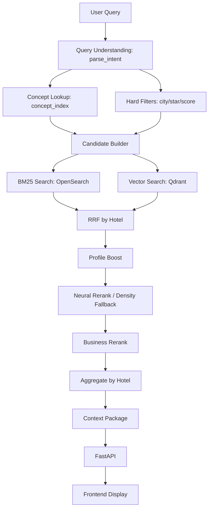

# DESIGN_RECOMMENDATION.md

Tài liệu đề xuất thiết kế lại giao diện DA10 OTA AI Search Platform theo hướng **Explainable Search / Explainable Retrieval**.

Phạm vi: phân tích từ code hiện có, không sửa source UI trong tài liệu này.

Nguyên tắc: giao diện mới không chỉ hiển thị danh sách khách sạn, mà phải trả lời được:

- Vì sao hệ thống hiểu query như vậy?
- Vì sao khách sạn này được xếp hạng cao?
- Ontology đóng góp gì vào search/retrieval?
- Kết quả hybrid/ontology tốt hơn BM25 thuần ở đâu?

## 1. Current Architecture Analysis

### 1.1 Pipeline thực tế trong code



Evidence:

- Query understanding: `retrieval/query_processing/intent_parser.py`, function `parse_intent`.
- Concept lookup: `retrieval/filtering/concept_index.py`, function `lookup_hotels_by_concepts`.
- Hard filters/candidates: `retrieval/filtering/hard_filter.py`, functions `inmemory_hard_filter`, `build_candidates`.
- Hybrid orchestrator: `retrieval/hybrid_search/pipeline.py`, function `run_hybrid_search`.
- BM25: `retrieval/lexical_search/service.py`, methods `search`, `search_for_fusion`.
- Vector: `retrieval/vector_search/qdrant_service.py`, class `QdrantSearchService`.
- Ranking: `retrieval/reranking/fusion.py`, functions `rrf_by_hotel`, `apply_profile_boost`, `business_rerank`, `aggregate_by_hotel`.
- Neural rerank: `retrieval/reranking/neural_rerank.py`, function `neural_rerank`.
- Context package: `context/context_package.py`.
- API: `api/main.py`.
- Frontend adapter: `api/frontend_adapter.py`.

### 1.2 API surface hiện có

| Endpoint | Status | Purpose | Evidence |
| --- | --- | --- | --- |
| `GET /search?q=` | IMPLEMENTED | BM25 baseline | `api/main.py`, `search_bm25` |
| `GET /hybrid_search?q=&top_n=` | IMPLEMENTED | Full retrieval trace oriented endpoint | `api/main.py`, `hybrid_search` |
| `POST /search` | IMPLEMENTED | Frontend-friendly Search response | `api/main.py`, `fe_search`; `api/frontend_adapter.py`, `to_search_response` |
| `POST /context` | IMPLEMENTED | Frontend-friendly Context response for selected hotel | `api/main.py`, `fe_context`; `api/frontend_adapter.py`, `build_hotel_context` |

### 1.3 Current frontend reality

| File | Current Role | Limitation |
| --- | --- | --- |
| `frontend/index.html` | Calls `GET /hybrid_search` and shows intent, score bars, matched chunks | Closer to trace view, but not structured as reviewer-grade explainability |
| `frontend/search_ui_v2.html` | Real backend Search/Context display after recent change | Shows real API output, but still lacks full explanation panels and ontology impact view |
| `frontend/src/components/**` | React-ready components | React/Vite runtime not confirmed as main demo path |

## 2. Existing Signals Found In Repo

### 2.1 Query Understanding pipeline

Implemented signals:

| Signal | Source Code | Available Shape |
| --- | --- | --- |
| Normalized query | `retrieval/query_processing/intent_parser.py` | Internal via `normalize` |
| Concepts | `ParsedIntent.concepts` | list of concept ids |
| Hard concepts | `ParsedIntent.hard_concepts` | `AMEN_`, `SETTING_` |
| Feel concepts | `ParsedIntent.feel_concepts` | `STYLE_`, `ASPECT_` |
| Object types | `ParsedIntent.object_types` | `OBJ_*` |
| Purposes | `ParsedIntent.purposes` | `PURPOSE_*` |
| Price tiers | `ParsedIntent.price_tiers` | `PRICE_*` |
| Landmarks | `ParsedIntent.landmarks` | `LMK_*` |
| Location concepts | `ParsedIntent.location_concepts` | `LOC_*` |
| City text | `ParsedIntent.city` | city string |
| Range filters | `ParsedIntent.range` | `price_min`, `price_max`, `score_min`, `star_eq` |
| Implicit intent evidence | `ParsedIntent.implicit` | `{concept_id: evidence}` |

Current gap:

- `parse_intent` returns concept groups, but does not expose per-concept `matched_text`, `source`, `confidence`, or ontology node metadata.
- The older `query_demo.py` has richer manual-test behavior, but production API uses `parse_intent`.

### 2.2 Ontology enrichment pipeline

Implemented assets/code:

| Pipeline Part | Evidence |
| --- | --- |
| Ontology core concepts | `ontology/core/*.yaml` |
| Synonym dictionary | `ontology/synonym_dictionary.yaml` |
| Metadata schema validation | `knowledge_engineering/metadata_extraction/schema.py` |
| Hotel metadata mapping | `knowledge_engineering/enrichment/metadata_pipeline.py` |
| Ontology mapper | `knowledge_engineering/enrichment/ontology_mapper.py` |
| Knowledge object builder | `knowledge_engineering/enrichment/build_objects.py` |
| KE labels bridge | `knowledge_engineering/common/ke_labels.py` |
| Chunk payload enrichment | `knowledge_engineering/chunking/strategies.py`, `attach_ke_labels` |

Current UI opportunity:

- The UI can show “Ontology labels attached to this hotel” from `metadata`, `context_package.chunks[].metadata.ontology_concepts`, and `ke_labels`-derived fields.
- The UI should not claim all ontology relations are applied in runtime ranking unless backend exposes the trace.

### 2.3 Query expansion pipeline

Implemented assets/code:

| Signal | Evidence |
| --- | --- |
| Compiled query expansion rules | `ontology/query_expansion.yaml` |
| Relation loader with validation | `knowledge_engineering/common/relation_loader.py` |
| Expansion evaluation | `knowledge_engineering/governance/evaluate_query_expansion.py` |
| Relation candidates/curated/rejected | `ontology/relations/*.yaml` |

Important finding:

- `ontology/query_expansion.yaml` has typed expansions with `relation_type`, `source_type`, `use_as`, `weight`, `confidence`, `status`.
- `run_hybrid_search` currently uses parsed concepts directly via `_candidate_concepts(intent)` and does not visibly call `ontology/query_expansion.yaml`.

Design implication:

- UI can show expansion graph as **available ontology explanation asset**.
- To claim expansion affected ranking, backend should expose `expanded_concepts` and `expansion_edges_used` from runtime.

### 2.4 Retrieval pipeline

Implemented signals:

| Stage | Evidence | UI Signal |
| --- | --- | --- |
| Candidate concepts | `retrieval/hybrid_search/pipeline.py`, `_candidate_concepts` | concept list used for lookup |
| Concept whitelist | `lookup_hotels_by_concepts` | concept candidate count, match count, IDF score |
| Hard filters | `inmemory_hard_filter` | city/star/score candidate count |
| Candidate builder | `build_candidates` | candidate count after intersection/fallback |
| BM25 retrieval | `BM25SearchService.search_for_fusion` | BM25 rank/score/source |
| Vector retrieval | `QdrantSearchService.search` | vector score/source/chunk |
| Fallback when no candidates | `run_hybrid_search` V3 comments | fallback reason |

Current gap:

- `run_hybrid_search` returns `n_candidates` and `n_fused`, but not all intermediate counts:
  - initial total hotels
  - count after hard filter
  - count after concept lookup
  - count after intersection
  - BM25 hit count
  - vector hit count

### 2.5 Ranking pipeline

Implemented signals:

| Signal | Evidence |
| --- | --- |
| RRF by hotel | `retrieval/reranking/fusion.py`, `rrf_by_hotel` |
| Profile boost | `apply_profile_boost` |
| Neural rerank / density fallback | `retrieval/reranking/neural_rerank.py` |
| Business rerank | `business_rerank` |
| Final hotel aggregation | `aggregate_by_hotel` |
| Ranking tests | `tests/test_fusion_ranking.py` |

Ranking factor candidates for UI:

- `rrf_score`
- `bm25_rank`
- `vector_rank`
- `profile_boost`
- `fused_score`
- `rerank_score`
- `text_signal_norm`
- `business_score`
- `final_score`
- `matched_chunks`
- `metadata.ke_review_score`
- `metadata.review_count`
- `metadata.ontology_concepts`
- `concept_match`
- `price_fit`

Current gap:

- `business_rerank` calculates internal components but only writes `text_signal_norm` and `business_score`.
- UI cannot show exact `review contribution`, `concept contribution`, `price contribution` unless backend adds breakdown fields.

### 2.6 Evidence / citation pipeline

Implemented signals:

| Signal | Evidence |
| --- | --- |
| Context package chunk citation index | `context/context_package.py`, `ContextChunk.citation_index` |
| Prompt with numbered citations | `build_context_string`, `build_prompt` |
| Frontend adapter citations | `api/frontend_adapter.py`, `to_search_response` |
| Context endpoint evidence | `api/frontend_adapter.py`, `build_hotel_context`, `_grounded_evidence` |
| LLM answer citations | `context/answer_generator.py`, `generate_answer` |

Current limitation:

- `POST /context` currently returns `citations`, `source_documents`, `context_chunks` as IDs plus `evidence`, not full rich citation objects.
- `to_search_response` builds simple citation/source/chunk from selected context chunk.
- There is a `context/citation_builder/README.md`, but no rich citation builder implementation found in code.

### 2.7 Review sentiment / semantic profile pipeline

Implemented signals:

| Signal | Evidence |
| --- | --- |
| ABSA extraction | `knowledge_engineering/enrichment/absa.py` |
| Review evidence files | `knowledge_engineering/enrichment/review_evidence/` |
| Profile builder | `knowledge_engineering/enrichment/profile_builder.py` |
| `semantic_profile` | `knowledge_engineering/common/ke_labels.py` |
| `negative_style_profile` | `profile_builder.py`, `ke_labels.py` |
| Grounded evidence extraction | `api/frontend_adapter.py`, `_grounded_evidence` |

UI value:

- This is one of the strongest signals for Explainable Search.
- UI should show:
  - positive aspects
  - negative aspects
  - evidence count
  - review span examples
  - whether signal is from `agoda_grades`, `agoda_review_tags`, or `absa`

### 2.8 Metadata enrichment pipeline

Implemented signals:

| Signal | Evidence |
| --- | --- |
| Location map | `metadata_pipeline.py`, `map_location` |
| Range filters | `map_range_filters` |
| Price tier inference | `infer_price_tier` |
| Nearby places | `map_nearby` |
| Knowledge object assembly | `build_objects.py` |
| Provenance/source URL | `build_objects.py`, `api/frontend_adapter.py` |

UI value:

- Metadata should not be just text under a card.
- It should be tied to ranking/filtering:
  - “Matched city filter”
  - “Matched family purpose”
  - “Matched kids amenity”
  - “Review score used in business ranking”

## 3. Missing Signals

### 3.1 Missing for Query Understanding Panel

Needed but not currently exposed by API:

| Missing Field | Why Needed |
| --- | --- |
| `matched_text` per concept | Explain why `PURPOSE_FAMILY` was detected |
| `source` per concept | distinguish synonym, implicit regex, location gazetteer, ontology relation |
| `confidence` per concept | reviewer trust |
| `ontology_node` label/facet | human-readable concept display |
| `negative_rules_triggered` | show concepts suppressed or conflicts handled |

### 3.2 Missing for Query Expansion Panel

Needed:

| Missing Field | Why Needed |
| --- | --- |
| `expanded_concepts` | show what ontology added |
| `expansion_edges_used` | display graph edges |
| `relation_type` | e.g. `evidence_for`, `broader`, `narrower` |
| `use_as` | filter/boost/suggestion/explanation |
| `expansion_impact` | whether edge affected filter/ranking |

Current data source:

- Can read from `ontology/query_expansion.yaml`, but API does not yet include runtime expansion trace.

### 3.3 Missing for Retrieval Pipeline Counts

Needed:

| Count | Current Status |
| --- | --- |
| total hotels | can infer from `load_ke_labels`, not returned |
| after hard filter | internal, not returned |
| after concept lookup | internal, not returned |
| after candidate builder | `n_candidates` returned |
| BM25 hits | internal, not returned |
| vector hits | internal, not returned |
| fused docs | `n_fused` returned |
| top hotels | returned |

### 3.4 Missing for Result Explanation

Needed:

```json
{
  "ranking_breakdown": {
    "base_text_score": 0.42,
    "rrf_score": 0.015,
    "profile_boost": 0.08,
    "review_score_component": 0.18,
    "review_count_component": 0.04,
    "concept_match_component": 0.07,
    "price_fit_component": 0.10,
    "final_score": 0.47
  }
}
```

Current code has parts of these, but not full component-level output.

### 3.5 Missing for Ontology Impact Panel

Needed:

| Metric | Source Needed |
| --- | --- |
| BM25-only result list | `GET /search` |
| Hybrid result list | `GET /hybrid_search` or `POST /search` |
| overlap | frontend can compute |
| newly surfaced relevant hotels | needs golden labels or relevance proxy |
| nDCG/Recall improvement | evaluation output from `evaluation/retrieval_metrics/eval_golden.py` |
| matched concepts difference | hybrid trace |

Current code has evaluation harness, but UI does not consume its report yet.

## 4. Wireframe Proposal

### 4.1 Main Layout

```text
┌──────────────────────────────────────────────────────────────┐
│ DA10 Explainable OTA Search                                  │
│ Search bar                                                   │
│ [query input..................................] [Search]      │
└──────────────────────────────────────────────────────────────┘

┌─────────────── Left Trace Column ───────────────┬──────────── Main Results ────────────┐
│ 1. Query Understanding                           │ Top-K Hotel Results                  │
│ 2. Query Expansion Graph                         │ ┌ Hotel Card #1                      │
│ 3. Retrieval Funnel                              │ │ Why this result?                   │
│ 4. Ontology Impact                               │ │ Evidence                           │
│                                                  │ │ Load Context                       │
│ Reviewer Mode toggle                             │ └─────────────────────────────────── │
└──────────────────────────────────────────────────┴─────────────────────────────────────┘
```

### 4.2 Tabs

Recommended tabs:

1. `Results`
2. `Query Understanding`
3. `Retrieval Trace`
4. `Ontology Impact`
5. `Reviewer Mode`
6. `Raw API`

## 5. UI Layout Sketch

### 5.1 Query Understanding Panel

Purpose: answer “Tại sao hệ thống hiểu query này?”

```text
Query: khách sạn phù hợp cho trẻ nhỏ gần VinWonders Phú Quốc

Detected Concepts
┌────────────────────────────┬────────────┬──────────────┬──────────────┐
│ Concept                    │ Confidence │ Matched Text │ Source       │
├────────────────────────────┼────────────┼──────────────┼──────────────┤
│ LOC_PHU_QUOC               │ N/A        │ Phú Quốc     │ synonym/gaz  │
│ LMK_VINWONDERS_PHU_QUOC    │ N/A        │ VinWonders   │ synonym/gaz  │
│ PURPOSE_FAMILY             │ N/A        │ trẻ nhỏ      │ implicit     │
│ OBJ_HOTEL                  │ N/A        │ khách sạn    │ synonym      │
└────────────────────────────┴────────────┴──────────────┴──────────────┘
```

Current API can show concept groups but not exact matched text/confidence. Therefore:

- Phase 1 UI: show concept groups from `intent`.
- Phase 2 backend: add `concept_trace`.

### 5.2 Query Expansion Panel

Purpose: answer “Ontology mở rộng query như thế nào?”

```text
PURPOSE_FAMILY
  ├─ evidence_for / boost / curated / confidence 0.85 -> AMEN_KIDS_CLUB
  ├─ evidence_for / boost / curated / confidence 0.85 -> AMEN_KIDS_POOL
  └─ broader / boost / curated / confidence 0.62 -> AMEN_POOL
```

Data source:

- `ontology/query_expansion.yaml`, `rules.*.expansions`.

Important warning:

- Do not label these edges as “used in ranking” unless backend returns them as used.
- Label as “available ontology expansion” until runtime confirms.

### 5.3 Retrieval Pipeline Panel

Purpose: answer “Lọc và retrieval đi qua những bước nào?”

```text
520 hotels
↓ Query Understanding
4 concepts detected
↓ Hard Filter
63 hotels
↓ Concept Lookup
128 hotels
↓ Candidate Builder
100 candidates
↓ BM25 + Vector
BM25 50 hits | Vector 50 hits
↓ RRF + Profile Boost + Business Rerank
10 final hotels
```

Phase 1 available now:

- `n_candidates`
- `n_fused`
- `top_hotels.length`
- `intent`

Phase 2 backend needs:

- `trace.counts.total_hotels`
- `trace.counts.hard_filter`
- `trace.counts.concept_lookup`
- `trace.counts.bm25_hits`
- `trace.counts.vector_hits`
- `trace.fallback_reason`

### 5.4 Result Explanation

Purpose: answer “Tại sao khách sạn này được xếp hạng cao?”

```text
WHY THIS RESULT?

Final score: 0.4732

Text Retrieval
- BM25 rank: 3
- Vector rank: 8
- RRF score: 0.0159

Ontology / Profile
- Matched concepts: PURPOSE_FAMILY, AMEN_KIDS_CLUB, LOC_PHU_QUOC
- Profile boost: +0.08

Business Ranking
- Review score component: +0.18
- Review count component: +0.04
- Concept match component: +0.07
- Price fit component: +0.10

Evidence
- Kids club from amenities
- Family positive reviews from ABSA
```

Phase 1 available now:

- `top_hotels[].rrf_score`
- `top_hotels[].bm25_rank`
- `top_hotels[].vector_rank`
- `top_hotels[].rerank_score`
- `top_hotels[].business_score`
- `top_hotels[].final_score`
- `top_hotels[].matched_chunks`
- `top_hotels[].metadata`

Phase 2 backend needs:

- explicit score contribution fields from `business_rerank`.

### 5.5 Evidence Panel

Purpose: tie every ranking signal to source.

```text
Signal: Kids Club
Evidence source: ontology_concepts / amenities
Value: AMEN_KIDS_CLUB
Source: knowledge_objects.json / hotel metadata

Signal: Family friendly
Evidence source: ABSA review
Span: "resort rất phù hợp cho gia đình có trẻ nhỏ"
Confidence/score: 0.83
Source: review_evidence/hotel_<id>.json
```

Available now:

- `POST /context` returns `evidence.positives` and `evidence.negatives`.
- Search response has simple citations/source documents/context chunks via `api/frontend_adapter.py`.

Recommended UI:

- Evidence should be grouped by signal:
  - metadata evidence
  - ontology evidence
  - review evidence
  - retrieval chunk evidence
  - negative evidence

### 5.6 Ontology Impact Panel

Purpose: answer “Ontology có cải thiện search không?”

Recommended comparison:

```text
Without Ontology: BM25 only
Endpoint: GET /search

With Ontology: Hybrid retrieval
Endpoint: GET /hybrid_search

┌──────────────────────┬──────────────┬─────────────────┐
│ Metric               │ BM25 Only    │ With Ontology   │
├──────────────────────┼──────────────┼─────────────────┤
│ Matched concepts     │ 0            │ 4               │
│ Candidate control    │ no           │ yes             │
│ Review/profile boost │ no           │ yes             │
│ Context package      │ no           │ yes             │
│ Overlap top 10       │ frontend compute             │
└──────────────────────┴──────────────┴─────────────────┘
```

If evaluation report exists:

```text
BM25-only nDCG@10
Hybrid nDCG@10
BM25-only Recall@10
Hybrid Recall@10
```

Evidence:

- BM25 baseline: `GET /search`.
- Hybrid: `GET /hybrid_search`.
- Evaluation harness: `evaluation/retrieval_metrics/eval_golden.py`.
- Golden review: `docs/reports/evaluation/golden_dataset_review.md`.

### 5.7 Reviewer Mode

Purpose: make mentor/reviewer understand what happened.

Reviewer Mode should display:

- Parsed intent raw JSON.
- Detected concepts grouped by facet.
- Expansion graph.
- Hard filters triggered.
- Candidate counts.
- BM25/vector/fusion ranking table.
- Per-result ranking factors.
- Evidence/citation trace.
- Negative rules/signals.
- Raw API response.

Recommended warning badges:

- `Runtime-used`
- `Available ontology asset`
- `Not used in ranking yet`
- `Mock not used`
- `Evidence from ABSA`
- `Evidence from metadata`

## 6. Component Hierarchy

Recommended component tree for future React or modular HTML:

```text
ExplainableSearchApp
├── SearchHeader
├── SearchControls
│   ├── QueryInput
│   ├── DemoQueryButtons
│   └── BackendStatusBadge
├── MainLayout
│   ├── ExplainabilitySidebar
│   │   ├── QueryUnderstandingPanel
│   │   ├── QueryExpansionPanel
│   │   ├── RetrievalFunnelPanel
│   │   └── OntologyImpactPanel
│   └── ResultsWorkspace
│       ├── ResultList
│       │   └── ExplainableResultCard
│       │       ├── MetadataSummary
│       │       ├── RankingBreakdown
│       │       ├── EvidencePanel
│       │       ├── ContextLoader
│       │       └── RawResultDetails
│       └── ReviewerModePanel
│           ├── IntentJsonViewer
│           ├── RankingTraceTable
│           ├── ContextPackageViewer
│           └── RawApiViewer
```

## 7. Mapping From Backend Data To UI Component

### 7.1 `GET /hybrid_search`

| Backend Field | UI Component | Notes |
| --- | --- | --- |
| `intent` | QueryUnderstandingPanel | show concept groups, range, city |
| `intent.concepts` | DetectedConceptList | currently no matched text/confidence |
| `intent.hard_concepts` | HardConceptBadges | filter-oriented concepts |
| `intent.feel_concepts` | Profile/ReviewConceptBadges | ranking-oriented concepts |
| `intent.landmarks` | Location/LandmarkPanel | show landmark reasoning |
| `intent.range` | HardFilterPanel | show star/price/review constraints |
| `n_candidates` | RetrievalFunnelPanel | candidate count after filtering/building |
| `n_fused` | RetrievalFunnelPanel | fused count after text retrieval/fusion |
| `top_hotels` | ResultList | best source for ranking explanation |
| `top_hotels[].rrf_score` | RankingBreakdown | text retrieval/fusion signal |
| `top_hotels[].bm25_rank` | RankingBreakdown | BM25 contribution |
| `top_hotels[].vector_rank` | RankingBreakdown | vector contribution |
| `top_hotels[].rerank_score` | RankingBreakdown | neural/density rerank |
| `top_hotels[].business_score` | RankingBreakdown | business ranking |
| `top_hotels[].final_score` | Result score | final display score |
| `top_hotels[].metadata.semantic_profile` | EvidencePanel | review/profile signals |
| `context_package` | ContextPackageViewer | chunks + citation index |
| `prompt` | LLMConsumptionPreview | prompt shown in reviewer mode |

### 7.2 `POST /search`

| Backend Field | UI Component | Notes |
| --- | --- | --- |
| `query` | SearchSummary | original query |
| `total` | SearchSummary | number of results |
| `results[].id` | ResultCard | `hotel_<id>` |
| `results[].title` | ResultCard title | hotel name |
| `results[].snippet` | ResultCard snippet | context/search text |
| `results[].score` | Result score | adapter score |
| `results[].metadata.location` | MetadataSummary | city/province |
| `results[].metadata.category` | MetadataSummary | object type |
| `results[].metadata.amenities` | MetadataSummary/Evidence | ontology-derived amenity labels |
| `results[].metadata.best_for` | MetadataSummary | purpose labels |
| `results[].citations` | CitationPreview | simple search-time citation |
| `results[].source_documents` | SourceDocumentPreview | source URL/id |
| `results[].context_chunks` | ContextPreview | selected chunk |

### 7.3 `POST /context`

| Backend Field | UI Component | Notes |
| --- | --- | --- |
| `result_id` | ContextHeader | selected hotel |
| `llm_context` | LLMConsumptionPreview | generated/grounded answer |
| `citations` | CitationPanel | currently ids |
| `source_documents` | SourceDocumentPanel | currently ids |
| `context_chunks` | ContextChunkPanel | currently ids |
| `evidence.positives` | EvidencePanel | ABSA positive aspects |
| `evidence.negatives` | NegativeEvidencePanel | warning/limitations |

### 7.4 `ontology/query_expansion.yaml`

| Field | UI Component | Notes |
| --- | --- | --- |
| `rules.<concept>.expands_to` | QueryExpansionGraph | simple graph edges |
| `rules.<concept>.expansions[].target` | Graph node | target concept |
| `relation_type` | Edge label | e.g. `evidence_for`, `broader` |
| `source_type` | Edge metadata | e.g. curated |
| `use_as` | Edge badge | filter/boost/suggestion |
| `weight` | Edge strength | display bar |
| `confidence` | Edge confidence | display percent |
| `status` | Edge status | verified/candidate |

## 8. Proposed Code Direction

Do not start by rewriting all frontend. Recommended sequence:

### Phase 1: Improve existing standalone real UI

Target file:

- `frontend/search_ui_v2.html`

Changes:

1. Keep it real-backend only.
2. Add left sidebar explainability panels.
3. Use `GET /hybrid_search` as primary data source for:
   - Query Understanding Panel
   - Retrieval Pipeline Panel
   - Ranking Explanation
   - LLM Context Preview
4. Keep `POST /context` for selected hotel evidence/LLM answer.
5. Add BM25 comparison by calling `GET /search`.

Reason:

- No React/Vite dependency.
- Demo-ready.
- Current backend already exposes `/hybrid_search`, `/search`, `/context`.

### Phase 2: Add backend trace fields

Needed backend additions:

```json
{
  "trace": {
    "concept_trace": [],
    "expansion_trace": [],
    "counts": {},
    "ranking_breakdown": {}
  }
}
```

Recommended source functions:

- `parse_intent` should optionally return concept match trace.
- `lookup_hotels_by_concepts` should expose concept-level counts.
- `build_candidates` should expose fallback reason and intersection counts.
- `business_rerank` should output component contributions.

### Phase 3: React componentization

Only after standalone demo is accepted:

- Extract panels into React-ready components.
- Align `frontend/src/api/api_client.js` with real `/search`, `/context`, `/hybrid_search`.
- Do not use `/api/v1/search` unless backend implements it.

## 9. Recommended UI Priority For NDHieu

### P0

- Add Query Understanding Panel using `GET /hybrid_search.intent`.
- Add Ranking Breakdown using `top_hotels` fields.
- Add Evidence Panel using `POST /context.evidence`.
- Add BM25 vs Hybrid comparison using `GET /search` and `GET /hybrid_search`.

### P1

- Add Query Expansion Graph from `ontology/query_expansion.yaml` or a backend endpoint.
- Add retrieval funnel counts once backend exposes more trace.
- Add per-signal evidence grouping.

### P2

- Build full React version.
- Add evaluation metrics from `evaluation/retrieval_metrics/eval_golden.py` outputs.
- Add reviewer export/report button.

## 10. Risks

| Risk | Severity | Explanation | Mitigation |
| --- | --- | --- | --- |
| UI overclaims ontology impact | HIGH | Expansion asset exists but runtime may not use it directly | Label as available vs runtime-used |
| Ranking breakdown incomplete | HIGH | Backend does not expose component-level contributions | Add trace fields before final claim |
| Context citations are shallow | MEDIUM | `/context` returns citation/source/chunk IDs, not rich citation objects | Show IDs now; request richer citation package |
| BM25 vs Hybrid comparison may be unfair | MEDIUM | Different endpoints/shapes and top-k behavior | Present as diagnostic, not final evaluation |
| Evaluation metrics not live in UI | MEDIUM | Eval harness exists, dashboard integration not direct | Use static report or add evaluation API later |
| Reviewer sees too much raw JSON | LOW | Raw trace is useful but noisy | Hide under details/advanced mode |

## 11. Final Recommendation

The next UI should be positioned as:

```text
DA10 Explainable Retrieval Console
```

Not just:

```text
Hotel Search UI
```

The highest-value demo is not a prettier result list. It is a traceable explanation:

```text
Query
-> concepts detected
-> ontology/metadata signals
-> candidate funnel
-> BM25/vector retrieval
-> fusion/reranking
-> evidence/citation
-> LLM-ready context
```

Recommended implementation start after this document:

1. Modify `frontend/search_ui_v2.html`.
2. Make `/hybrid_search` the main search call for explainability.
3. Keep `/context` for selected hotel evidence.
4. Add `/search` BM25-only comparison panel.
5. Avoid claiming query expansion affected ranking until backend exposes runtime expansion trace.

