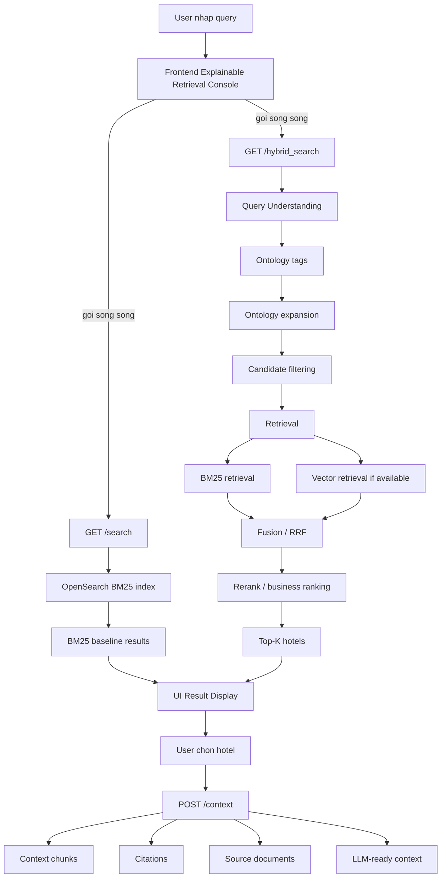
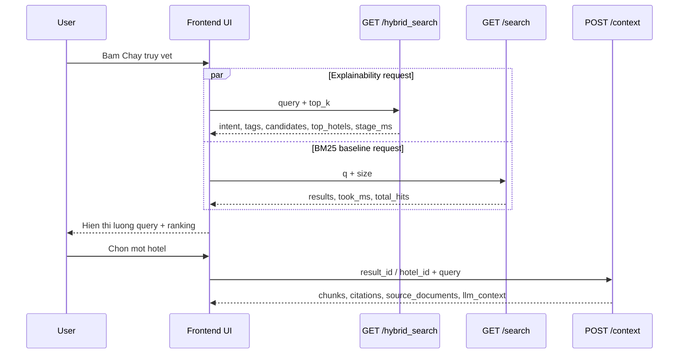

# Query Flow Diagram Preview

Muc dich: preview so do truc quan de giai thich duong di cua mot cau query trong giao dien Explainable Retrieval Console.

Query demo:

```text
khach san phu hop cho tre nho gan VinWonders Phu Quoc
```

## Diagram 1 - User Query To Result



## Diagram 2 - Explainable Search Journey

```mermaid
flowchart LR
    Q[1. Query goc] --> A[2. Gan ontology tags]
    A --> B[3. Mo rong ontology]
    B --> C[4. Tim ung vien]
    C --> D[5. BM25 / Vector retrieval]
    D --> E[6. Fusion]
    E --> F[7. Rerank]
    F --> G[8. Top-K hotels]
    G --> H[9. Context package]
    H --> I[10. Citation / evidence]
```



## Diagram 3 - Timing View



## UI Placement Proposal

Neu anh duyet, em se them mot nut nho trong section `Latency trace`:

```text
[Xem so do luong du lieu + timing]
```

Khi bam nut:

- Mo/thu gon panel diagram ngay ben duoi latency.
- Hien thi flow ASCII hoac Mermaid-style static HTML.
- Hien thi thoi gian tren tung canh/buoc neu frontend da co timing.
- Khong goi them backend.
- Khong anh huong latency.

## Diagram 4 - UI Flow With Timing Labels

Day la ban de nhung vao UI sau khi anh duyet. Thoi gian se lay tu bien latency dang co trong frontend:

- `timing.totalMs`
- `timing.requests.hybrid.durationMs`
- `timing.requests.bm25.durationMs`
- `state.bm25.took_ms`
- `state.hybrid.stage_ms.intent`
- `state.hybrid.stage_ms.filter`
- `state.hybrid.stage_ms.text_retrieval`
- `state.hybrid.stage_ms.fusion`
- `state.hybrid.stage_ms.rerank`
- `state.hybrid.stage_ms.context`
- `timing.context[selectedHotelId].durationMs`

Mock layout khi da co data:

```text
[User Query]
   |
   | wall-clock: 1779.8 ms
   v
[Frontend UI]
   |
   +-----------------------------+
   |                             |
   | GET /hybrid_search          | GET /search
   | 1775.6 ms                   | 786.6 ms
   v                             v
[Query Understanding]        [BM25 Baseline]
 intent: 26.5 ms              backend took_ms: 755 ms
   |
   v
[Candidate Filter]
 filter: 700.3 ms
   |
   v
[Text Retrieval]
 text_retrieval: 581.5 ms
   |
   v
[Fusion]
 fusion: 406.9 ms
   |
   v
[Rerank]
 rerank: 0.8 ms
   |
   v
[Top-K Hotels]
   |
   | after user selects hotel
   v
[POST /context]
 request: only measured after click
   |
   v
[Chunks + Citations + Evidence]
```

Neu backend khong tra field nao, UI se hien:

```text
TODO: backend chua expose timing cho buoc nay
```
## Noi dung nen hien thi trong UI

```text
Query
  -> Frontend
  -> GET /hybrid_search
      -> Query Understanding
      -> Ontology Tags
      -> Candidate Filtering
      -> Retrieval
      -> Fusion
      -> Rerank
      -> Top-K Hotels
  -> GET /search
      -> BM25 Baseline
  -> User selects hotel
  -> POST /context
      -> Context Chunks
      -> Citations
      -> Source Documents
      -> LLM-ready Context
```

## Ghi chu demo

- `/hybrid_search` va `/search` chay song song.
- `wall-clock latency` gan bang request lau nhat, khong phai tong cua tat ca request.
- `Backend stage_ms` la breakdown ben trong `/hybrid_search`.
- `POST /context` chi chay sau khi user chon mot khach san.
