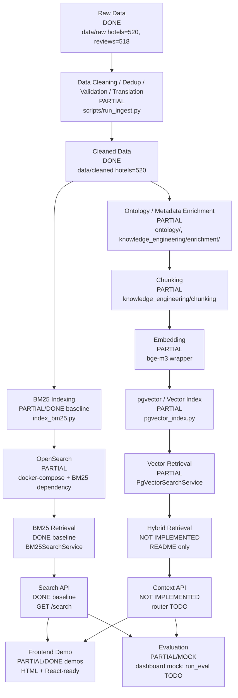
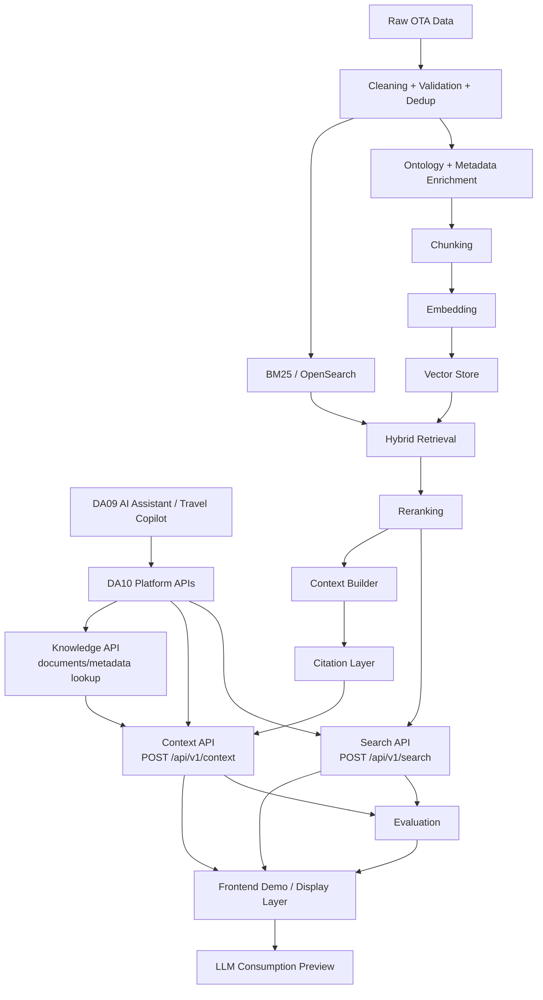

# REPOSITORY REVIEW - DA10 OTA AI Search Platform

Generated date: 2026-06-17

Vai trò báo cáo: Senior Technical Auditor + Software Architect + Project Manager.

Nguyên tắc:

- Không sửa source code.
- Chỉ dùng bằng chứng có trong repository.
- Nếu thiếu bằng chứng, ghi rõ: `KHÔNG ĐỦ BẰNG CHỨNG`.
- Các phần trăm là ước lượng audit dựa trên artifact hiện có, không phải cam kết chính thức của team.

Ghi chú trạng thái workspace khi audit: working tree đang có file frontend modified và một số file untracked. Evidence: `git status --short --branch` trong quá trình review.

## 1. Executive Summary

DA10 OTA AI Search Platform là lớp Knowledge & Retrieval cho hệ thống travel/OTA. Theo README, DA10 có nhiệm vụ thu nạp dữ liệu du lịch, làm giàu, lập chỉ mục và cung cấp reusable Search / Context / Knowledge API cho DA09 và các hệ thống AI khác. DA10 không phải chatbot/end-user UI của DA09. Evidence: `README.md:3-9`, `README.md:13-22`.

Pipeline mục tiêu của dự án:

```text
Raw Data
-> Data Cleaning
-> Ontology / Metadata Enrichment
-> Chunking
-> Embedding
-> BM25 Retrieval
-> Vector Retrieval
-> Hybrid Retrieval
-> Search API
-> Context API
-> Evaluation
-> Frontend Demo
-> DA09 AI Assistant
```

Hiện trạng thực tế mạnh nhất trong repo là đường BM25 baseline:

```text
data/cleaned/*.json
-> indexing/bm25_index/index_bm25.py
-> OpenSearch
-> api/main.py GET /search
-> frontend/search_ui_v2.html REAL_BM25 mode
```

Evidence:

- Có 520 file JSON trong `data/cleaned`, 520 raw hotel JSON và 518 raw review JSON theo filesystem scan.
- BM25 indexer đọc `data/cleaned` và map hotel fields vào OpenSearch document: `indexing/bm25_index/index_bm25.py:48-140`.
- FastAPI tạo OpenSearch client và `BM25SearchService`: `api/main.py:18-24`.
- FastAPI expose `GET /search`: `api/main.py:61-79`.
- `search_ui_v2.html` có REAL_BM25 mode gọi `GET /search`: `frontend/search_ui_v2.html:422`, `frontend/search_ui_v2.html:969-989`.

Những phần đã có nhưng chưa hoàn chỉnh:

- Vector indexing/search bằng pgvector đã có code, nhưng chưa được nối vào FastAPI. Evidence: `indexing/vector_index/pgvector_index.py:1-214`, `retrieval/vector_search/service.py:1-134`, `api/main.py:82-86`.
- Chunking có code cho hotel/review/CMS, nhưng persisted processed chunk artifacts chưa được xác nhận; `data/processed` chỉ có `.gitkeep` theo filesystem scan. Evidence: `knowledge_engineering/chunking/strategies.py:143-260`.
- Frontend có standalone demos và React-ready components, nhưng chưa có React/Vite runtime. Evidence: `frontend/README.md:12-24`.
- Evaluation dashboard frontend có mock/demo, nhưng evaluation harness thật chưa implement. Evidence: `frontend/evaluation_dashboard.html:267-280`, `scripts/run_eval.py:1-5`.

Blocker lớn nhất: real RAG flow chưa thể chạy end-to-end vì Context API chưa được implement trong FastAPI và API contract còn lệch giữa current `/search`, planned `/search`, và proposed `/api/v1/search`. Evidence: `api/main.py:82-86`, `docs/08_api_contract.md:5-17`, `docs/Vu_Duc_Kien/VuDucKien_api_schema_proposal.md:27-29`, `docs/Vu_Duc_Kien/VuDucKien_api_schema_proposal.md:313`.

Tiến độ tổng thể audit: khoảng 48%.

Lý do: Data + BM25 baseline + demo frontend đã có artifact đáng kể; Context API, hybrid retrieval, reranking, real evaluation và React runtime vẫn thiếu hoặc chưa được verify.

## 2. Current Architecture (AS-IS)



AS-IS facts:

- Current API entrypoint is `api/main.py`, not `api/routes/*`. Evidence: `api/main.py:47-86`.
- Registered routes are `/health`, `/metrics`, `/search`. Evidence: `api/main.py:50-79`.
- TODO comments show Search/Context/Knowledge routers are not registered. Evidence: `api/main.py:82-86`.
- `GET /search` calls `keyword_search_service.search(q)`. Evidence: `api/main.py:71-75`.
- `BM25SearchService` builds OpenSearch `multi_match` over `name`, `description^2`, `city`, `address`, `amenities`. Evidence: `retrieval/lexical_search/service.py:11`, `retrieval/lexical_search/service.py:61-72`.
- `BM25SearchService` returns `query`, `results`, `took_ms`, `total_hits`. Evidence: `retrieval/lexical_search/service.py:54-59`.
- Each BM25 result maps `id`, `name`, `accommodation_type`, `star_rating`, `review_score`, `address`, `city`, `description`, `score`. Evidence: `retrieval/lexical_search/service.py:75-87`.

## 3. Target Architecture (TO-BE)



TO-BE evidence:

- README mô tả DA10 cung cấp Search / Context / Knowledge API cho DA09. Evidence: `README.md:3-8`, `README.md:36-42`.
- `docs/08_api_contract.md` mô tả planned Search API, Context API, Knowledge API. Evidence: `docs/08_api_contract.md:5-17`.
- Kien proposal định nghĩa `POST /api/v1/search`. Evidence: `docs/Vu_Duc_Kien/VuDucKien_api_schema_proposal.md:27-49`.
- Kien proposal định nghĩa `POST /api/v1/context`. Evidence: `docs/Vu_Duc_Kien/VuDucKien_api_schema_proposal.md:313`.
- NDHieu frontend architecture xác định frontend là DA10 display/demo layer, không phải chatbot DA09 hoặc backend retrieval. Evidence: `docs/docs_NDHieu/HIEU_FRONTEND_ARCHITECTURE.md:55-91`, `docs/docs_NDHieu/HIEU_FRONTEND_ARCHITECTURE.md:93-130`.

## 4. Module Breakdown

| Module | Owner | Status | Progress | Evidence |
| ------ | ----- | ------ | -------- | -------- |
| Data Collection | OWNER UNKNOWN | PARTIAL | 70% | `crawler/`, `crawler/main.py`; `scripts/run_crawl.py:1-5` raises `NotImplementedError`; 520 raw hotel files found |
| Data Cleaning | Do Minh Hieu theo docs | PARTIAL/DONE baseline | 70% | `scripts/run_ingest.py:1-12`; `docs/docs_NDHieu/TEAM_OWNERSHIP.md:19`; 520 cleaned files found |
| Ontology | Truong Anh Long theo docs | PARTIAL | 65% | `ontology/`; `docs/docs_NDHieu/TEAM_OWNERSHIP.md:20`; recent commits mention ontology fixes in git log |
| Metadata Enrichment | Truong Anh Long theo docs | PARTIAL | 60% | `knowledge_engineering/enrichment/`; `knowledge_engineering/enrichment/hotel_profiles.json`; `docs/docs_NDHieu/TEAM_DEPENDENCY_MAP.md:107-130` |
| Chunking | Nguyen Ngoc Khanh Duy theo docs | PARTIAL | 60% | `knowledge_engineering/chunking/strategies.py:143-260`; `docs/docs_NDHieu/TEAM_OWNERSHIP.md:21` |
| Embedding | OWNER UNKNOWN | PARTIAL | 55% | `indexing/embedding/models.py:1-73`; `requirements.txt:26-28` |
| BM25 | Le Hoang Dat theo docs | DONE baseline | 75% | `retrieval/lexical_search/service.py:40-93`; `docs/docs_NDHieu/TEAM_OWNERSHIP.md:22` |
| OpenSearch | Le Hoang Dat theo docs | PARTIAL/DONE baseline | 70% | `docker-compose.yml:31-40`; `indexing/bm25_index/index_bm25.py:162-210`; `docs/Le Hoang Dat/opensearch_index_run_guide.md` |
| Qdrant | OWNER UNKNOWN | CONFIG ONLY | 20% | `docker-compose.yml:24-29`; no verified API integration |
| Vector Retrieval | OWNER UNKNOWN | PARTIAL | 45% | `retrieval/vector_search/service.py:31-50`, `retrieval/vector_search/service.py:119-134`; not wired to FastAPI |
| Hybrid Retrieval | Nguyen Anh Tai theo dependency docs | NOT IMPLEMENTED | 10% | `retrieval/hybrid_search/README.md:1-4`; `docs/docs_NDHieu/TEAM_OWNERSHIP.md:23` |
| Reranking | Nguyen Anh Tai theo dependency docs | NOT IMPLEMENTED | 5% | `retrieval/reranking/README.md:1-4`; no runtime code found |
| Search API | Vu Duc Kien planned owner; current implementation owner unknown | PARTIAL | 50% | current `GET /search`: `api/main.py:61-79`; proposed Kien schema: `docs/Vu_Duc_Kien/VuDucKien_api_schema_proposal.md:27-49` |
| Context API | Vu Duc Kien planned owner | NOT IMPLEMENTED | 10% | `api/main.py:82-86`; `docs/Vu_Duc_Kien/VuDucKien_api_schema_proposal.md:313`; `tests/test_context.py:1-5` |
| Knowledge API | OWNER UNKNOWN | NOT IMPLEMENTED | 5% | planned in `docs/08_api_contract.md:13-17`; no FastAPI route found |
| Evaluation | Vu Duc Kien theo docs | PARTIAL/MOCK | 20% | `scripts/run_eval.py:1-5`; `frontend/evaluation_dashboard.html:267-280`; `docs/docs_NDHieu/HIEU_FRONTEND_ARCHITECTURE.md:146-178` |
| Dashboard | Nguyen Duy Hieu | PARTIAL/DONE mock display | 65% | `frontend/evaluation_dashboard.html:267-348`; `docs/docs_NDHieu/HIEU_TASK_BOARD.md:210-218` |
| Frontend | Nguyen Duy Hieu | PARTIAL/DONE demos | 65% | `frontend/README.md:12-24`; `frontend/search_ui.html`; `frontend/search_ui_v2.html:410-422`; `docs/docs_NDHieu/HIEU_TASK_BOARD.md:31-45` |

## 5. Ownership Analysis

Ownership dưới đây chỉ dựa trên repo docs, task board, status files và commit messages. Nếu không đủ bằng chứng, ghi `KHÔNG ĐỦ BẰNG CHỨNG`.

### Nguyen Duy Hieu

Scope được xác nhận:

- Frontend Demo Tool / DA10 Display Layer. Evidence: `docs/docs_NDHieu/HIEU_TASK_BOARD.md:1-13`, `docs/docs_NDHieu/HIEU_CURRENT_STATUS.md:5-33`, `docs/docs_NDHieu/HIEU_FRONTEND_ARCHITECTURE.md:1-16`.
- Search/RAG result display, metadata, citation, source document, context chunk, LLM preview, evaluation display, demo UX. Evidence: `docs/docs_NDHieu/HIEU_FRONTEND_ARCHITECTURE.md:93-130`.
- Không sở hữu backend API, retrieval/ranking, embedding, chunking, data cleaning, metric calculation, DA09 chatbot generation. Evidence: `docs/docs_NDHieu/HIEU_CURRENT_STATUS.md:22-33`.

Đã làm:

- `frontend/search_ui.html` standalone demo. Evidence: `docs/docs_NDHieu/HIEU_TASK_BOARD.md:52`, `docs/docs_NDHieu/HIEU_TASK_BOARD.md:81`.
- `frontend/mock_api_responses.json`. Evidence: `docs/docs_NDHieu/HIEU_TASK_BOARD.md:54`, `docs/docs_NDHieu/HIEU_TASK_BOARD.md:83`.
- `frontend/frontend_design.md`, `frontend/dashboard_design.md`, `frontend/demo_scenarios.md`. Evidence: `docs/docs_NDHieu/HIEU_TASK_BOARD.md:51-55`.
- React-ready components for Kien schema v1. Evidence: `docs/docs_NDHieu/HIEU_TASK_BOARD.md:67`, `docs/docs_NDHieu/HIEU_CURRENT_STATUS.md:231-240`.
- `frontend/search_ui_v2.html` standalone Search UI v2. Evidence: `docs/docs_NDHieu/HIEU_TASK_BOARD.md:68`, `frontend/search_ui_v2.html:410-422`.
- Evaluation Dashboard display layer mock/demo. Evidence: `docs/docs_NDHieu/HIEU_TASK_BOARD.md:210-218`, `frontend/evaluation_dashboard.html:267-280`.

Chưa làm / chưa hoàn tất:

- React/Vite runtime chưa có. Evidence: `frontend/README.md:18-24`, `docs/docs_NDHieu/HIEU_TASK_BOARD.md:65-66`.
- Real backend integration chưa verify. Evidence: `docs/docs_NDHieu/HIEU_CURRENT_STATUS.md:100-109`, `docs/docs_NDHieu/HIEU_TASK_BOARD.md:72`.
- Final dashboard integration còn IN_PROGRESS. Evidence: `docs/docs_NDHieu/HIEU_TASK_BOARD.md:69`.
- E2E testing còn IN_PROGRESS/checklist. Evidence: `docs/docs_NDHieu/HIEU_TASK_BOARD.md:70`, `docs/docs_NDHieu/HIEU_CURRENT_STATUS.md:242-246`.
- UX/report feedback còn cần review demo laptop/projector. Evidence: `docs/docs_NDHieu/HIEU_TASK_BOARD.md:138-143`.

### Vu Duc Kien

Đã làm / được gán:

- API & Evaluation / metric calculation owner theo docs. Evidence: `docs/docs_NDHieu/TEAM_OWNERSHIP.md:17-18`, `docs/docs_NDHieu/HIEU_FRONTEND_ARCHITECTURE.md:146-178`.
- Proposed Search API và Context API schema. Evidence: `docs/Vu_Duc_Kien/VuDucKien_api_schema_proposal.md:1-8`, `docs/Vu_Duc_Kien/VuDucKien_api_schema_proposal.md:27-49`, `docs/Vu_Duc_Kien/VuDucKien_api_schema_proposal.md:313`.
- Commit history có branch/PR liên quan `kien_eval_mornitor`. Evidence: `git log --oneline --max-count=30` có `6c95144 Merge pull request #36 from truonganhlong/kien_eval_mornitor`.

Chưa làm / chưa có bằng chứng implement:

- `POST /api/v1/search` chưa thấy trong FastAPI runtime. Evidence: `api/main.py:50-86`.
- `POST /api/v1/context` chưa thấy trong FastAPI runtime. Evidence: `api/main.py:82-86`.
- Real evaluation engine/harness chưa implement trong `scripts/run_eval.py`. Evidence: `scripts/run_eval.py:1-5`.

### Do Minh Hieu

Được gán:

- Data Quality / cleaning docs. Evidence: `docs/docs_NDHieu/TEAM_OWNERSHIP.md:19`, `docs/Do Minh Hieu/data_quality_report.md`, `docs/Do Minh Hieu/cleaning_rules.md`.

Đã có artifact:

- Ingestion pipeline orchestration. Evidence: `scripts/run_ingest.py:1-12`.
- Cleaning/dedup/validation modules exist. Evidence: `ingestion/cleaning/`, `ingestion/deduplication/`, `ingestion/validation/`.

Chưa đủ bằng chứng:

- Ai là production owner của toàn bộ current cleaned dataset: `KHÔNG ĐỦ BẰNG CHỨNG`.

### Truong Anh Long

Được gán:

- Knowledge Engineering / ontology dependency inputs. Evidence: `docs/docs_NDHieu/TEAM_OWNERSHIP.md:20`, `docs/docs_NDHieu/TEAM_DEPENDENCY_MAP.md:107-130`.

Đã có artifact:

- `ontology/`, `knowledge_engineering/enrichment/`, relation and query expansion docs. Evidence: filesystem scan, `docs/reports/ontology/`.
- Commit history có nhiều commit ontology/relation/enrichment. Evidence: `git log --oneline --max-count=30` có `38dbcc1 feat(ontology): relation graph + query expansion governance pipeline`, `8bab7d3 fix(ontology)...`.

### Nguyen Ngoc Khanh Duy

Được gán:

- Chunk/context structure dependency. Evidence: `docs/docs_NDHieu/TEAM_OWNERSHIP.md:21`.

Đã có artifact:

- Chunking and embedding reports. Evidence: `docs/Nguyen Ngoc Khanh Duy/chunking_report.md`, `docs/Nguyen Ngoc Khanh Duy/embedding_report.md`.
- Commit history có PR `feature/chunking-embedding`. Evidence: `git log --oneline --max-count=30` có `432efdd Merge pull request #41 from truonganhlong/feature/chunking-embedding`.

Chưa đủ bằng chứng:

- Ai trực tiếp implement `knowledge_engineering/chunking/strategies.py`: `KHÔNG ĐỦ BẰNG CHỨNG`.

### Le Hoang Dat

Được gán:

- Search infrastructure/OpenSearch dependency. Evidence: `docs/docs_NDHieu/TEAM_OWNERSHIP.md:22`, `docs/Le Hoang Dat/opensearch_index_run_guide.md`.

Đã có artifact:

- OpenSearch guide, keyword search guide, SLO docs. Evidence: `docs/Le Hoang Dat/opensearch_index_run_guide.md`, `docs/Le Hoang Dat/keyword_search_implementation_guide.md`, `docs/Le Hoang Dat/slo_defination.md`.

### Nguyen Anh Tai

Được gán:

- Retrieval/ranking dependency. Evidence: `docs/docs_NDHieu/TEAM_OWNERSHIP.md:23`.

Chưa đủ bằng chứng:

- Runtime implementation for hybrid retrieval/ranking by this owner: `KHÔNG ĐỦ BẰNG CHỨNG`.

## 6. Progress Assessment

| Area | Progress | Giải thích |
| ---- | -------- | ---------- |
| DA10 Overall | 48% | Data + BM25 + baseline API + frontend demos có thật; Context API, hybrid retrieval, reranking, real evaluation chưa hoàn chỉnh. Evidence: `api/main.py:50-86`, `scripts/run_eval.py:1-5`, `retrieval/hybrid_search/README.md:1-4`. |
| Data Layer | 75% | 520 raw hotel, 518 review, 520 cleaned file; ingestion runner có clean/dedup/validate/translate. Tests ingestion vẫn skip/TODO. Evidence: filesystem scan, `scripts/run_ingest.py:1-12`, `tests/test_ingestion.py:7-107`. |
| Retrieval Layer | 45% | BM25 service done baseline, vector service partial, hybrid/reranking not implemented. Evidence: `retrieval/lexical_search/service.py:40-93`, `retrieval/vector_search/service.py:31-50`, `retrieval/hybrid_search/README.md:1-4`, `retrieval/reranking/README.md:1-4`. |
| Context Layer | 15% | Chunking code có; Context API/citation runtime chưa có. Evidence: `knowledge_engineering/chunking/strategies.py:143-260`, `api/main.py:82-86`, `tests/test_context.py:1-5`. |
| API Layer | 45% | FastAPI có health, metrics, BM25 search; Context/Knowledge routers TODO; Kien v1 schema chưa implement. Evidence: `api/main.py:50-86`, `docs/Vu_Duc_Kien/VuDucKien_api_schema_proposal.md:27-49`. |
| Frontend Layer | 65% | Standalone demos + React-ready components; no React/Vite runtime; real Context API unavailable. Evidence: `frontend/README.md:12-24`, `frontend/search_ui_v2.html:410-422`, `docs/docs_NDHieu/HIEU_TASK_BOARD.md:31-45`. |
| Evaluation Layer | 20% | Mock dashboard exists, but real harness not implemented. Evidence: `frontend/evaluation_dashboard.html:267-348`, `scripts/run_eval.py:1-5`. |

## 7. Dependency Graph

```mermaid
flowchart LR
    Data["Data Collection / Cleaning"] --> Ontology["Ontology / Metadata"]
    Ontology --> Chunking["Chunking"]
    Chunking --> Embedding["Embedding"]
    Data --> BM25["BM25 / OpenSearch Index"]
    Embedding --> Vector["Vector Index / Retrieval"]
    BM25 --> Retrieval["Retrieval"]
    Vector --> Retrieval
    Retrieval --> Hybrid["Hybrid + Reranking"]
    Hybrid --> SearchAPI["Search API"]
    Hybrid --> Context["Context Construction"]
    Context --> ContextAPI["Context API"]
    SearchAPI --> Evaluation["Evaluation"]
    ContextAPI --> Evaluation
    SearchAPI --> Frontend["Frontend Demo"]
    ContextAPI --> Frontend
    Evaluation --> Frontend
    Frontend --> DA09["DA09 AI Assistant / Mentor Demo"]
```



Critical Path:

1. Data quality -> OpenSearch BM25 index.
   - Evidence: `indexing/bm25_index/index_bm25.py:48-60`, `indexing/bm25_index/index_bm25.py:162-166`.
2. Search API contract -> frontend integration.
   - Evidence: current `GET /search`: `api/main.py:61-62`; proposed `POST /api/v1/search`: `docs/Vu_Duc_Kien/VuDucKien_api_schema_proposal.md:27-29`.
3. Chunking + vector store -> Context API.
   - Evidence: chunking code `knowledge_engineering/chunking/strategies.py:143-260`; Context route missing `api/main.py:82-86`.
4. Context API -> citation/context UI + evaluation.
   - Evidence: NDHieu scope includes citation/context display `docs/docs_NDHieu/HIEU_FRONTEND_ARCHITECTURE.md:95-110`; Context API not implemented `api/main.py:82-86`.
5. Evaluation output -> evaluation dashboard real data.
   - Evidence: dashboard says Kien calculates, Hieu displays `frontend/evaluation_dashboard.html:267-280`; `scripts/run_eval.py:1-5`.

## 8. Blockers

### Blocker #1: Context API chưa implement

Impact: Không thể demo real RAG context/citation end-to-end.

Owner: Vu Duc Kien theo docs/API & Evaluation ownership; backend implementation owner current code: `KHÔNG ĐỦ BẰNG CHỨNG`.

Resolution: Implement/register Context API route and response contract.

Evidence: `api/main.py:82-86`, `tests/test_context.py:1-5`, `docs/Vu_Duc_Kien/VuDucKien_api_schema_proposal.md:313`.

### Blocker #2: API contract mismatch

Impact: Frontend normalizer phải hỗ trợ nhiều shape; dễ drift.

Owner: Vu Duc Kien for proposed schema; current backend owner unknown.

Resolution: Chốt current MVP giữ `GET /search` hay chuyển sang `POST /api/v1/search`.

Evidence: `api/main.py:61-62`, `docs/08_api_contract.md:5-12`, `docs/Vu_Duc_Kien/VuDucKien_api_schema_proposal.md:27-29`.

### Blocker #3: Generic indexing pipeline chưa implement

Impact: Không có một command chuẩn cho chunk + embed + build indexes.

Owner: OWNER UNKNOWN.

Resolution: Implement `scripts/run_index.py` hoặc document alternate commands.

Evidence: `scripts/run_index.py:1-5`.

### Blocker #4: Evaluation harness chưa implement

Impact: Evaluation dashboard chỉ là mock/demo.

Owner: Vu Duc Kien theo docs; implementation owner unknown.

Resolution: Provide evaluation output JSON/API or implement harness.

Evidence: `scripts/run_eval.py:1-5`, `frontend/evaluation_dashboard.html:267-280`.

### Blocker #5: React/Vite runtime chưa có

Impact: React-ready components không chạy được như app.

Owner: Nguyen Duy Hieu + Team theo task board.

Resolution: Decide standalone-only vs React/Vite setup.

Evidence: `frontend/README.md:18-24`, `docs/docs_NDHieu/HIEU_TASK_BOARD.md:65-66`.

### Blocker #6: Vector search chưa nối vào FastAPI

Impact: Hybrid/RAG retrieval chưa expose qua API.

Owner: OWNER UNKNOWN.

Resolution: Add API route/service composition after contract decision.

Evidence: `retrieval/vector_search/service.py:119-134`, `api/main.py:82-86`.

### Blocker #7: Hybrid retrieval runtime chưa có

Impact: Search quality target TO-BE chưa đạt.

Owner: Nguyen Anh Tai dependency docs; implementation evidence insufficient.

Resolution: Implement hybrid search module.

Evidence: `retrieval/hybrid_search/README.md:1-4`.

### Blocker #8: Reranking runtime chưa có

Impact: Không có layer rerank như target architecture.

Owner: Nguyen Anh Tai dependency docs; implementation evidence insufficient.

Resolution: Implement reranking service or mark out of MVP.

Evidence: `retrieval/reranking/README.md:1-4`.

### Blocker #9: Knowledge API chưa implement

Impact: Source document/metadata lookup chưa có real endpoint.

Owner: OWNER UNKNOWN.

Resolution: Register Knowledge API or defer with explicit decision.

Evidence: `docs/08_api_contract.md:13-17`, `api/main.py:82-86`.

### Blocker #10: Persisted processed chunks chưa verify

Impact: Context API khó build nếu không có chunk store.

Owner: Chunking owner per docs: Nguyen Ngoc Khanh Duy; runtime owner unknown.

Resolution: Generate/store chunks or use pgvector text_chunks.

Evidence: `data/processed` filesystem scan only `.gitkeep`; `knowledge_engineering/chunking/strategies.py:143-260`.

### Blocker #11: Qdrant configuration exists but integration unclear

Impact: Vector DB direction ambiguous: Qdrant vs pgvector.

Owner: OWNER UNKNOWN.

Resolution: Choose and document vector store for Sprint 2/3.

Evidence: `docker-compose.yml:24-29`, `sql/supabase_vector_schema.sql:1-35`, `retrieval/vector_search/service.py:1-17`.

### Blocker #12: Frontend real Context unavailable

Impact: NDHieu cannot complete real citation/context integration.

Owner: blocked by API/backend owner.

Resolution: Provide Context API or stable mock-to-real mapping.

Evidence: `frontend/search_ui_v2.html:422`, `api/main.py:82-86`.

### Blocker #13: Evaluation output from Kien not connected

Impact: Evaluation dashboard remains mock/demo.

Owner: Vu Duc Kien.

Resolution: Provide `evaluation_report` JSON/API.

Evidence: `frontend/evaluation_dashboard.html:342-355`, `scripts/run_eval.py:1-5`.

### Blocker #14: Some frontend docs mention old endpoints

Impact: Developers may call wrong endpoint.

Owner: Nguyen Duy Hieu for docs; API owner for final contract.

Resolution: Update docs after final API decision.

Evidence: `frontend/README.md:50-64`, `frontend/src/api/api_client.js:6-7`.

### Blocker #15: Real backend integration not verified

Impact: Demo may fail if switching from mock to real.

Owner: Nguyen Duy Hieu + backend/API owner.

Resolution: Run backend and test `search_ui_v2.html` REAL_BM25 mode.

Evidence: `docs/docs_NDHieu/HIEU_CURRENT_STATUS.md:100-109`, `frontend/search_ui_v2.html:969-989`.

### Blocker #16: Ingestion tests skipped/TODO

Impact: Data quality pipeline confidence limited.

Owner: Do Minh Hieu per docs; test implementation owner unknown.

Resolution: Implement unskipped ingestion tests.

Evidence: `tests/test_ingestion.py:7-107`.

### Blocker #17: Context tests placeholder

Impact: Cannot validate Context Layer behavior.

Owner: OWNER UNKNOWN.

Resolution: Add tests after Context API implementation.

Evidence: `tests/test_context.py:1-5`.

### Blocker #18: Frontend E2E is checklist, not executable test

Impact: UI regression not automated.

Owner: Nguyen Duy Hieu.

Resolution: Add Playwright or equivalent only if runtime/demo target requires it.

Evidence: `docs/docs_NDHieu/HIEU_CURRENT_STATUS.md:242-246`, `frontend/tests/e2e_test.js`.

### Blocker #19: Branch/workspace has pending modified/untracked frontend files

Impact: Review/commit/pull workflow can be confusing.

Owner: local workspace user.

Resolution: Decide what to commit, ignore, or discard.

Evidence: `git status --short --branch`.

### Blocker #20: Mentor-facing Vietnamese encoding readability may need review

Impact: Demo/docs can look unprofessional if mojibake appears.

Owner: varies by file.

Resolution: Review rendered files in browser/editor and normalize encoding if needed.

Evidence: console output shows mojibake in `frontend/README.md:70-72`, `frontend/search_ui_v2.html:429`.

## 9. Risks

| # | Risk | Severity | Evidence |
| -- | ---- | -------- | -------- |
| 1 | API contract drift between current/proposed endpoints | CRITICAL | `api/main.py:61-62`, `docs/08_api_contract.md:5-12`, `docs/Vu_Duc_Kien/VuDucKien_api_schema_proposal.md:27-29` |
| 2 | Real RAG cannot be demonstrated without Context API | CRITICAL | `api/main.py:82-86`, `tests/test_context.py:1-5` |
| 3 | Evaluation metrics may be mistaken as real if labels ignored | HIGH | `frontend/evaluation_dashboard.html:267-280`, `frontend/evaluation_dashboard.html:342-348` |
| 4 | Hybrid search roadmap overstates current runtime | HIGH | `retrieval/hybrid_search/README.md:1-4` |
| 5 | Reranking roadmap overstates current runtime | HIGH | `retrieval/reranking/README.md:1-4` |
| 6 | Vector store ambiguity: Qdrant configured, pgvector implemented | HIGH | `docker-compose.yml:24-29`, `retrieval/vector_search/service.py:1-17` |
| 7 | Generic indexing pipeline missing | HIGH | `scripts/run_index.py:1-5` |
| 8 | Evaluation harness missing | HIGH | `scripts/run_eval.py:1-5` |
| 9 | React components may be treated as runnable app | MEDIUM | `frontend/README.md:18-24` |
| 10 | Standalone HTML embedded mock can drift from JSON mock | MEDIUM | `frontend/search_ui_v2.html:422`, `frontend/mock_api_responses_v2.json:4` |
| 11 | BM25 index must exist before indexer runs | MEDIUM | `indexing/bm25_index/index_bm25.py:162-166` |
| 12 | OpenSearch outage breaks `/search` | MEDIUM | `api/main.py:76-79` |
| 13 | Ingestion quality not fully tested | MEDIUM | `tests/test_ingestion.py:7-107` |
| 14 | Context tests placeholder can hide missing behavior | MEDIUM | `tests/test_context.py:1-5` |
| 15 | Data quality report scope may be unclear | MEDIUM | `docs/data_quality_report.md`; current full quality acceptance `KHÔNG ĐỦ BẰNG CHỨNG` |
| 16 | Mojibake in docs/demo can hurt review | MEDIUM | `frontend/README.md:70-72`, `frontend/search_ui_v2.html:429` |
| 17 | Ownership for current production API code unknown | MEDIUM | `docs/docs_NDHieu/TEAM_OWNERSHIP.md:37-45` |
| 18 | Local branch/workspace state can confuse handoff | LOW | `git status --short --branch` |
| 19 | Qdrant service may be unused overhead | LOW | `docker-compose.yml:24-29`, no API use found |
| 20 | Knowledge API planned but not scheduled in code | LOW | `docs/08_api_contract.md:13-17`, `api/main.py:82-86` |

## 10. NDHieu Audit

### Scope Ownership

NDHieu chịu trách nhiệm:

- Frontend Demo Tool / DA10 Display Layer. Evidence: `docs/docs_NDHieu/HIEU_TASK_BOARD.md:1-13`.
- Search/RAG result display, Top-K list, metadata, citation, source document, context chunk, LLM consumption preview. Evidence: `docs/docs_NDHieu/HIEU_CURRENT_STATUS.md:9-20`.
- Evaluation output display khi evaluation outputs được cung cấp. Evidence: `docs/docs_NDHieu/HIEU_CURRENT_STATUS.md:20`, `frontend/evaluation_dashboard.html:267-280`.
- Demo UX, loading/empty/error states, standalone HTML demo, React-ready components. Evidence: `docs/docs_NDHieu/HIEU_FRONTEND_ARCHITECTURE.md:95-110`.

NDHieu không chịu trách nhiệm:

- Backend API implementation.
- Retrieval/ranking algorithms.
- Embedding.
- Chunking logic.
- Data cleaning.
- Metric calculation.
- DA09 chatbot response generation.

Evidence: `docs/docs_NDHieu/HIEU_CURRENT_STATUS.md:22-33`, `docs/docs_NDHieu/HIEU_FRONTEND_ARCHITECTURE.md:112-130`.

### Đã hoàn thành

- Sprint 1 frontend architecture design. Evidence: `docs/docs_NDHieu/HIEU_TASK_BOARD.md:51`.
- Standalone Search/RAG demo `frontend/search_ui.html`. Evidence: `docs/docs_NDHieu/HIEU_TASK_BOARD.md:52`, `frontend/README.md:12-16`.
- Dashboard design. Evidence: `docs/docs_NDHieu/HIEU_TASK_BOARD.md:53`.
- Mock API responses v1. Evidence: `docs/docs_NDHieu/HIEU_TASK_BOARD.md:54`.
- Demo scenarios. Evidence: `docs/docs_NDHieu/HIEU_TASK_BOARD.md:55`.
- React-ready components updated for Kien API schema v1. Evidence: `docs/docs_NDHieu/HIEU_TASK_BOARD.md:67`, `docs/docs_NDHieu/HIEU_CURRENT_STATUS.md:231-240`.
- Standalone Search UI v2. Evidence: `docs/docs_NDHieu/HIEU_TASK_BOARD.md:68`, `frontend/search_ui_v2.html:410-422`.
- Evaluation Dashboard Display Layer mock/demo. Evidence: `docs/docs_NDHieu/HIEU_TASK_BOARD.md:210-218`, `frontend/evaluation_dashboard.html:267-348`.
- Current task board says total frontend roadmap progress is 60%. Evidence: `docs/docs_NDHieu/HIEU_TASK_BOARD.md:31-45`.

### Chưa hoàn thành

- Sprint 1 review and mentor feedback still IN_PROGRESS. Evidence: `docs/docs_NDHieu/HIEU_TASK_BOARD.md:58`.
- SearchInterface/API client/result/context components are still partly marked IN_PROGRESS except schema-v1 update task. Evidence: `docs/docs_NDHieu/HIEU_TASK_BOARD.md:59-64`.
- React/Vite runtime decision TODO. Evidence: `docs/docs_NDHieu/HIEU_TASK_BOARD.md:65`.
- React component smoke test TODO. Evidence: `docs/docs_NDHieu/HIEU_TASK_BOARD.md:66`.
- Final dashboard IN_PROGRESS. Evidence: `docs/docs_NDHieu/HIEU_TASK_BOARD.md:69`.
- E2E testing IN_PROGRESS/checklist. Evidence: `docs/docs_NDHieu/HIEU_TASK_BOARD.md:70`.
- Real backend integration TODO. Evidence: `docs/docs_NDHieu/HIEU_TASK_BOARD.md:72`.
- Final demo TODO. Evidence: `docs/docs_NDHieu/HIEU_TASK_BOARD.md:74`.

### Blocked bởi ai

- API contract: blocked by API & Evaluation owner/backend team. Evidence: `docs/docs_NDHieu/HIEU_TASK_BOARD.md:190-193`.
- Backend availability: blocked by backend/API owner. Evidence: `docs/docs_NDHieu/HIEU_TASK_BOARD.md:192-194`.
- React/Vite decision: blocked by team/mentor decision. Evidence: `docs/docs_NDHieu/HIEU_TASK_BOARD.md:194`.
- Final golden queries: blocked by team/mentor confirmation. Evidence: `docs/docs_NDHieu/HIEU_TASK_BOARD.md:195`.
- Evaluation output: blocked by Kien/API & Evaluation layer. Evidence: `frontend/evaluation_dashboard.html:267-280`, `docs/docs_NDHieu/HIEU_FRONTEND_ARCHITECTURE.md:146-178`.

### Phần nào không nên làm nữa

Để tránh sai scope, NDHieu không nên tự làm:

- Retrieval/ranking algorithm.
- Hybrid search.
- Reranker.
- Embedding pipeline.
- Data cleaning.
- Context API backend.
- Evaluation metric calculation.
- DA09 chatbot response generation.

Evidence: `docs/docs_NDHieu/HIEU_FRONTEND_ARCHITECTURE.md:112-130`.

NDHieu chỉ nên làm mock/demo nếu backend chưa có, nhưng phải label rõ mock/demo. Evidence: `frontend/evaluation_dashboard.html:267-280`, `frontend/evaluation_dashboard.html:342-348`.

### Checklist hoàn thành

- [ ] Verify `frontend/search_ui.html` trên laptop/màn chiếu thật.
- [ ] Verify `frontend/search_ui_v2.html` trên laptop/màn chiếu thật.
- [ ] Verify `frontend/evaluation_dashboard.html` trên laptop/màn chiếu thật.
- [ ] Ghi UX feedback vào `frontend/ux_report.md`.
- [ ] Xác nhận với Kien final `/search` contract.
- [ ] Xác nhận với Kien final `/context` contract.
- [ ] Xác nhận evaluation output format với Kien.
- [ ] Quyết định với team có cần React/Vite runtime không.
- [ ] Nếu có React/Vite, tạo runtime và smoke test components.
- [ ] Nếu không có React/Vite, chuẩn hóa standalone HTML demo là official demo path.
- [ ] Align `api_client.js` với contract thật sau khi backend chốt.
- [ ] Update `searchTypes.js` sau khi contract thật chốt.
- [ ] Kiểm tra mock data drift giữa HTML và JSON.
- [ ] Kiểm tra lỗi encoding/hiển thị tiếng Việt trước mentor review.
- [ ] Chuẩn bị final demo script.

### Ước lượng % hoàn thành của NDHieu

| Scope | Estimate | Reason |
| ----- | -------- | ------ |
| Frontend Implementation % | 70% | Standalone demos, mock data, dashboard mock, React-ready components đã có; final dashboard/runtime/E2E chưa hoàn tất. Evidence: `docs/docs_NDHieu/HIEU_TASK_BOARD.md:31-45`, `frontend/README.md:12-24`. |
| Frontend Integration % | 35% | REAL_BM25 mode có thể gọi `GET /search`, nhưng real Context API/evaluation output chưa có. Evidence: `frontend/search_ui_v2.html:969-989`, `api/main.py:82-86`, `scripts/run_eval.py:1-5`. |
| Overall Ownership % | 60% | Khớp task board total frontend roadmap 60%; blocker chính nằm ngoài frontend. Evidence: `docs/docs_NDHieu/HIEU_TASK_BOARD.md:31-45`, `docs/docs_NDHieu/HIEU_TASK_BOARD.md:186-196`. |

## 11. Next 30 Days Plan

### Priority 1: Chốt và kiểm chứng current MVP demo

Task: Verify `frontend/search_ui_v2.html` REAL_BM25 mode với backend thật.

Why: Đây là flow real-data gần nhất hiện có.

Dependency: FastAPI + OpenSearch + BM25 index.

Owner: NDHieu for frontend verification; backend/search owner for service availability.

Evidence: `frontend/search_ui_v2.html:969-989`, `api/main.py:61-79`.

### Priority 1: Chốt API contract Search

Task: Quyết định giữ `GET /search` baseline hay implement `POST /api/v1/search`.

Why: Frontend/API normalizer và docs đang lệch.

Dependency: Vu Duc Kien + backend/API team.

Owner: Vu Duc Kien for proposed schema; production backend owner `KHÔNG ĐỦ BẰNG CHỨNG`.

Evidence: `api/main.py:61-62`, `docs/Vu_Duc_Kien/VuDucKien_api_schema_proposal.md:27-29`.

### Priority 1: Implement or explicitly defer Context API

Task: Tạo real Context API hoặc ghi rõ out-of-scope cho Sprint.

Why: Đây là blocker RAG lớn nhất.

Dependency: chunk storage/vector retrieval/citation format.

Owner: Vu Duc Kien/API layer + chunk/retrieval owners; exact backend implementer `KHÔNG ĐỦ BẰNG CHỨNG`.

Evidence: `api/main.py:82-86`, `tests/test_context.py:1-5`.

### Priority 2: Chuẩn hóa vector store direction

Task: Quyết định pgvector hay Qdrant cho Sprint 2/3.

Why: Repo có cả Qdrant service và pgvector implementation.

Dependency: retrieval architecture decision.

Owner: Team/retrieval owner; `KHÔNG ĐỦ BẰNG CHỨNG` cho final owner.

Evidence: `docker-compose.yml:24-29`, `sql/supabase_vector_schema.sql:1-35`, `retrieval/vector_search/service.py:1-17`.

### Priority 2: Provide evaluation output contract

Task: Kien cung cấp `evaluation_report` JSON/API shape.

Why: Dashboard hiện chỉ mock/demo.

Dependency: evaluation calculation owner.

Owner: Vu Duc Kien.

Evidence: `frontend/evaluation_dashboard.html:267-280`, `scripts/run_eval.py:1-5`.

### Priority 2: NDHieu demo hardening

Task: Review layout, encoding, laptop/projector display cho 3 HTML demos.

Why: Mentor review cần demo sạch và rõ.

Dependency: none for visual review.

Owner: Nguyen Duy Hieu.

Evidence: `docs/docs_NDHieu/HIEU_TASK_BOARD.md:163-172`.

### Priority 3: Decide React/Vite runtime

Task: Team quyết định có cần runnable React app không.

Why: React-ready components hiện chưa chạy được.

Dependency: mentor/team decision.

Owner: Nguyen Duy Hieu + Team.

Evidence: `frontend/README.md:18-24`, `docs/docs_NDHieu/HIEU_TASK_BOARD.md:65-66`.

### Priority 3: Add executable tests where needed

Task: Chuyển placeholder/checklist tests thành executable tests.

Why: Giảm regression risk.

Dependency: API/runtime readiness.

Owner: module owners.

Evidence: `tests/test_context.py:1-5`, `tests/test_ingestion.py:7-107`, `frontend/tests/e2e_test.js`.

## 12. Final Verdict

### 1. Dự án hiện đang ở giai đoạn nào?

Dự án đang ở giai đoạn Sprint 2 / integration foundation: real BM25 baseline đã có, data/ontology/chunking/vector pieces đang được xây, frontend demo đã khá đầy đủ, nhưng real RAG end-to-end chưa hoàn thành.

Evidence: `api/main.py:61-79`, `retrieval/lexical_search/service.py:40-93`, `frontend/search_ui_v2.html:410-422`, `api/main.py:82-86`.

### 2. Điều gì là blocker lớn nhất?

Blocker lớn nhất là Context API + API contract mismatch.

- Context API chưa implement: `api/main.py:82-86`.
- Current API là `GET /search`: `api/main.py:61-62`.
- Proposed schema là `POST /api/v1/search` và `POST /api/v1/context`: `docs/Vu_Duc_Kien/VuDucKien_api_schema_proposal.md:27-29`, `docs/Vu_Duc_Kien/VuDucKien_api_schema_proposal.md:313`.

### 3. Ai đang bị block nhiều nhất?

NDHieu bị block nhiều nhất ở phần real integration vì frontend display cần Search API, Context API và evaluation output thật.

Evidence:

- Task board Waiting On Others: `docs/docs_NDHieu/HIEU_TASK_BOARD.md:186-196`.
- Real backend integration TODO: `docs/docs_NDHieu/HIEU_TASK_BOARD.md:72`.
- Hieu does not own backend/evaluation calculation: `docs/docs_NDHieu/HIEU_CURRENT_STATUS.md:22-33`.

### 4. NDHieu cần làm gì tiếp theo?

Theo bằng chứng hiện tại, NDHieu nên:

1. Verify `frontend/search_ui_v2.html` trên laptop/projector.
2. Test REAL_BM25 mode nếu backend/OpenSearch đang chạy.
3. Verify `frontend/evaluation_dashboard.html` và label mock/demo.
4. Hỏi Kien final `/search`, `/context`, evaluation output shape.
5. Chỉ update frontend normalizer/components sau khi contract chốt.
6. Không tự implement retrieval/ranking/context/evaluation calculation.

Evidence: `docs/docs_NDHieu/HIEU_TASK_BOARD.md:163-172`, `docs/docs_NDHieu/HIEU_FRONTEND_ARCHITECTURE.md:112-130`.

### 5. Nếu mentor review hôm nay thì điểm mạnh và điểm yếu là gì?

Điểm mạnh:

- Có real BM25 backend baseline. Evidence: `api/main.py:61-79`, `retrieval/lexical_search/service.py:40-93`.
- Có 520 cleaned hotel records. Evidence: filesystem scan of `data/cleaned`.
- Có standalone frontend demos không cần npm/runtime. Evidence: `frontend/README.md:12-16`, `frontend/search_ui_v2.html:410-422`.
- Có evaluation dashboard mock/demo với ownership boundary rõ. Evidence: `frontend/evaluation_dashboard.html:267-280`.
- Có task board và architecture docs cho NDHieu. Evidence: `docs/docs_NDHieu/HIEU_TASK_BOARD.md`, `docs/docs_NDHieu/HIEU_FRONTEND_ARCHITECTURE.md`.

Điểm yếu:

- Real Context API chưa có. Evidence: `api/main.py:82-86`.
- Evaluation real harness chưa có. Evidence: `scripts/run_eval.py:1-5`.
- Hybrid/reranking chưa implement runtime. Evidence: `retrieval/hybrid_search/README.md:1-4`, `retrieval/reranking/README.md:1-4`.
- API contract chưa thống nhất. Evidence: `api/main.py:61-62`, `docs/08_api_contract.md:5-12`, `docs/Vu_Duc_Kien/VuDucKien_api_schema_proposal.md:27-29`.
- React-ready frontend chưa chạy như app. Evidence: `frontend/README.md:18-24`.

Kết luận: Dự án đủ mạnh để demo Search/BM25 baseline và frontend display/mocking. Dự án chưa đủ để claim full RAG production-ready hoặc real Context API/evaluation-ready.
