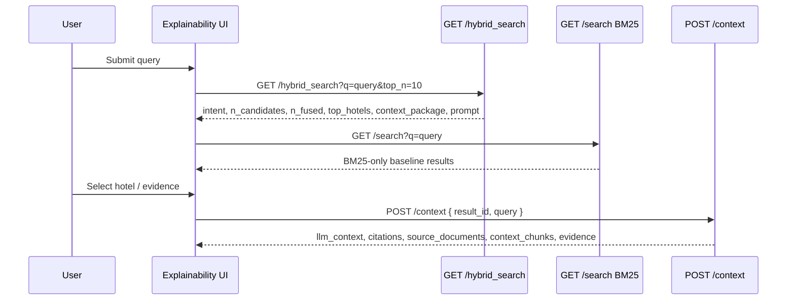

# UI_WIREFRAME_EXPLAINABILITY.md

Wireframe cho giao diện **DA10 Explainable Search Journey**.

Mục tiêu: thay vì chỉ hiển thị hotel cards, UI phải kể lại hành trình xử lý query từ lúc user nhập câu hỏi đến lúc hệ thống tạo context cho LLM.

## 1. Layout Màn Hình

```text
┌──────────────────────────────────────────────────────────────────────────────┐
│ DA10 Explainable Search Journey                                             │
│ Query: [khách sạn phù hợp cho trẻ nhỏ gần Vinwonders Phú Quốc        ] [Run]│
│ Backend: http://localhost:8000  Status: /hybrid_search + /context            │
└──────────────────────────────────────────────────────────────────────────────┘

┌───────────────────────────────┬──────────────────────────────────────────────┐
│ LEFT: Journey Navigator       │ RIGHT: Active Stage Detail                   │
│                               │                                              │
│ 1. Query Understanding        │ ┌──────────────────────────────────────────┐ │
│ 2. Ontology Expansion         │ │ Stage Detail                             │ │
│ 3. Candidate Funnel           │ │ - input                                  │ │
│ 4. Retrieval Sources          │ │ - output                                 │ │
│ 5. Ranking Explanation        │ │ - data source                            │ │
│ 6. Evidence & Citations       │ │ - backend exposure                       │ │
│ 7. LLM Context                │ │ - frontend readiness                     │ │
│ 8. Reviewer Mode              │ └──────────────────────────────────────────┘ │
└───────────────────────────────┴──────────────────────────────────────────────┘

┌──────────────────────────────────────────────────────────────────────────────┐
│ BOTTOM: Result Comparison / Selected Hotel Explanation                       │
│ Hotel A vs Hotel B ranking factors, evidence, context package                │
└──────────────────────────────────────────────────────────────────────────────┘
```

## 2. Luồng Dữ Liệu



## 3. Component Tree

```text
ExplainabilityApp
├── Header
│   ├── QueryInput
│   ├── RunButton
│   └── BackendStatus
├── JourneyLayout
│   ├── JourneyNavigator
│   │   ├── StageNavItem(Query Understanding)
│   │   ├── StageNavItem(Ontology Expansion)
│   │   ├── StageNavItem(Candidate Funnel)
│   │   ├── StageNavItem(Retrieval Sources)
│   │   ├── StageNavItem(Ranking Explanation)
│   │   ├── StageNavItem(Evidence & Citations)
│   │   ├── StageNavItem(LLM Context)
│   │   └── StageNavItem(Reviewer Mode)
│   └── StageDetail
│       ├── QueryUnderstandingPanel
│       ├── OntologyExpansionPanel
│       ├── CandidateFunnelPanel
│       ├── RetrievalSourcesPanel
│       ├── RankingExplanationPanel
│       ├── EvidenceCitationPanel
│       ├── LLMContextPanel
│       └── ReviewerRawPanel
└── ResultExplanationDock
    ├── SelectedHotelSummary
    ├── WhyThisResult
    ├── HotelComparison
    └── RawJsonToggle
```

## 4. Mock Screen Bằng ASCII

### 4.1 Query Understanding

```text
┌─ Query Understanding ───────────────────────────────────────────────────────┐
│ Query                                                                       │
│ "khách sạn phù hợp cho trẻ nhỏ gần Vinwonders Phú Quốc"                    │
│                                                                             │
│ Parsed Intent                                                               │
│ ┌───────────────────────┬─────────────────────────────────────────────────┐ │
│ │ Object Type           │ OBJ_HOTEL                                       │ │
│ │ Purpose               │ PURPOSE_FAMILY                                  │ │
│ │ Location              │ LOC_PHU_QUOC                                    │ │
│ │ Landmark              │ LMK_VINWONDERS_PHU_QUOC                         │ │
│ │ Range                 │ none                                            │ │
│ └───────────────────────┴─────────────────────────────────────────────────┘ │
│                                                                             │
│ Missing from backend today: matched_text, source, confidence per concept.   │
└─────────────────────────────────────────────────────────────────────────────┘
```

### 4.2 Ontology Expansion

```text
┌─ Ontology Expansion ────────────────────────────────────────────────────────┐
│ Available ontology edges                                                    │
│                                                                             │
│ PURPOSE_FAMILY                                                              │
│   ├── evidence_for / curated / boost / confidence 0.85 ──> AMEN_KIDS_CLUB   │
│   └── evidence_for / curated / boost / confidence 0.85 ──> AMEN_KIDS_POOL   │
│                                                                             │
│ LOC_PHU_QUOC                                                                │
│   └── implies / curated / filter / confidence 1.00 ──────> SETTING_ISLAND   │
│                                                                             │
│ Badge: Available ontology asset. Runtime usage trace not exposed yet.       │
└─────────────────────────────────────────────────────────────────────────────┘
```

### 4.3 Candidate Funnel

```text
┌─ Candidate Funnel ──────────────────────────────────────────────────────────┐
│ Total hotels                       needs backend trace                      │
│ Concept lookup                     needs backend trace                      │
│ Hard filter                        needs backend trace                      │
│ Final candidates                   n_candidates from /hybrid_search         │
│ Fused docs                         n_fused from /hybrid_search              │
│ Top hotels                         top_hotels.length                        │
│                                                                             │
│ [520] -> [concept lookup ?] -> [hard filter ?] -> [n_candidates] -> [Top-K] │
└─────────────────────────────────────────────────────────────────────────────┘
```

### 4.4 Retrieval Sources

```text
┌─ Retrieval Sources ─────────────────────────────────────────────────────────┐
│ BM25 baseline                                                               │
│ endpoint: GET /search                                                       │
│ fields: name, description^2, city, address, amenities                       │
│                                                                             │
│ Vector retrieval                                                            │
│ service: QdrantSearchService                                                │
│ status: available only if Qdrant/model/index are ready                      │
│                                                                             │
│ Hybrid                                                                      │
│ endpoint: GET /hybrid_search                                                │
│ combines: candidates + BM25 + vector + rerank                               │
└─────────────────────────────────────────────────────────────────────────────┘
```

### 4.5 Ranking Explanation

```text
┌─ Why This Result? ──────────────────────────────────────────────────────────┐
│ Hotel: selected hotel                                                       │
│                                                                             │
│ Available now                                                               │
│ ┌─────────────────────┬─────────────┐                                      │
│ │ final_score         │ 0.xxxx      │                                      │
│ │ business_score      │ 0.xxxx      │                                      │
│ │ rrf_score           │ 0.xxxx      │                                      │
│ │ bm25_rank           │ rank / N    │                                      │
│ │ vector_rank         │ rank / N    │                                      │
│ │ rerank_score        │ 0.xxxx      │                                      │
│ │ matched_chunks      │ N           │                                      │
│ └─────────────────────┴─────────────┘                                      │
│                                                                             │
│ Needed backend change                                                       │
│ review_component, concept_component, price_fit_component, profile_boost     │
└─────────────────────────────────────────────────────────────────────────────┘
```

### 4.6 Evidence & Citations

```text
┌─ Evidence & Citations ──────────────────────────────────────────────────────┐
│ Positive Evidence from /context.evidence.positives                          │
│ - Aspect: Dịch vụ | score: 0.xx | evidence_count: N                         │
│ - Aspect: Gia đình | score: 0.xx | evidence_count: N                        │
│                                                                             │
│ Negative Evidence from /context.evidence.negatives                          │
│ - Aspect: Ồn | negative_score: 0.xx                                         │
│ - Spans: "..."                                                              │
│                                                                             │
│ Citation IDs                                                                │
│ - cit_<hotel_id>                                                            │
│ Source IDs                                                                  │
│ - doc_<hotel_id>                                                            │
│ Context chunk IDs                                                           │
│ - chunk_<hotel_id>                                                          │
└─────────────────────────────────────────────────────────────────────────────┘
```

### 4.7 LLM Context

```text
┌─ LLM Context Preview ───────────────────────────────────────────────────────┐
│ Context Package from /hybrid_search.context_package                         │
│ Prompt from /hybrid_search.prompt                                           │
│ Answer / llm_context from POST /context                                     │
│                                                                             │
│ [1] Hotel A tại Phú Quốc ...                                                │
│ Nội dung: ...                                                               │
└─────────────────────────────────────────────────────────────────────────────┘
```

### 4.8 Reviewer Mode

```text
┌─ Reviewer Mode ─────────────────────────────────────────────────────────────┐
│ Tabs:                                                                       │
│ [Intent JSON] [Top Hotels JSON] [Context Package] [Prompt] [BM25 Baseline] │
│                                                                             │
│ Warnings                                                                    │
│ - concept confidence not exposed                                            │
│ - query expansion runtime trace not exposed                                 │
│ - ranking contribution breakdown not exposed                                │
│ - rich citations not exposed                                                │
└─────────────────────────────────────────────────────────────────────────────┘
```

## 5. Data Mapping

### `/hybrid_search`

```text
/hybrid_search.intent
  -> QueryUnderstandingPanel

/hybrid_search.n_candidates
/hybrid_search.n_fused
/hybrid_search.top_hotels.length
  -> CandidateFunnelPanel

/hybrid_search.top_hotels[]
  -> RankingExplanationPanel
  -> HotelComparison

/hybrid_search.context_package
/hybrid_search.prompt
  -> LLMContextPanel
  -> ReviewerMode
```

### `/search`

```text
/search.results[]
  -> BM25OnlyComparison
  -> OntologyImpactPanel
```

### `/context`

```text
/context.llm_context
  -> LLMContextPanel

/context.evidence.positives
/context.evidence.negatives
  -> EvidenceCitationPanel

/context.citations
/context.source_documents
/context.context_chunks
  -> CitationTrace
```

## 6. IMPLEMENTABLE NOW

Can be implemented immediately in `frontend/search_ui_v2.html`:

- Journey layout.
- Query Understanding Panel from `/hybrid_search.intent`.
- Candidate Funnel with available counts.
- Ranking Explanation with available top hotel fields.
- Evidence Panel from `/context.evidence`.
- LLM Context from `/hybrid_search.prompt`, `/hybrid_search.context_package`, `/context.llm_context`.
- Reviewer Mode raw JSON.
- BM25 vs Hybrid top-list comparison using `/search` and `/hybrid_search`.

## 7. NEEDS BACKEND CHANGE

Backend should add:

- `concept_trace`.
- `expansion_trace`.
- `candidate_trace`.
- `retrieval_trace`.
- `ranking_breakdown`.
- rich citation objects.
- service status flags.

## 8. FUTURE IMPROVEMENT

- Interactive ontology graph.
- Side-by-side hotel comparison.
- Query-level export report for mentor.
- Evaluation metric overlay from golden set.
- Visual diff: BM25-only vs Hybrid vs Hybrid+Ontology.
- Red flag panel for negative review evidence.

