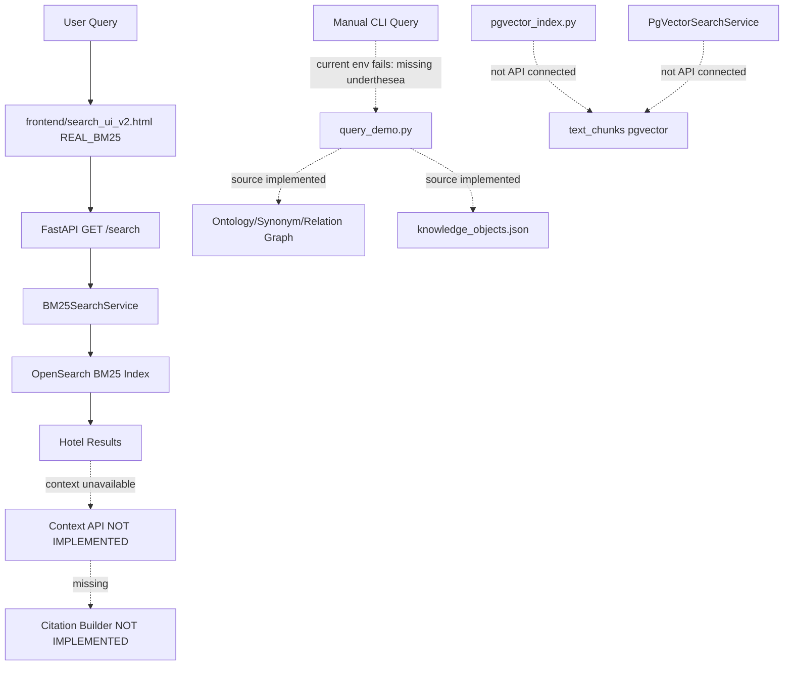
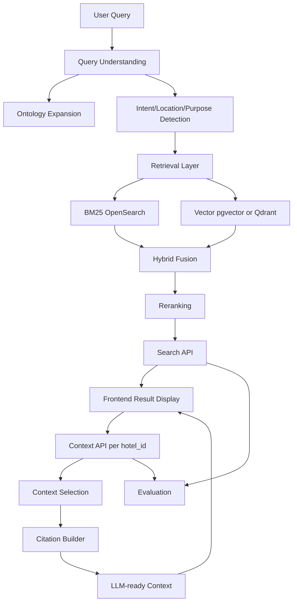

# Deep Code-First Project Audit - DA10 OTA AI Search Platform

Generated date: 2026-06-18  
Reviewer role: Senior Technical Auditor / Project Reviewer  
Scope: Code, scripts, tests, generated artifacts, configs, selected docs for claim comparison  

## 1. Executive Verdict

This repository is not mock-only, but it is also not a complete RAG/hybrid retrieval platform yet.

Current reality from code:

- Real cleaned data exists: 520 hotel JSON files in `data/cleaned`.
- Real baseline backend exists: FastAPI `GET /search`.
- Real BM25/OpenSearch service exists.
- Real BM25 indexer exists.
- Real pgvector indexing/search code exists, but it is not connected to FastAPI.
- Ontology / Knowledge Engineering is substantial: assets, generated artifacts, query demo code, relation graph loader, ABSA/profile code and tests exist.
- Context API is not implemented.
- Citation builder is not implemented.
- Hybrid retrieval is not implemented.
- Reranking/fusion is not implemented.
- Evaluation engine is not implemented.
- Frontend has standalone demos and React-ready components, but no verified React/Vite runtime.

Most accurate project status:

```text
Real cleaned data + BM25 baseline + ontology/KE artifacts + frontend demo.
Not yet real RAG/hybrid retrieval end-to-end.
```

## 2. Runtime Check Result

Commands were attempted against the current workspace.

### Query Demo Runtime

Command:

```powershell
python -m knowledge_engineering.enrichment.query_demo "Tôi muốn resort yên tĩnh gần biển cho gia đình"
```

Result:

```text
ModuleNotFoundError: No module named 'underthesea'
```

Command:

```powershell
.\.venv\Scripts\python -m knowledge_engineering.enrichment.query_demo "Tôi muốn resort yên tĩnh gần biển cho gia đình"
```

Result:

```text
ModuleNotFoundError: No module named 'underthesea'
```

### Selected Test Runtime

Command:

```powershell
.\.venv\Scripts\python -m pytest tests/test_api.py tests/test_retrieval.py tests/test_ke_enrichment.py tests/test_chunking.py tests/test_pgvector_search.py tests/test_context.py -q
```

Result:

```text
ModuleNotFoundError: No module named 'prometheus_client'
ModuleNotFoundError: No module named 'underthesea'
```

Conclusion:

- Code and tests exist.
- Current local environment is not fully runnable.
- Any claim that the repository is plug-and-play runnable is currently inaccurate unless dependencies are installed first.

## 3. Repository Crawl

### 3.1 API Layer

Path:

```text
api/
```

Main file:

```text
api/main.py
```

Implemented:

- `GET /health`
- `GET /metrics`
- `GET /search`

Evidence:

- `api/main.py` defines `app = FastAPI(...)`.
- `api/main.py` defines `@app.get("/health")`.
- `api/main.py` defines `@app.get("/metrics")`.
- `api/main.py` defines `@app.get("/search")`.
- `api/main.py` imports `BM25SearchService`.

Current real query flow:

```text
GET /search?q=<query>
-> api.main.search_bm25()
-> keyword_search_service.search(q)
-> retrieval.lexical_search.BM25SearchService
-> OpenSearch multi_match
-> hotel results
```

Not implemented:

- `POST /api/v1/search`
- `POST /api/v1/context`
- Knowledge API
- Context API router
- Search API router matching Kien schema

Evidence:

```python
# TODO:
# from api.routes import search_api, context_api, knowledge_api
# app.include_router(search_api.router)
# app.include_router(context_api.router)
# app.include_router(knowledge_api.router)
```

Assessment:

```text
API layer is PARTIAL.
Real BM25 baseline exists.
Target Search/Context/Knowledge APIs are not implemented.
```

### 3.2 Retrieval Layer

Path:

```text
retrieval/
```

Implemented modules:

- `retrieval/lexical_search/service.py`
- `retrieval/vector_search/service.py`

Skeleton modules:

- `retrieval/hybrid_search/`
- `retrieval/reranking/`
- `retrieval/filtering/`
- `retrieval/query_processing/`

#### BM25 Service

Evidence:

```text
retrieval/lexical_search/service.py
```

Important class/function:

- `BM25SearchService`
- `search()`
- `_build_query()`
- `_map_hit()`

Search fields:

```python
DEFAULT_SEARCH_FIELDS = ["name", "description^2", "city", "address", "amenities"]
```

Returned source fields:

```python
DEFAULT_SOURCE_FIELDS = [
    "id",
    "name",
    "accommodation_type",
    "star_rating",
    "review_score",
    "address",
    "city",
]
```

Issue:

`_map_hit()` tries to return `description`, but `description` is not included in `_source`.

Impact:

- Real `/search` may return `description: null`.
- Frontend cannot show rich result cards from real backend.
- `source_url`, `amenities`, `review_count`, `images`, `latitude`, `longitude` are also not returned.

#### Vector Search

Evidence:

```text
retrieval/vector_search/service.py
```

Important class/function:

- `PgVectorSearchService`
- `search()`
- `_build_query()`
- `_map_row()`
- `create_pgvector_search_service()`

Vector query:

```sql
ORDER BY embedding <=> %s::vector
```

Assessment:

- pgvector search source code exists.
- It is not connected to `api/main.py`.
- No public API endpoint exposes it.

#### Hybrid and Reranking

Evidence:

```text
retrieval/hybrid_search/README.md
retrieval/hybrid_search/__init__.py
retrieval/reranking/README.md
retrieval/reranking/__init__.py
```

Assessment:

```text
Hybrid retrieval and reranking are skeleton-only in the current repo.
```

No evidence found for:

- `fusion.py`
- `business_rerank`
- `reciprocal_rank_fusion`
- `aggregate_by_hotel`
- `neural_rerank`
- production cross-encoder reranker

If a report claims these exist in the current workspace, mark it as:

```text
OVERCLAIM / INSUFFICIENT EVIDENCE
```

### 3.3 Indexing Layer

Path:

```text
indexing/
```

Implemented:

- BM25 indexer
- pgvector indexer
- embedding registry/model wrapper

Skeleton:

- metadata index

#### BM25 Indexer

Evidence:

```text
indexing/bm25_index/index_bm25.py
indexing/bm25_index/index_mapping.json
```

Important functions:

- `iter_docs()`
- `run_indexing()`
- `promote_alias()`

Mapping issue:

Many text fields use:

```json
"analyzer": "standard"
```

Impact:

- Vietnamese tokenization is basic.
- No dedicated Vietnamese analyzer.
- Search quality may be weaker for Vietnamese compound terms and accent variations.

#### Vector Indexer

Evidence:

```text
indexing/vector_index/pgvector_index.py
sql/supabase_vector_schema.sql
```

Important functions:

- `iter_clean_documents()`
- `build_rows_for_document()`
- `index_documents()`
- `upsert_rows()`
- `main()`

Important table:

```sql
CREATE TABLE IF NOT EXISTS text_chunks
```

Assessment:

- pgvector indexing is implemented.
- Unified indexing script is not implemented.

#### Unified Index Pipeline

Evidence:

```text
scripts/run_index.py
```

Current content:

```python
raise NotImplementedError("Indexing pipeline not implemented yet")
```

Assessment:

```text
Individual indexers exist, but the unified indexing pipeline is not implemented.
```

### 3.4 Ontology Layer

Path:

```text
ontology/
```

Important assets:

- `ontology/synonym_dictionary.yaml`
- `ontology/query_expansion.yaml`
- `ontology/relations/curated.yaml`
- `ontology/relations/candidates.yaml`
- `ontology/relations/rejected.yaml`
- `ontology/core/*.yaml`

Assessment:

- `ontology/` is mainly an asset layer.
- Runtime logic is in `knowledge_engineering/`.

### 3.5 Knowledge Engineering

Path:

```text
knowledge_engineering/
```

This is one of the strongest parts of the repo.

Implemented modules:

- `knowledge_engineering/common/normalize.py`
- `knowledge_engineering/common/implicit_intent.py`
- `knowledge_engineering/common/relation_loader.py`
- `knowledge_engineering/common/build_expansion.py`
- `knowledge_engineering/enrichment/query_demo.py`
- `knowledge_engineering/enrichment/ontology_mapper.py`
- `knowledge_engineering/enrichment/absa.py`
- `knowledge_engineering/enrichment/build_objects.py`
- `knowledge_engineering/enrichment/profile_builder.py`
- `knowledge_engineering/chunking/strategies.py`
- `knowledge_engineering/entity_extraction/*`
- `knowledge_engineering/governance/*`

Generated artifacts:

```text
knowledge_engineering/enrichment/knowledge_objects.json = 520
knowledge_engineering/enrichment/hotel_tags.json = 520
knowledge_engineering/enrichment/hotel_metadata.json = 520
knowledge_engineering/enrichment/hotel_profiles.json = 520
```

Important functions:

- `query_demo.parse_concepts()`
- `query_demo.parse_range()`
- `query_demo.parse_location_text()`
- `query_demo.search()`
- `query_demo.show()`
- `implicit_intent.parse_implicit_intent()`
- `relation_loader.load_relations()`
- `build_expansion.build()`
- `ontology_mapper.map_hotel()`

Important caveat:

`query_demo.py` explicitly says it is a manual test tool, not production search.

Source-level capabilities:

- Concept extraction
- Surface-form synonym lookup
- Folded Vietnamese matching
- Implicit intent detection
- Range parsing
- Location extraction
- Location hierarchy matching
- Purpose-to-amenity boost
- Relation graph boost trace
- Landmark soft ranking
- Style/aspect profile ranking

Runtime caveat:

Current environment cannot run it because `underthesea` is missing.

Assessment:

```text
Ontology / KE is VERIFIED in source and artifacts.
It is NOT integrated into production FastAPI /search.
```

### 3.6 Context Layer

Path:

```text
context/
```

Subfolders:

- `selection/`
- `citation_builder/`
- `token_budget/`
- `aggregation/`
- `compression/`
- `ordering/`

Current status:

- Mostly README and `__init__.py`.
- No implementation found.

Evidence:

```text
tests/test_context.py
```

Content:

```python
"""Tests for context construction (Layer 7). TODO: implement."""

def test_placeholder():
    assert True
```

Assessment:

```text
Context layer is not implemented.
Citation builder is not implemented.
Token budget is not implemented.
Aggregation is not implemented.
```

### 3.7 Evaluation Layer

Path:

```text
evaluation/
scripts/run_eval.py
scripts/audit_golden_set.py
```

Status:

- `evaluation/retrieval_metrics/` skeleton.
- `evaluation/rag_eval/` skeleton.
- `scripts/run_eval.py` not implemented.
- `scripts/audit_golden_set.py` exists and generates audit report for golden set.

Evidence:

```python
raise NotImplementedError("Evaluation harness not implemented yet")
```

Golden set audit evidence:

```text
docs/golden_set_v1_audit.md
```

Key findings:

- 49 queries.
- 520 cleaned hotels loaded.
- ID existence: PASS.
- Hard filter consistency: FAIL, 6 mismatches.
- 46 queries have top-15 lexical candidates omitted from golden.
- Conclusion: not clean enough to treat as final golden set without human review.

Assessment:

```text
Evaluation engine is not implemented.
Golden set audit exists, and it shows the golden set still needs review.
```

### 3.8 Frontend Layer

Path:

```text
frontend/
```

Implemented standalone demos:

- `frontend/search_ui.html`
- `frontend/search_ui_v2.html`
- `frontend/evaluation_dashboard.html`

React-ready source:

- `frontend/src/api/api_client.js`
- `frontend/src/components/*`
- `frontend/src/dashboard/*`
- `frontend/src/types/searchTypes.js`
- `frontend/src/config/config.js`

#### `search_ui.html`

Status:

- Standalone old mock demo.
- Shows Search/RAG flow with embedded mock data.

#### `search_ui_v2.html`

Status:

- Standalone v2 demo.
- Has `MOCK_SCHEMA_V1` mode.
- Has `REAL_BM25` mode.
- Calls real backend:

```javascript
fetch(`${API_BASE_URL}/search?q=${encodeURIComponent(query)}`)
```

Explicitly states:

- Real BM25 data is available in real mode.
- Real Context API is not implemented.
- Parsed intent, query_id, citations, chunks and LLM context are not available from current backend endpoint.

Assessment:

```text
This is the best current demo path for Nguyen Duy Hieu.
```

#### React Components

Implemented:

- `SearchInterface.jsx`
- `ResultList.jsx`
- `ResultCard.jsx`
- `MetadataCard.jsx`
- `CitationList.jsx`
- `ContextPreview.jsx`
- `LoadingState.jsx`
- `ErrorState.jsx`
- `EmptyState.jsx`
- `EvaluationDashboard.jsx`

Status:

- React-ready only.
- No verified React/Vite runtime.

#### API Client

Evidence:

```text
frontend/src/api/api_client.js
```

Functions:

- `search()`
- `getContext()`
- `searchV2()`
- `getContextV2()`
- `normalizeSearchResponse()`
- `normalizeSearchResult()`
- `normalizeContextResponse()`
- `normalizeApiError()`

Issue:

- `searchV2()` calls target `POST /api/v1/search`.
- Backend currently only has `GET /search`.

Assessment:

```text
Frontend is ahead of backend contract.
Real integration only works through standalone search_ui_v2.html REAL_BM25 mode.
```

## 4. Owner Mapping

Owner evidence sources:

- `task.md`
- `frontend/README.md`
- `docs/docs_NDHieu/*`
- `docs/Do Minh Hieu/*`
- `docs/Le Hoang Dat/*`
- `docs/Nguyen Ngoc Khanh Duy/*`
- git commit history

| Owner | Assigned Area | Evidence | Current Reality |
| --- | --- | --- | --- |
| Nguyen Duy Hieu | Frontend Demo Tool | `task.md`, `frontend/README.md`, docs_NDHieu | Strong standalone demos and React-ready components; real integration partial |
| Vu Duc Kien | API & Evaluation | `task.md`, docs_NDHieu, schema proposal references | Target schema planned; real `POST /api/v1/search` and Context API not implemented |
| Do Minh Hieu | Data Quality | `task.md`, `docs/Do Minh Hieu/*` | Data pipeline docs/scripts exist; ingestion tests skipped |
| Truong Anh Long | Knowledge Engineering / Ontology | git commits, KE files | Strong ontology/ABSA/query demo artifacts |
| Nguyen Ngoc Khanh Duy | Chunking & Embedding | `task.md`, docs reports | Chunking/embedding code and reports exist |
| Le Hoang Dat / eltad2003 | Search Infrastructure | git commits, docs Le Hoang Dat | BM25 service/indexing/benchmark exist |
| Nguyen Anh Tai | Retrieval & Ranking | `task.md` | Direct code ownership evidence insufficient; hybrid/ranking implementation not found |

## 5. Claim vs Reality Matrix

| Component | Report / Plan Says | Code Reality | Match Level |
| --- | --- | --- | --- |
| Data | 520 cleaned hotels | 520 files in `data/cleaned`; quick check all Vietnam | VERIFIED |
| Search API | Search API exists/planned | Real API only `GET /search`; target v1 not implemented | PARTIAL |
| Context API | Planned/needed | Not implemented | OVERCLAIM if described as done |
| Knowledge API | Planned | Not implemented | OVERCLAIM if described as done |
| BM25 | Implemented | `BM25SearchService`, indexer, tests, benchmark docs | VERIFIED |
| Vector Search | Implemented/planned | pgvector code exists, not API-integrated | PARTIAL |
| Qdrant | Some docs mention Qdrant | Docker/config only; `.env.example` marks legacy; code uses pgvector | OVERCLAIM if called runtime |
| Hybrid Retrieval | Planned | Skeleton only | OVERCLAIM if called done |
| Reranking | Planned | Skeleton only | OVERCLAIM |
| Fusion/RRF | External report mentions code | No such code found | INSUFFICIENT EVIDENCE |
| Ontology | Implemented | Assets/artifacts/source/tests exist | VERIFIED |
| Query Understanding | Implemented in demo | Source exists; current env dependency missing; not API-integrated | PARTIAL |
| Relation Graph | Implemented | `relation_loader`, `build_expansion`, tests exist | VERIFIED |
| Chunking | Implemented | `chunking/strategies.py`, tests exist | VERIFIED |
| Citation Builder | Planned | Skeleton only | OVERCLAIM |
| Evaluation Engine | Planned | `run_eval.py` NotImplemented | OVERCLAIM |
| Evaluation Dashboard | Present | Mock/demo only | PARTIAL |
| Frontend v2 | Present | Mock + real BM25 mode | VERIFIED |
| React App | Components ready | No verified runtime | PARTIAL |

## 6. Pipeline Trace

### AS-IS Runtime



### TO-BE Target



### Pipeline Step Evidence

| Step | Code Location | Status | Evidence |
| --- | --- | --- | --- |
| User Query | frontend/API | Works for frontend v2 real BM25 | `search_ui_v2.html` |
| Query Understanding | `query_demo.py`, `implicit_intent.py` | Source exists; current env missing dep | `parse_concepts`, `parse_implicit_intent` |
| Ontology Expansion | `relation_loader.py`, `build_expansion.py` | Source exists | `load_relations`, `build()` |
| Intent Detection | `implicit_intent.py` | Source exists | `RULES`, `parse_implicit_intent()` |
| Location Extraction | `query_demo.py` | Source exists | `parse_location_text`, `_matches_location_concepts` |
| Purpose Detection | `implicit_intent.py`, `query_demo.py` | Source exists | `PURPOSE_*`, `_purpose_evidence()` |
| BM25 Retrieval | `BM25SearchService` | Runtime API exists | `api/main.py`, `retrieval/lexical_search/service.py` |
| Vector Retrieval | `PgVectorSearchService` | Source exists, not API connected | `retrieval/vector_search/service.py` |
| Ranking | BM25 `_score`; query_demo local score | No production hybrid ranking | `query_demo.search.score()` |
| Filtering | query_demo filters; BM25 no structured filters | Partial | `query_demo.search()` |
| Context Building | `context/*` | Not implemented | skeleton only |
| Citation | `context/citation_builder` | Not implemented | skeleton only |
| Frontend | HTML demos + components | HTML works; React runtime not verified | `frontend/*` |
| LLM Context | Mock only | Not real | `search_ui_v2.html` embedded mock |

## 7. Evidence Collection

### Existing Demo / Runtime Entry Points

| Entrypoint | Status |
| --- | --- |
| `api/main.py` | FastAPI BM25 runtime |
| `knowledge_engineering/enrichment/query_demo.py` | CLI source exists, current env dependency missing |
| `indexing/bm25_index/index_bm25.py` | BM25 indexer |
| `indexing/vector_index/pgvector_index.py` | pgvector indexer |
| `scripts/run_ingest.py` | data ingestion orchestration |
| `scripts/run_index.py` | NotImplemented |
| `scripts/run_eval.py` | NotImplemented |
| `scripts/audit_golden_set.py` | golden set audit utility |
| `scripts/benchmark_search.py` | benchmark utility |

### Query Processing Strength

Source-level strengths:

- Concept extraction from synonym dictionary.
- Folded Vietnamese normalization.
- Implicit intent detection.
- Location text parsing.
- Location hierarchy matching.
- Range parsing.
- Purpose-to-amenity boost.
- Relation graph verified boost.
- Landmark ranking.
- Style/aspect profile scoring.

Evidence:

- `knowledge_engineering/enrichment/query_demo.py`
- `knowledge_engineering/common/implicit_intent.py`
- `knowledge_engineering/common/relation_loader.py`
- `knowledge_engineering/common/build_expansion.py`

Limitation:

```text
This affects query_demo, not current FastAPI /search.
```

### Does Relation Graph Really Run?

In source:

- Yes.
- `query_demo._load_boost_relations()` calls `load_relations(status={"verified"}, use_as={"boost"})`.
- `query_demo.search()` builds `expansion_trace`.
- `build_expansion.py` compiles verified relations into `ontology/query_expansion.yaml`.

In production API:

- No evidence.
- `api/main.py` only calls BM25.

### Is There Evidence Retrieval Is Better Than Keyword Search?

Current repo:

- BM25 benchmark exists.
- Dense/chunking reports exist.
- No production A/B hybrid vs BM25 eval harness.
- `scripts/run_eval.py` not implemented.

Conclusion:

```text
INSUFFICIENT EVIDENCE that current production retrieval is better than keyword search.
```

## 8. Quality Scorecard

| Module | Score | Explanation |
| --- | ---: | --- |
| Data | 78 | 520 cleaned VN hotels; quick check good; still needs production validation and type scope clarification |
| Ontology | 82 | Rich assets, relation graph, generated artifacts, tests; not connected to API runtime |
| Query Understanding | 70 | Strong source logic; current environment fails due missing `underthesea`; not production integrated |
| Retrieval | 48 | BM25 real, pgvector source exists; hybrid/vector not API-integrated |
| Ranking | 35 | BM25 score only in API; query_demo ranking non-production; no hybrid fusion/reranker runtime |
| Context | 10 | Skeleton only |
| Citation | 8 | Skeleton/backend missing; frontend mock only |
| Evaluation | 18 | Golden audit exists; real eval harness missing |
| Frontend | 72 | Good standalone demos and React-ready components; no React runtime; real context unavailable |
| API | 45 | Health/metrics/BM25 search real; target APIs missing |
| Documentation | 68 | Many useful docs/reports; notable drift and overclaims |

Overall project estimate:

```text
48-55%
```

Reason:

- Data/BM25/Ontology/Frontend demos are substantial.
- Context/Hybrid/Reranking/Evaluation are missing.

## 9. Risk Matrix

| Risk | Severity | Evidence | Impact | Recommended Fix |
| --- | --- | --- | --- | --- |
| API contract mismatch | CRITICAL | real `GET /search`, planned `POST /api/v1/search` | Frontend/backend integration confusion | Decide contract and implement adapter |
| Context API missing | CRITICAL | `api/main.py` TODO; `context/*` skeleton | Cannot demo real RAG | Implement minimal Context API |
| Evaluation harness missing | HIGH | `scripts/run_eval.py` NotImplemented | Cannot prove quality | Implement retrieval eval |
| Hybrid/reranking missing | HIGH | skeleton folders | Search quality target unmet | Implement fusion/ranking |
| Environment missing deps | HIGH | runtime errors for `underthesea`, `prometheus_client` | Tests/demo fail locally | Update requirements/install |
| `.env` BM25 index mismatch | HIGH | `.env` uses `travel_bm25` | API may query wrong index | Align env and add health check |
| BM25 source fields too limited | MEDIUM | source fields omit description/source_url/amenities | Real frontend cards weak | Add source fields and tests |
| Qdrant vs pgvector drift | MEDIUM | Docker Qdrant, code pgvector | Architecture confusion | Choose one source of truth |
| Golden set not final | MEDIUM | `golden_set_v1_audit.md` says review needed | Evaluation unreliable | Human review labels |
| React app not runnable | MEDIUM | components exist, runtime not verified | Cannot demo React app | Setup Vite or declare standalone official |

## 10. Nguyen Duy Hieu Review

### 10.1 Completed Work

Hieu has completed or prepared:

- `frontend/search_ui.html`
- `frontend/search_ui_v2.html`
- `frontend/evaluation_dashboard.html`
- `frontend/src/api/api_client.js`
- `frontend/src/components/SearchInterface.jsx`
- `frontend/src/components/ResultList.jsx`
- `frontend/src/components/ResultCard.jsx`
- `frontend/src/components/MetadataCard.jsx`
- `frontend/src/components/CitationList.jsx`
- `frontend/src/components/ContextPreview.jsx`
- `frontend/src/components/LoadingState.jsx`
- `frontend/src/components/ErrorState.jsx`
- `frontend/src/components/EmptyState.jsx`
- `frontend/src/dashboard/EvaluationDashboard.jsx`

Strong points:

- `search_ui_v2.html` can call real BM25 backend.
- Mock/real distinction is partly present.
- Evaluation dashboard labels metrics as mock/demo.
- React-ready components follow Search -> Context flow.

### 10.2 Misunderstandings / Risky Assumptions

Hieu should not assume:

- Full RAG demo is real.
- Context API exists.
- `searchV2()` works with real backend.
- Evaluation metrics are real.
- React components are runnable without runtime.
- Qdrant is the actual current vector backend.

### 10.3 Work That May Be Excess

- Creating more mock files without a specific demo need.
- Writing more planning docs without source-of-truth cleanup.
- Investing further in React components before runtime decision.

### 10.4 Work Hieu Should Do Next

P0:

- Verify `search_ui_v2.html` REAL_BM25 mode after backend/env fix.
- Strengthen visual labels:
  - REAL
  - MOCK
  - UNAVAILABLE
- Ask backend/search owner to return richer fields from `/search`.

P1:

- Add Query Analysis Panel.
- Add Retrieval Trace Panel.
- Add Ranking Explanation Panel.
- Add Evidence Status Panel.

P2:

- Integrate real Context API when available.
- Setup React/Vite only if team chooses React app path.
- Integrate real evaluation output only when Kien provides it.

### 10.5 Suggested UI Panels

| Panel | Purpose | Current/Future Source |
| --- | --- | --- |
| Query Analysis Panel | Show parsed intent and filters | mock now; future API |
| Ontology Expansion Panel | Show concepts and relation boost | query_demo/future API |
| Retrieval Trace Panel | Show BM25/vector/hybrid path | BM25 now; hybrid future |
| Ranking Explanation | Explain why result ranked high | BM25 score now; future ranking API |
| Evidence Graph | Hotel -> chunk -> citation -> source | mock now; Context API future |
| Context Construction Trace | Show token/chunk selection | mock now; Context API future |
| Availability Badges | Prevent overclaim | frontend-only now |

## 11. Priority Roadmap

### Project P0

1. Fix dependency/environment reproducibility.
2. Align `.env` BM25 index with current alias.
3. Decide current API contract: `GET /search` vs `POST /api/v1/search`.
4. Return richer fields from real `/search`.
5. Explicitly mark Context API as missing until implemented.

### Project P1

1. Implement minimal Context API.
2. Choose vector backend: pgvector or Qdrant.
3. Connect vector retrieval to API.
4. Implement citation builder.
5. Implement evaluation harness.

### Project P2

1. Implement hybrid fusion.
2. Implement reranking.
3. Clean/finalize golden set.
4. Add CI tests for API/context/evaluation.
5. Harden frontend/backend integration.

### NDHieu P0

1. Make `search_ui_v2.html` the official current demo path.
2. Test REAL_BM25 mode.
3. Add stronger mock/real/unavailable labeling.
4. Ask backend for missing fields.

### NDHieu P1

1. Add query analysis display.
2. Add retrieval trace display.
3. Add ranking explanation display.
4. Prepare context display for future API.

### NDHieu P2

1. Decide React/Vite runtime with team.
2. Integrate real Context API.
3. Integrate real evaluation output.

## 12. Final Conclusion

The project is strongest in:

- Data availability.
- BM25 baseline.
- Ontology/KE artifacts.
- Frontend standalone demos.

The project is weakest in:

- Context API.
- Citation runtime.
- Hybrid retrieval.
- Reranking/fusion.
- Evaluation engine.
- Runtime dependency reproducibility.

Most important correction:

```text
Do not present the project as full RAG/hybrid search yet.
Present it as real BM25 baseline + strong ontology preparation + frontend display layer, with RAG/context/evaluation still pending.
```

