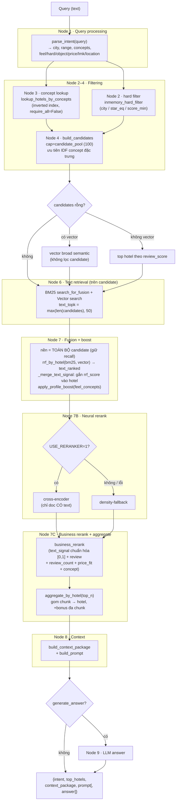

# Sơ đồ luồng Retrieval & Ranking

Nguồn: [`retrieval/hybrid_search/pipeline.py`](../../../retrieval/hybrid_search/pipeline.py) — hàm `run_hybrid_search()`, và [`retrieval/reranking/fusion.py`](../../../retrieval/reranking/fusion.py).

Pipeline gồm 8 node (Node 1→8), thiết kế để **từng node có thể vắng service** mà luồng vẫn chạy (degrade về candidate KE thuần).

---

## 1. Luồng tổng quan (end-to-end)

---

## 2. Chi tiết tính điểm ranking

Hai tầng cho điểm độc lập rồi hợp nhất: **RRF (cấp hotel)** → **business score** → **final score**.

```mermaid
flowchart LR
    subgraph SRC["Tín hiệu text retrieval"]
        BM["BM25 results"] --> RRF
        VEC["Vector results"] --> RRF
    end

    RRF["rrf_by_hotel<br/>Σ 1/(k+rank), k=60<br/>gom theo hotel_id"] --> RRFS["rrf_score"]

    RRFS --> PB["apply_profile_boost<br/>+ 0.05 × Σ profile.score<br/>(feel_concepts)"]
    PB --> FS["fused_score"]

    FS --> NEU["neural_rerank<br/>(cross-encoder → rerank_score<br/>hoặc density-fallback)"]

    NEU --> BR

    subgraph BR["business_rerank — chuẩn hóa text-signal [0,1] trước khi fuse"]
        direction TB
        NORM["neural = minmax(rerank/ fused/ rrf)"]
        RV["review = ke_review_score / 10"]
        RC["review_count = log1p(n)/log1p(max)"]
        PF["price_fit = 1 nếu price ≤ intent_max_price"]
        CM["concept = |concepts ∩ ontology| / |concepts|"]
    end

    BR --> BS["business_score =<br/>0.05·neural + 0.2·review<br/>+ 0.1·review_count<br/>+ 0.1·price_fit + 0.1·concept"]

    BS --> AGG2["aggregate_by_hotel<br/>max_score/hotel<br/>+ 0.01·min(count-1, 5)"]
    AGG2 --> FINAL["final_score → top_n"]
```

> **Lưu ý quan trọng (xem memory):** text-signal RRF nằm thang `[0, ~0.016]` còn review/price/concept đã ở `[0,1]`. Nếu cộng thẳng, text-signal bị nuốt ~24×. `business_rerank` **chuẩn hóa min-max text-signal về `[0,1]` trên tập candidate** trước khi fuse. Trọng số `neural=0.05` được calibrate bằng sweep trên `golden_set_v2` (recall 0.5114 / MRR 0.9065 / Hit 0.9831).

---

## Hằng số & trọng số

| Tham số | Giá trị | Vị trí |
|---|---|---|
| `RRF_K` | 60 | `fusion.py` |
| `PROFILE_BOOST_WEIGHT` | 0.05 | `fusion.py` |
| `BUSINESS_WEIGHTS.neural` | 0.05 | `fusion.py` |
| `BUSINESS_WEIGHTS.review` | 0.2 | `fusion.py` |
| `BUSINESS_WEIGHTS.review_count` | 0.1 | `fusion.py` |
| `BUSINESS_WEIGHTS.price_fit` | 0.1 | `fusion.py` |
| `BUSINESS_WEIGHTS.concept` | 0.1 | `fusion.py` |
| `candidate_pool` | 100 | `pipeline.py` |
| `top_n` | 5 | `pipeline.py` |
| aggregate bonus | `0.01 × min(count-1, 5)` | `fusion.py` |
