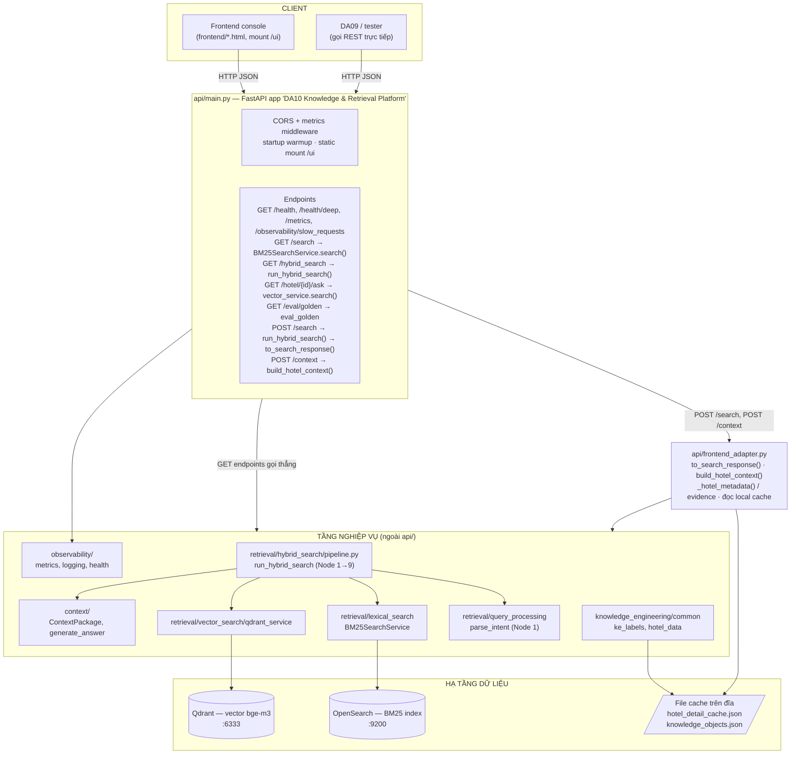
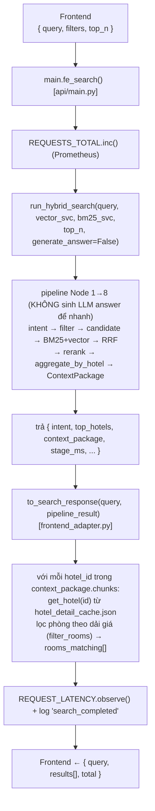
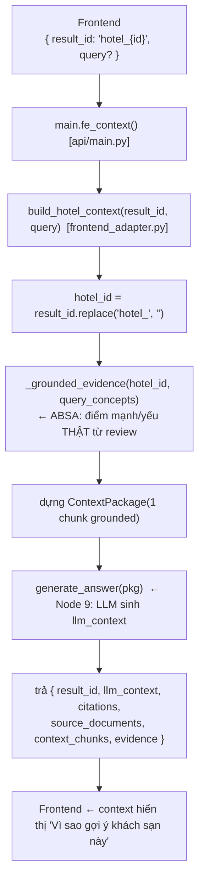
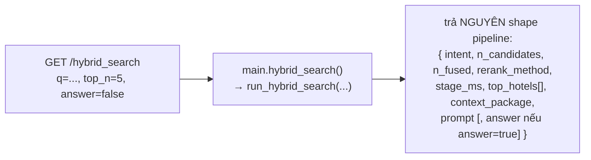
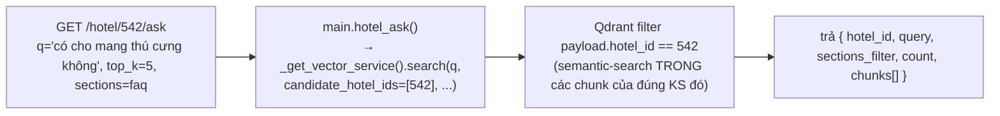

# 01 — API Overview / Architecture

> **Người phụ trách:** Vũ Đức Kiên
> **Phạm vi:** toàn bộ folder [`api/`](../../api/) — tầng Platform Services (Layer 8) của hệ thống DA10.
> **Mục tiêu tài liệu:** để người tiếp nhận hiểu nhanh kiến trúc, luồng request → response, và quan hệ giữa các file trong `api/` mà không phải đọc lại toàn bộ code.

---

## 1. `api/` gồm những gì?

```
api/
├── main.py               ← TOÀN BỘ FastAPI app + mọi endpoint sống ở đây
├── frontend_adapter.py   ← Dịch output pipeline → schema mà frontend cần
├── __init__.py           ← rỗng
├── app/__init__.py       ← rỗng (scaffolding, CHƯA dùng)
├── routes/__init__.py    ← rỗng (scaffolding, CHƯA dùng)
└── schemas/__init__.py   ← rỗng (scaffolding, CHƯA dùng)
```

> ⚠️ **Quan trọng cho người tiếp nhận:** các folder `app/`, `routes/`, `schemas/` hiện là
> **thư mục rỗng** (chỉ có `__init__.py` trống). Đó là bộ khung dự trù cho lần refactor sau
> này (tách router/schema ra khỏi `main.py`). **Hiện tại chưa có code nào trong đó** — đừng
> mất thời gian tìm logic ở đấy. Comment `TODO: register routers from api/routes/.` ở đầu
> [`main.py`](../../api/main.py) chính là dấu vết của kế hoạch tách này.
>
> Vậy nên: **muốn hiểu API = đọc `main.py` + `frontend_adapter.py`.** Chỉ có 2 file.

---

## 2. Vị trí của `api/` trong toàn hệ thống

`api/` là **lớp mỏng (thin layer)**: nó KHÔNG chứa thuật toán tìm kiếm. Nó chỉ:
1. Nhận HTTP request, validate tham số.
2. Gọi xuống các module nghiệp vụ ở tầng dưới.
3. Đo đạc (metrics/log) và định dạng lại response cho client.



**Ghi nhớ 1 câu:** `main.py` là *bộ định tuyến + đo đạc*, `frontend_adapter.py` là *bộ phiên
dịch shape dữ liệu*, còn "bộ não" tìm kiếm nằm ở `retrieval/` (ngoài phạm vi `api/`).

---

## 3. Hai nhóm endpoint — đừng nhầm

Có **hai "giao diện" khác nhau** cùng sống trong `main.py`, phục vụ 2 đối tượng khác nhau:

| Nhóm | Endpoint | Dành cho | Đặc điểm |
|------|----------|----------|----------|
| **Debug / kỹ thuật (GET)** | `/search`, `/hybrid_search`, `/hotel/{id}/ask`, `/eval/golden` | Dev, tester, DA09 gọi thô | Trả **shape pipeline gốc** (`top_hotels`, `context_package`, `intent`…). Tham số qua query-string. |
| **Frontend (POST)** | `/search`, `/context` | Frontend console (`/ui`) | Trả **shape frontend** (`results[]`, `llm_context`, `citations`…). Body JSON. Đi qua `frontend_adapter.py`. |

> 🔑 `GET /search` và `POST /search` **trùng path nhưng khác method** → là 2 handler hoàn toàn
> khác nhau (`search_bm25` vs `fe_search`). GET = BM25 thuần; POST = full hybrid + adapter.

---

## 4. Luồng request → response (chi tiết theo endpoint chính)

### 4.1 `POST /search` (frontend gọi khi user bấm "Tìm")



### 4.2 `POST /context` (frontend gọi khi user mở chi tiết 1 khách sạn)



> **Vì sao tách 2 bước search/context?** `POST /search` cố tình **không gọi LLM**
> (`generate_answer=False`) cho nhanh khi trả danh sách. LLM (chậm, ~vài giây) chỉ chạy khi
> user thực sự mở 1 khách sạn → gọi `POST /context`. Đây là quyết định thiết kế để tối ưu độ
> trễ trang kết quả. Xem [04_Business_Logic_Decision_Notes.md](04_Business_Logic_Decision_Notes.md).

### 4.3 `GET /hybrid_search` (debug — xem toàn bộ pipeline)



### 4.4 `GET /hotel/{hotel_id}/ask` (hỏi trong phạm vi 1 khách sạn)


Khác `/hybrid_search` (tìm xuyên nhiều KS): endpoint này **khóa cứng 1 hotel_id**, chỉ dùng
vector (chunk-level), không sinh LLM.

---

## 5. Quan hệ giữa các file / thành phần

| Thành phần | File | Vai trò | Được gọi bởi |
|-----------|------|---------|--------------|
| FastAPI app + routes | [`api/main.py`](../../api/main.py) | Khai báo app, middleware, tất cả endpoint | uvicorn / client |
| Adapter shape | [`api/frontend_adapter.py`](../../api/frontend_adapter.py) | Pipeline → schema frontend; đọc cache; dựng evidence ABSA | `POST /search`, `POST /context` |
| Pipeline hybrid | `retrieval/hybrid_search/pipeline.py` | Node 1→9 orchestrator | `GET /hybrid_search`, `POST /search` |
| Intent parser | `retrieval/query_processing/intent_parser.py` | Câu VN → intent (giá, sao, concept, city…) | pipeline; `build_hotel_context` |
| BM25 service | `retrieval/lexical_search` (`BM25SearchService`) | Keyword search trên OpenSearch | `GET /search`, pipeline |
| Vector service | `retrieval/vector_search/qdrant_service` | Semantic search bge-m3 trên Qdrant | `GET /hotel/{id}/ask`, pipeline |
| Context builder | `context/` (`ContextPackage`, `generate_answer`) | Node 8/9: gói context + gọi LLM | `build_hotel_context`, pipeline |
| Hotel cache | `knowledge_engineering/common/hotel_data.py` | Đọc `hotel_detail_cache.json`, lọc phòng | `frontend_adapter` |
| KE labels | `knowledge_engineering/common/ke_labels.py` | Nhãn concept/ABSA của từng KS | `frontend_adapter`, pipeline |
| Observability | `observability/{metrics,logging,health}.py` | Prometheus, JSON log, deep health | `main.py` |

---

## 6. Vòng đời ứng dụng (startup → request → shutdown)

**Khi khởi động (`@app.on_event("startup")` trong `main.py`):**
1. `_warmup()` — nạp sẵn synonym dictionary (tránh cold-start ~978ms request đầu), và nếu
   `USE_RERANKER=1` thì nạp cross-encoder; ép khởi tạo bge-m3 embedding **ở main thread**.
   > 🐛 Lý do quan trọng: route hybrid chạy ở threadpool của Starlette (hàm `def`, không phải
   > `async def`). Nếu để model torch (XLM-RoBERTa) lazy-load LẦN ĐẦU trong thread con → torch
   > native crash (exit 139) trên CPU/Windows. Nên phải khởi tạo model ngay ở startup.
2. `_start_dep_probe()` — probe OpenSearch/Qdrant/Postgres 1 lần, rồi chạy nền định kỳ
   (`DEP_PROBE_INTERVAL`, mặc định 30s) để cập nhật gauge `da10_dependency_up`.

**Mỗi request (`@app.middleware("http")`):**
- Sinh/đọc `X-Request-ID` (ưu tiên header client), gắn vào contextvar → mọi dòng log của
  request mang cùng request_id (truy vết xuyên stage).
- Đo `da10_http_request_duration_seconds` + đếm `da10_http_requests_total` cho **mọi** request
  (dùng `try/finally` nên request lỗi vẫn được đo).

**Khi tắt (`shutdown`):** hủy task probe nền.

---

## 7. Service khởi tạo lazy + an toàn khi hạ tầng vắng

`main.py` khởi tạo vector/BM25 service theo kiểu **lazy + cache + nuốt lỗi**:
- `_get_vector_service()` — load model bge-m3 **1 lần**, cache lại. Nếu Qdrant/model lỗi → trả `None`.
- `_get_bm25_service()` — trả service nếu index BM25 tồn tại, ngược lại `None`.

Pipeline được thiết kế để **từng nguồn có thể vắng** mà API vẫn trả `200`: thiếu cả vector lẫn
BM25 thì tụt về "candidate-only" (xếp hạng bằng nhãn KE). Trường hợp degraded được đếm bằng
metric `da10_search_degraded_total` để dashboard/alert phát hiện — **tránh âm thầm phục vụ kết
quả kém**. Đây là điểm cần nhớ khi đọc log/metrics.

---

## 8. Tài liệu liên quan

- [02_API_Reference.md](02_API_Reference.md) — từng endpoint: method, path, schema, mã lỗi, ví dụ.
- [03_Setup_and_Run.md](03_Setup_and_Run.md) — cài đặt, `.env`, chạy local, port.
- [04_Business_Logic_Decision_Notes.md](04_Business_Logic_Decision_Notes.md) — quy tắc nghiệp vụ hardcode, lý do thiết kế.
- [VuDucKien_api_schema_proposal.md](VuDucKien_api_schema_proposal.md) — ⚠️ bản **đề xuất** schema
  ban đầu (`/api/v1/...`). **KHÔNG khớp** với code đang chạy; giữ lại làm tham chiếu lịch sử.
