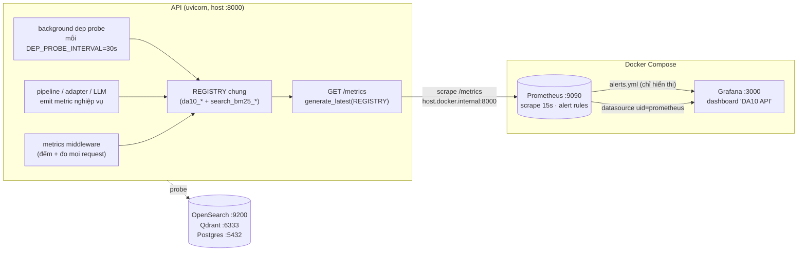

# 05 — Monitoring Architecture

> **Người phụ trách:** Vũ Đức Kiên
> **Phạm vi:** monitoring của hệ thống DA10 — module [`observability/`](../../observability/) + tích hợp trong [`api/main.py`](../../api/main.py).
> **Nguồn sự thật:** code, không phải doc cũ. Mọi tên metric/nhãn/bucket dưới đây trích trực tiếp từ
> [`observability/metrics/__init__.py`](../../observability/metrics/__init__.py).

---

## 1. Đo cái gì, bằng công cụ gì

| Lớp | Công cụ | Vai trò |
|-----|---------|---------|
| **Thu thập metric** | `prometheus_client` (Python) | API tự expose metric dạng Prometheus text tại `GET /metrics` |
| **Lưu trữ + query** | **Prometheus** | Scrape `/metrics` mỗi 15s, lưu time-series, chạy alert rules |
| **Trực quan hoá** | **Grafana** | Dashboard `DA10 API` (provisioned sẵn) đọc từ Prometheus |
| **Health probe** | code `observability/health.py` | Probe OpenSearch/Qdrant/Postgres → gauge `da10_dependency_up` |
| **Log** | JSON logger tự viết | Xem [06_Logging_Guide.md](06_Logging_Guide.md) |

> ⚠️ **Chưa có Alertmanager** → alert chỉ **hiển thị** trong tab Alerts của Prometheus/Grafana,
> **không** gửi email/Slack. Xem [07_Alerting_and_Runbook.md](07_Alerting_and_Runbook.md).

---

## 2. Sơ đồ luồng monitoring

**Điểm mấu chốt về registry:** mọi collector đăng ký vào **một `REGISTRY` dùng chung**
(`CollectorRegistry()`, KHÔNG phải default global registry). Nhờ vậy `GET /metrics` gom được cả
metric mới `da10_*` (observability) lẫn metric cũ `search_bm25_*` (khai báo trong `api/main.py`)
trong **một** lần `generate_latest(REGISTRY)`. **Đừng tạo metric object ở nơi khác** → tránh
lỗi duplicate registration; luôn import từ `observability.metrics`.

---

## 3. Danh mục metric (đầy đủ, theo code)

### 3.1 HTTP layer — emit ở middleware `api/main.py`

| Metric | Loại | Nhãn | Ý nghĩa |
|--------|------|------|---------|
| `da10_http_requests_total` | Counter | `endpoint`, `method`, `status` | Đếm mọi HTTP request. `status` = HTTP code |
| `da10_http_request_duration_seconds` | Histogram | `endpoint`, `method` | Latency request. Buckets: `0.05,0.1,0.15,0.25,0.5,0.75,1,2,5`s |

> Nhãn `method` **cố ý** tách `GET /search` (BM25 baseline) khỏi `POST /search` (hybrid) — cùng
> route path nhưng latency rất khác; thiếu `method` thì p95 bị trộn 2 endpoint → sai.
> `endpoint` dùng **route template** (vd `/hotel/{hotel_id}/ask`) để tránh nổ cardinality.

### 3.2 Chất lượng tìm kiếm

| Metric | Loại | Nhãn | Emit ở đâu | Ý nghĩa |
|--------|------|------|-----------|---------|
| `da10_search_zero_results_total` | Counter | `search_mode` = `hybrid`\|`frontend`\|`hotel_ask` | `api/main.py` | Search trả 0 kết quả (màn hình trắng) |
| `da10_search_degraded_total` | Counter | `source` = `bm25`\|`vector`\|`both` | `pipeline._emit_degraded` | Search chạy thiếu nguồn retrieval → tụt candidate-only |
| `da10_rerank_method_total` | Counter | `method` = `cross-encoder`\|`density-fallback` | `pipeline._emit_rerank_method` | Phương pháp rerank **thực tế** đã chạy |

### 3.3 LLM (Node 9) — emit ở `context/answer_generator._emit_llm`

| Metric | Loại | Nhãn | Ý nghĩa |
|--------|------|------|---------|
| `da10_llm_duration_seconds` | Histogram | — | Thời gian gọi LLM. Buckets tới `60`s (LLM chậm) |
| `da10_llm_requests_total` | Counter | `status` = `ok`\|`error` | `error` = thiếu key/mạng/parse lỗi/answer rỗng |

### 3.4 Context build — emit ở `api/main.py` (`fe_context`)

| Metric | Loại | Ý nghĩa |
|--------|------|---------|
| `da10_context_build_duration_seconds` | Histogram | Thời gian dựng context (gồm gọi LLM). Buckets tới `120`s → p95 không bão hoà |

### 3.5 Per-stage pipeline — emit ở `pipeline._stage`

| Metric | Loại | Nhãn | Ý nghĩa |
|--------|------|------|---------|
| `da10_stage_duration_seconds` | Histogram | `stage` | Latency từng nhóm node. Buckets `0.01..30`s |

**Các giá trị `stage` (theo `pipeline.py`):** `intent`, `filter`, `text_retrieval`, `fusion`,
`rerank`, `context`. Đây là công cụ chính để biết **stage nào nghẽn** khi search chậm.

### 3.6 Golden evaluation — emit ở `api/main.py` (`eval_golden`)

| Metric | Loại | Nhãn | Ý nghĩa |
|--------|------|------|---------|
| `da10_eval_metric` | Gauge | `name` = `recall`\|`precision`\|`hit`\|`mrr`\|`ndcg`, `k` | Metric lần chạy `GET /eval/golden` gần nhất |
| `da10_eval_queries_total` | Gauge | — | Số câu golden đã đánh giá lần gần nhất |
| `da10_eval_duration_seconds` | Histogram | — | Thời gian chạy eval |

### 3.7 Dependency health — emit ở `observability/health.py`

| Metric | Loại | Nhãn | Ý nghĩa |
|--------|------|------|---------|
| `da10_dependency_up` | Gauge | `dependency` = `opensearch`\|`qdrant`\|`postgres` | `1`=up, `0`=down |
| `da10_dependency_probe_duration_seconds` | Histogram | `dependency` | Latency probe |

### 3.8 Metric cũ (BM25 baseline) — khai báo trong `api/main.py`

| Metric | Loại | Nhãn | Ghi chú |
|--------|------|------|---------|
| `search_bm25_request_duration_seconds` | Histogram | `endpoint` | Từ Sprint 1, vẫn giữ |
| `search_bm25_requests_total` | Counter | `endpoint` | |
| `search_bm25_errors_total` | Counter | `endpoint` | |

> Được đăng ký vào cùng `REGISTRY` nên xuất hiện chung ở `/metrics`. Dashboard có 1 panel
> "BM25 Appendix" cho nhóm này.

---

## 4. Dashboard Grafana

- **File:** [`observability/grafana/dashboards/da10_api.json`](../../observability/grafana/dashboards/da10_api.json)
- **Tên / UID:** `DA10 API` / `da10-api-v1`, nằm trong folder **DA10**.
- **Provisioning tự động** (không phải import tay):
  - Datasource: [`provisioning/datasources/datasource.yml`](../../observability/grafana/provisioning/datasources/datasource.yml) — Prometheus `uid=prometheus`, url `http://prometheus:9090`, isDefault.
  - Dashboard provider: [`provisioning/dashboards/provider.yml`](../../observability/grafana/provisioning/dashboards/provider.yml) — nạp mọi json trong `/var/lib/grafana/dashboards`, reload mỗi 30s.

**Các panel hiện có (trích từ JSON):**

| Panel | Query (rút gọn) |
|-------|-----------------|
| Search p95/p50 Latency (server-side) | `histogram_quantile(0.95, rate(da10_http_request_duration_seconds_bucket{endpoint="/search",method="POST"}[5m]))*1000` |
| Context p95/p50 Latency | `histogram_quantile(…, da10_context_build_duration_seconds_bucket…)` |
| Request Rate (req/s) | `rate(da10_http_requests_total{endpoint="/search"}[5m])`, `…{endpoint="/context"}` |
| Error Rate (5xx req/s) | `rate(da10_http_requests_total{status=~"5.."}[5m])` |
| Zero-Result Rate | `rate(da10_search_zero_results_total[5m])` |
| Stage p95 Latency (ms) | `histogram_quantile(0.95, rate(da10_stage_duration_seconds_bucket[5m]))*1000` |
| Dependency Up | `da10_dependency_up` |
| BM25 Appendix — Request Duration p95 | `histogram_quantile(0.95, rate(da10_http_request_duration_seconds_bucket[5m]))*1000` |
| LLM (Node 9) p95/p50 Latency | `histogram_quantile(…, da10_llm_duration_seconds_bucket…)` |
| LLM Error Ratio | `sum(rate(da10_llm_requests_total{status="error"}[15m])) / clamp_min(sum(rate(da10_llm_requests_total[15m])),1e-9)` |
| Degraded Search Rate | `rate(da10_search_degraded_total[5m])` |
| Rerank Method (rate) | `rate(da10_rerank_method_total[5m])` |
| Golden: Recall@10 / Precision@10 / Hit@10 / MRR / nDCG@10 / Số câu eval | `da10_eval_metric{name="…",k="10"}`, `da10_eval_queries_total` |

---

## 5. Cách truy cập

Giả định đã `docker compose up -d prometheus grafana` (xem [03_Setup_and_Run.md](03_Setup_and_Run.md)):

| Thứ | URL | Ghi chú |
|-----|-----|---------|
| **API metrics thô** | `http://localhost:8000/metrics` | Prometheus text; kiểm tra nhanh metric có emit không |
| **Prometheus** | `http://localhost:9090` | Tab *Graph* để query; tab *Alerts* xem rule; *Status → Targets* xem scrape có `UP` không |
| **Grafana** | `http://localhost:3000` | Anonymous bật sẵn (`GF_AUTH_ANONYMOUS_ENABLED=true`, role Admin) → không cần login. Vào **Dashboards → DA10 → DA10 API** |
| **Deep health** | `http://localhost:8000/health/deep` | JSON trạng thái từng dependency; `503` nếu có cái down |

**Cấu hình scrape** ([`prometheus.yml`](../../observability/prometheus.yml)):
- `scrape_interval: 15s`, `metrics_path: /metrics`.
- Target: `host.docker.internal:8000` — vì **API chạy trên host** (uvicorn), Prometheus trong
  Docker. Nếu chạy Prometheus trực tiếp trên host thì đổi target thành `localhost:8000`.

---

## 6. Cách metric được cập nhật (vòng đời)

1. **Mỗi request:** middleware `_metrics_middleware` trong `api/main.py` (dùng `try/finally` nên
   request lỗi vẫn được đo) → tăng `da10_http_requests_total`, observe `da10_http_request_duration_seconds`.
2. **Trong pipeline:** context manager `_stage()` observe `da10_stage_duration_seconds`;
   `_emit_degraded` / `_emit_rerank_method` đếm chất lượng.
3. **Khi gọi LLM:** `_emit_llm` trong `answer_generator.py`.
4. **Dependency:** task nền `_dep_probe_loop` chạy `deep_health()` mỗi `DEP_PROBE_INTERVAL`
   (mặc định 30s) để gauge `da10_dependency_up` luôn tươi — **Prometheus scrape `/metrics` chứ
   không gọi `/health/deep`**, nên nếu chỉ cập nhật gauge khi gọi tay `/health/deep` thì gauge sẽ cũ.

> Mọi hàm emit metric đều **nuốt lỗi** (`try/except: pass`) — observability không bao giờ được
> làm vỡ request nghiệp vụ. Ghi nhớ khi debug: metric thiếu ≠ request lỗi.

---

## 7. Benchmark / SLO tham chiếu

- Script tải giả lập: `scripts/benchmark_search.py` (đo P50/P95/P99). Xem [`SLO_GUIDELINE.md`](../../SLO_GUIDELINE.md).
- Ghi chú đo thực tế (Sprint 1 BM25): server-side p95 ~73ms nhưng client-side p95 ~800ms do
  OpenSearch sync block nghẽn threadpool uvicorn. Đây là lý do các bucket latency HTTP kéo tới 5s.
- Alert `HighSearchLatency` đặt ngưỡng p95 `POST /search` > **1.5s** (xem runbook).

---

## 8. Tài liệu liên quan
- [06_Logging_Guide.md](06_Logging_Guide.md) — log format, trace request, debug.
- [07_Alerting_and_Runbook.md](07_Alerting_and_Runbook.md) — alert & quy trình xử lý sự cố.
- [02_API_Reference.md](02_API_Reference.md) — `/metrics`, `/health/deep`, `/observability/slow_requests`.
