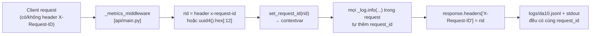

# 06 — Logging Guide

> **Người phụ trách:** Vũ Đức Kiên
> **Nguồn sự thật:** [`observability/logging/__init__.py`](../../observability/logging/__init__.py) +
> chỗ dùng trong [`api/main.py`](../../api/main.py), [`retrieval/hybrid_search/pipeline.py`](../../retrieval/hybrid_search/pipeline.py).

---

## 1. Log format

Log là **JSON có cấu trúc, mỗi dòng 1 object** (JSON Lines). Formatter là `_VnJsonFormatter`
(tự viết, không phụ thuộc `pythonjsonlogger`). Mỗi bản ghi luôn có:

| Field | Nguồn | Ví dụ |
|-------|-------|-------|
| `timestamp` | Giờ VN (`+07:00`), ISO 8601 | `"2026-07-01T10:12:03+07:00"` |
| `level` | Log level | `"INFO"` |
| `request_id` | contextvar (nếu có) | `"a1b2c3d4e5f6"` |
| `message` | Chỉ khi log có message text | thường rỗng (ta dùng `extra`) |
| *(các field khác)* | Từ `extra={...}` khi gọi logger | `event`, `latency_ms`, `query`, `stage_ms`… |

**Cách log trong code** — luôn truyền dữ liệu qua `extra`, message để rỗng:
```python
from observability.logging import get_logger
_log = get_logger()
_log.info("", extra={"event": "search_completed", "latency_ms": 812.4, "query": q[:200], ...})
```

Formatter merge mọi key trong `extra` vào JSON (lọc bỏ các thuộc tính nội bộ của `LogRecord`
như `name`, `funcName`, `taskName`…). `ensure_ascii=False` → tiếng Việt hiển thị nguyên, không escape.

**Ví dụ 1 dòng log thực tế:**
```json
{"timestamp":"2026-07-01T10:12:03+07:00","level":"INFO","request_id":"a1b2c3d4e5f6","event":"search_completed","latency_ms":812.4,"query":"resort yên tĩnh đà nẵng","stage_ms":{"intent":5.1,"filter":40.2,"text_retrieval":610.0,"fusion":12.0,"rerank":130.0,"context":15.1},"n_results":5,"rerank_method":"density_fallback"}
```

---

## 2. Log levels

| Level | Dùng khi nào (trong code) |
|-------|---------------------------|
| `INFO` | Mặc định. Các event hoàn tất request (`*_completed`) |
| `DEBUG` | Chỉ bật khi `SCHEMA_DEBUG=1` — dump cấu trúc response `[SCHEMA]` để đối chiếu contract với frontend |
| `WARNING` | Vd `hotel_id không có trong cache` (`frontend_adapter.to_search_response`) |

- Logger tên **`da10`**, level mặc định `INFO`, `propagate=False` (không lan lên root logger).
- Bật DEBUG: đặt biến môi trường `SCHEMA_DEBUG=1` trước khi chạy API → `api/main.py` hạ level
  logger xuống `DEBUG` và in thêm các dòng `[SCHEMA] ...` mô tả key + type của response.

---

## 3. Log nằm ở đâu

Logger gắn **2 handler** (xem `get_logger()`):

| Đích | Handler | Chi tiết |
|------|---------|----------|
| **stdout** | `StreamHandler` | Thấy ngay ở console chạy `uvicorn` (hoặc `docker logs`) |
| **File** | `RotatingFileHandler` | Ghi ra **`logs/da10.jsonl`** (thư mục `logs/` tự tạo) |

**Xoay vòng file (rotation):** `maxBytes = 10MB`, `backupCount = 5` → tối đa `da10.jsonl` +
`da10.jsonl.1..5` ≈ **~60MB trần**. Chặn file phình vô hạn. Đây cũng là lý do
`GET /observability/slow_requests` đọc toàn bộ file an toàn (file có trần).

> Logger là **singleton** (`_logger` global). Gọi `get_logger()` nhiều lần trả về cùng instance,
> không nhân đôi handler.

---

## 4. request_id — sợi chỉ xuyên suốt 1 request

Cơ chế truy vết: **mỗi request có 1 `request_id`, mọi dòng log trong request đó tự mang id này.**



- **Set ở đâu:** middleware `api/main.py` gọi `set_request_id(rid)`. `rid` ưu tiên header
  `X-Request-ID` từ client/proxy; không có thì sinh `uuid4().hex[:12]` (12 hex).
- **Cơ chế:** `contextvars.ContextVar` trong `observability/logging` → an toàn qua async/thread.
- **Trả về client:** response luôn có header `X-Request-ID` để client đối chiếu.

---

## 5. Cách trace 1 request

### Cách A — theo `request_id` (chính xác nhất)
Lấy `request_id` từ response header `X-Request-ID`, rồi lọc file log:

```powershell
# PowerShell — mọi dòng log của đúng request đó
Select-String -Path logs\da10.jsonl -Pattern '"request_id":"a1b2c3d4e5f6"'
```
```bash
# Bash/jq — đẹp hơn
grep '"request_id":"a1b2c3d4e5f6"' logs/da10.jsonl | jq .
```

### Cách B — qua endpoint truy vết request chậm (không cần vào server)
```
GET /observability/slow_requests?min_ms=500&limit=50
```
Trả các request **đã hoàn tất** (event thuộc `search_completed`/`hybrid_search_completed`/
`context_completed`), sắp xếp mới nhất lên đầu, kèm `stage_ms` breakdown. Xem chi tiết ở
[02_API_Reference.md §4](02_API_Reference.md).

### Các `event` chính để filter
| `event` | Emit ở | Field hữu ích |
|---------|--------|---------------|
| `search_completed` | `POST /search` | `latency_ms`, `query`, `stage_ms`, `n_results`, `rerank_method` |
| `hybrid_search_completed` | `GET /hybrid_search` | như trên + `answer` |
| `hotel_ask_completed` | `GET /hotel/{id}/ask` | `hotel_id`, `n_results`, `sections_filter` |
| `context_completed` | `POST /context` | `result_id`, `has_answer`, `latency_ms` |

---

## 6. Debug khi có sự cố — quy trình gợi ý

1. **Xem log gần nhất** ở console uvicorn hoặc đuôi file:
   ```powershell
   Get-Content logs\da10.jsonl -Tail 50
   ```
2. **Request cụ thể lỗi?** Lấy `X-Request-ID` client nhận được → filter theo Cách A. Xem dòng
   có `level=ERROR`/exception, hoặc `stage_ms` để biết nghẽn ở stage nào.
3. **Search chậm?** Dùng `GET /observability/slow_requests?min_ms=1000` → nhìn `stage_ms`:
   - `text_retrieval` cao → OpenSearch/Qdrant chậm.
   - `rerank` cao → cross-encoder (nếu `USE_RERANKER=1`).
   - `context` cao → LLM chậm (Node 9).
4. **Search trả rỗng (màn hình trắng)?** Tìm `n_results: 0` + metric `da10_search_zero_results_total`.
5. **Kết quả kém bất thường?** Kiểm tra có degraded không: log/metric `da10_search_degraded_total`
   (thiếu BM25/vector) và `rerank_method` (rơi về `density-fallback`?).
6. **Dependency?** `GET /health/deep` xem OpenSearch/Qdrant/Postgres cái nào `error`.
7. **Cần soi schema response** (lệch contract với frontend)? Chạy lại API với `SCHEMA_DEBUG=1`,
   tìm các dòng `[SCHEMA]`.

> **Lưu ý mã hoá (Windows):** log tiếng Việt là UTF-8. Nếu console hiển thị lỗi ký tự, chạy
> uvicorn với `-X utf8` (xem [03_Setup_and_Run.md](03_Setup_and_Run.md)) và đọc file bằng công cụ UTF-8.

---

## 7. Những điểm dễ nhầm khi bàn giao

- **Không có module tracing thật.** `observability/tracing/` chỉ là stub rỗng (README placeholder).
  "Tracing" hiện tại = log JSON + `request_id` + endpoint `slow_requests` ("poor man's tracing"),
  **không** dùng OpenTelemetry/Jaeger.
- **Log không tự gửi đi đâu.** Chỉ stdout + file local. Không có Loki/ELK. Muốn tập trung log
  phải tự thêm.
- **`message` thường rỗng** vì convention là nhét dữ liệu vào `extra`. Đừng tìm nội dung ở field
  `message` — tìm ở `event` và các field cùng cấp.
- **`timestamp` là giờ VN (+07:00)**, không phải UTC — lưu ý khi so với Prometheus (UTC).

---

## 8. Tài liệu liên quan
- [05_Monitoring_Architecture.md](05_Monitoring_Architecture.md) — metric, Prometheus, Grafana.
- [07_Alerting_and_Runbook.md](07_Alerting_and_Runbook.md) — alert & xử lý sự cố.
